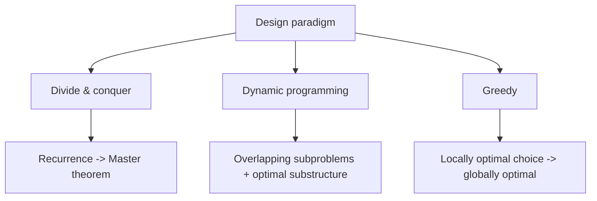

# Introduction to Algorithms (CLRS)

The canonical algorithms textbook, by Thomas H. Cormen, Charles E. Leiserson,
Ronald L. Rivest, and Clifford Stein — universally abbreviated **CLRS**. The
copy ingested here is the **Third Edition** (MIT Press, 2009, ISBN
9780262033848). It aims to be both a rigorous reference and a teaching text:
each algorithm is presented in pseudocode, analyzed for correctness, and given
a formal running-time bound. This note is a high-level **map of what the book
covers**, not a re-derivation of the results.

The book's connective tissue is a single question asked over and over: *for a
given problem, what is a correct algorithm, and how fast is it as the input
grows?* Everything else — the notation, the design paradigms, the data
structures — exists to answer that question precisely.

## The big themes

### Asymptotic analysis (the shared vocabulary)

Before any algorithm, the book fixes how we talk about cost. Running time is
measured as a function of input size, and the constant factors are abstracted
away with asymptotic notation:

- **Θ (Theta)** — a tight bound: the function grows at this rate, up to
  constants.
- **O (big-O)** — an upper bound: no worse than this rate.
- **Ω (Omega)** — a lower bound: at least this rate.

This vocabulary is what lets the rest of the book say "merge sort is Θ(n log n)"
and have it mean something exact. Amortized analysis (aggregate, accounting,
and potential methods) extends this to sequences of operations where an
occasional expensive step is paid for by many cheap ones.

### Divide and conquer & recurrences

A recurring design paradigm: split a problem into subproblems, solve them
recursively, and combine. The cost of such an algorithm is expressed as a
**recurrence**, and the book gives three tools to solve them — the
substitution method, the recursion-tree method, and the **master theorem**
(a plug-in formula for recurrences of the form `T(n) = aT(n/b) + f(n)`).

## Sorting and order statistics

A thorough treatment of sorting, used partly as a vehicle for teaching analysis
techniques:

- **Comparison sorts** — insertion sort (simple, Θ(n²)), merge sort (stable,
  Θ(n log n), divide-and-conquer), heapsort (Θ(n log n), in place, via the heap
  data structure), and quicksort (Θ(n log n) average, Θ(n²) worst, fast in
  practice with good pivoting).
- The **Ω(n log n) lower bound** for comparison-based sorting — proved with a
  decision-tree argument, establishing that you cannot do better while only
  comparing elements.
- **Linear-time sorts** that beat that bound by not comparing: counting sort,
  radix sort, and bucket sort, each relying on structure in the keys.
- **Order statistics** — selecting the k-th smallest element, including a
  worst-case linear-time selection algorithm.

## Data structures

The book builds up the standard toolkit, each with its operations and their
costs:

- **Heaps** — a nearly-complete binary tree supporting a priority queue; the
  engine behind heapsort.
- **Hash tables** — expected O(1) lookup via hashing, with chaining and open
  addressing for collision resolution.
- **Binary search trees (BSTs)** — ordered dictionaries whose operations run in
  time proportional to tree height.
- **Red-black trees** — self-balancing BSTs that guarantee O(log n) height, so
  operations stay logarithmic in the worst case. (Augmented structures like
  interval trees and order-statistic trees are built on this base.)
- Supporting structures: stacks, queues, linked lists, and B-trees for
  disk-based storage.

## Algorithm design paradigms

- **Dynamic programming** — for problems with *overlapping subproblems* and
  *optimal substructure*, solve each subproblem once and reuse the answer.
  Worked examples include rod cutting, matrix-chain multiplication, longest
  common subsequence, and optimal binary search trees.
- **Greedy algorithms** — make the locally optimal choice at each step and prove
  it yields a global optimum. Examples include activity selection and Huffman
  coding, with the theory of matroids as the underlying justification for when
  greedy works.

## Graph algorithms

A large section, since graphs model so much:

- **Traversal** — breadth-first search (BFS, shortest paths in unweighted
  graphs) and depth-first search (DFS, with topological sort and
  strongly-connected-components as applications).
- **Minimum spanning trees (MST)** — Kruskal's and Prim's algorithms, both
  greedy, connecting all vertices at least total cost.
- **Single-source shortest paths** — Dijkstra (non-negative weights) and
  Bellman-Ford (handles negative edges, detects negative cycles).
- **All-pairs shortest paths** — Floyd-Warshall (dynamic programming) and
  Johnson's algorithm.
- **Maximum flow** — the Ford-Fulkerson method and its refinements, with the
  max-flow / min-cut duality.

## Selected topics and the theory of hardness

The later parts branch into more specialized material — number-theoretic
algorithms (including RSA), string matching, computational geometry, and matrix
operations — and then close with the book's most conceptually important
chapter for practicing engineers:

- **P vs NP and NP-completeness.** *P* is the class of problems solvable in
  polynomial time; *NP* is the class whose solutions can be *verified* in
  polynomial time. Whether P = NP is the field's central open question. A
  problem is **NP-complete** if it is in NP and every NP problem reduces to it —
  so an efficient algorithm for any one NP-complete problem would efficiently
  solve them all. The book shows the standard **reduction** technique and works
  through canonical NP-complete problems (SAT, clique, vertex cover, the
  traveling salesman problem, and others). The practical lesson: recognizing a
  problem as NP-complete tells you to stop hunting for a fast exact algorithm
  and reach instead for **approximation algorithms** or heuristics, which the
  final chapter introduces.

## Why it matters here

CLRS is the shared reference behind the algorithmic building blocks that show up
throughout software design — the data structures, complexity trade-offs, and
graph techniques that inform how systems are structured and scaled. See the
[system design master tree](system-design-master-tree.md) for how these
foundations connect to broader architecture decisions.

## References

- [Introduction to Algorithms, Third Edition — MIT Press](https://mitpress.mit.edu/9780262033848/introduction-to-algorithms/)
