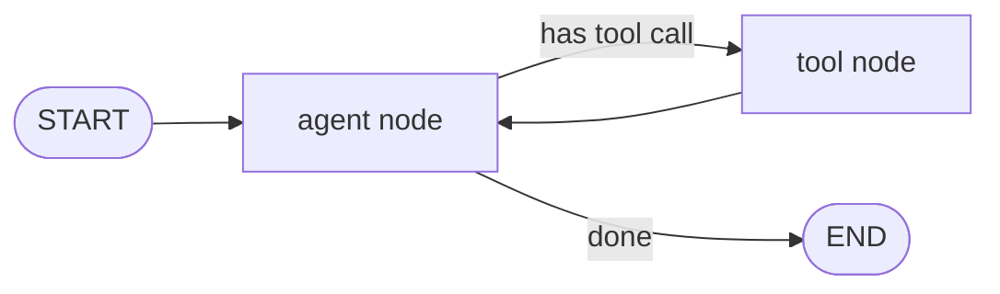

# LangGraph

LangGraph is a low-level orchestration framework from LangChain for building
stateful, long-running agents. Its distinguishing choice is to model an agent's
control flow as an explicit **typed graph** rather than hiding it behind an
opaque `while` loop. It is used in production by companies building agents at
scale (Klarna, Uber, J.P. Morgan among the named adopters).

## The core idea: topology as a graph

A LangGraph application is a directed graph over a shared **state** object:

- **Nodes** are units of work — usually a function or an LLM call. Each node
  reads the current state and returns an update to it.
- **Edges** wire nodes together. They can be static (always go A → B) or
  **conditional** (a routing function inspects the state and picks the next
  node), which is how branching, looping, and dynamic handoffs are expressed.
- **State** is a shared, typed channel that every node reads from and writes to.
  Reducers define how concurrent updates merge (e.g. append to a message list).

Because the loop is drawn out as a graph instead of buried in framework code,
the agent's topology is inspectable, testable, and controllable — you decide
exactly where control can branch, pause, or cycle. This is the "low-level,
controllable" positioning: LangGraph gives you the primitives (nodes, edges,
state, persistence) rather than a pre-baked agent abstraction.

## What the graph model buys you

- **Durable execution** — graph state can be checkpointed to a persistence
  layer, so a run can be paused and resumed, survive crashes, and pick up
  exactly where it left off. This is what makes long-running agents practical.
- **Human-in-the-loop** — because execution can pause at a node and wait, you
  can insert approval or correction steps mid-run.
- **Memory** — short-term (the state carried through one run) and long-term
  (persisted across runs) both fall out of the same persistence machinery. See
  [agent memory systems](agent-memory-systems-knowledge-graphs.md).
- **Streaming** — token- and step-level streaming of intermediate progress.

## Where it sits

LangGraph is the graph/runtime layer; it composes with the broader LangChain
ecosystem for models, tools, and integrations, and pairs with LangSmith for
tracing and evaluation. It is one concrete implementation of the patterns in
[building effective agents](building-effective-agents.md) — the prompt-chaining,
routing, and orchestrator-worker workflows map directly onto graph topologies.
Contrast its explicit-graph (declarative) stance with more code-first, no-graph
frameworks; both approaches to the same
[agent runtime](agent-runtime.md) problem. Tools it calls are frequently exposed
via the [Model Context Protocol](model-context-protocol.md).

## References

- [LangGraph documentation](https://langchain-ai.github.io/langgraph/) (redirects to [docs.langchain.com](https://docs.langchain.com/oss/python/langgraph/overview))
