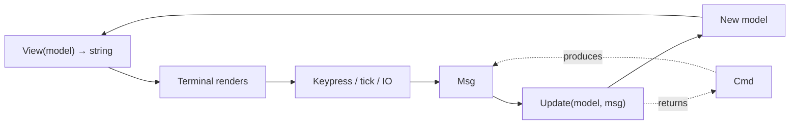

Bubble Tea is a [Go](go.md) framework for building terminal user interfaces (TUIs),
from Charm (charmbracelet). Its defining choice is that it does not invent its own UI
paradigm: it adopts **The Elm Architecture (TEA)**, the same
model–update–view discipline that made the Elm language predictable. The result is a
TUI framework where state changes are explicit, the update path is a single function,
and rendering is a pure projection of state — an unusually functional shape for Go.

## The Model–Update–View triad

Every Bubble Tea program is defined by three things, and only three:

- **Model** — a value (usually a struct) holding all application state. It is the single
  source of truth. There is no scattered mutable state; if it matters, it is in the
  model.
- **Update** — `Update(msg tea.Msg) (tea.Model, tea.Cmd)`. Given the current model and a
  message describing "something that happened," it returns a *new* model and optionally
  a command. This is where all state transitions live, funneled through one function.
- **View** — `View() string` (returning the string to draw). It is a pure function of
  the model: same model, same output. It never mutates state and never performs I/O — it
  only renders.

The framework owns the event loop. It calls `View` to paint, waits for a `Msg`, hands
the model and that message to `Update`, takes the returned model, and repeats. You never
write the loop yourself.

## Msg and Cmd: message passing over side effects

Bubble Tea keeps side effects out of `Update` by routing everything through two types:

- **`Msg`** — an arbitrary value announcing that something occurred: a keypress, a timer
  tick, a window resize, an HTTP response. `Update` inspects it, conventionally with a
  type switch, and decides how the model should change.
- **`Cmd`** — a function that performs I/O (or any side effect) and eventually produces a
  `Msg`. `Update` does not *do* the network call; it *returns a `Cmd`* that will, and the
  runtime executes it, feeding the resulting `Msg` back into `Update`. Effects are thus
  described as data-returning functions rather than performed inline.

This is the crucial convention: `Update` and `View` stay pure and testable, while all
the messy, asynchronous, effectful work is pushed to the edges as commands whose only
way back into the program is another message.

## Immutable-style updates and composition

`Update` returns a model rather than mutating in place, so state transitions read as
transformations — the old model in, the new model out. Because state, transitions, and
rendering are cleanly separated, components **compose**: a larger model embeds smaller
models as fields, forwards messages to their `Update`, and stitches their `View` output
together. [Bubbles](https://github.com/charmbracelet/bubbles) is the companion library
of ready-made components (text inputs, viewports, spinners, tables) built to this exact
contract, so they drop into any Bubble Tea model.

Styling is a separate concern, handled by **Lip Gloss** — a declarative library for
colors, borders, padding, and layout that produces styled strings. `View` composes Lip
Gloss-styled strings; styling never leaks into `Update` or the model, mirroring the same
separation Bubble Tea enforces everywhere.

## Why the conventions matter

The functional event-loop model is what makes Bubble Tea programs easy to reason about
and to test: state is one value, transitions are one pure function, and rendering is a
pure function of state, so a test can feed messages to `Update` and assert on the
returned model with no terminal in the loop. It is the same "make change easy by keeping
effects at the edges" discipline, applied to the terminal.

Bubble Tea covers the interactive, full-screen surface of a Go program, complementing
[Cobra](cobra.md), which structures the scriptable command tree — a Cobra command can
launch a Bubble Tea program for its interactive workflows.

## References

- [charmbracelet/bubbletea on GitHub](https://github.com/charmbracelet/bubbletea)
