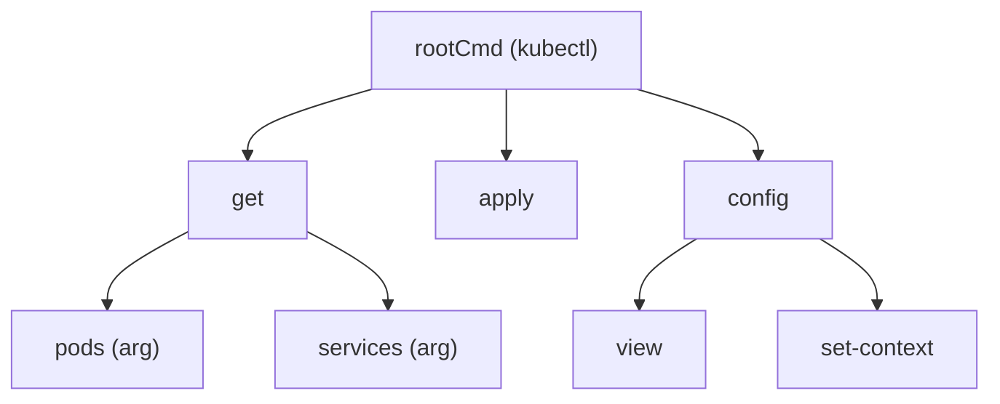

# Cobra Conventions & Philosophy

Cobra (spf13/cobra) is the de-facto framework for building command-line applications in
[Go](go.md). It is the machinery behind the tools that define the category — `kubectl`,
`hugo`, `gh` (the GitHub CLI), and the Docker CLI all sit on it — which is why it functions
as an unofficial standard: adopt it and your CLI feels familiar to anyone who has used those.
Cobra is a *command layer*, not a configuration layer; the standard Go CLI stack pairs it with
Viper (both from the same author) for configuration, covered below.

## The governing metaphor: commands read like sentences

Cobra's core philosophy is that a good CLI reads like a sentence, so users can guess how to
drive it. The interface is built from three parts:

- **Commands** are *actions* (verbs) — `get`, `clone`, `server`.
- **Args** are the *things* those actions operate on (nouns).
- **Flags** are *modifiers* (adjectives) that adjust how an action runs.

The convention Cobra pushes is `APPNAME VERB NOUN --ADJECTIVE`, e.g. `hugo server --port=1313`
or `git clone URL --bare`. Designing your command names to satisfy that grammar is the single
most idiomatic thing you can do — the whole framework is organized to reward it.

## Commands as a tree

A Cobra application is a **tree of `*cobra.Command` values**: one root command, with
subcommands attached via `rootCmd.AddCommand(...)`, and those subcommands can have their own
children arbitrarily deep. Parsing, help, and completion all walk this tree. This is the same
compose-a-tree-of-small-pieces shape that [Typer](typer.md) reaches through nested `Typer()`
apps in Python — Cobra just builds it explicitly with Go structs and `AddCommand` wiring
instead of decorators.

Each `Command` carries its own `Use`, `Short`, and `Long` help text, an `Args` validator
(e.g. `cobra.ExactArgs(1)`), its flags, and the function that runs it. Because help and usage
strings live on the command itself, `--help` output can never drift from the code — it is
generated from the tree.

## Persistent vs. local flags

Flags come in two scopes, and choosing correctly is a recurring design decision:

- **Local flags** (`cmd.Flags()`) apply only to the command they are defined on.
- **Persistent flags** (`cmd.PersistentFlags()`) apply to that command *and every descendant*.

Cross-cutting options — `--verbose`, `--config`, `--namespace` — belong on the root as
persistent flags so the whole tree inherits them; command-specific options stay local. Getting
this wrong (a persistent flag that should have been local) leaks options into subcommands where
they make no sense.

## Project layout and `cobra-cli`

Cobra ships a generator, `cobra-cli`, that scaffolds the conventional layout so most CLIs look
alike. `cobra-cli init` produces a `main.go` that does nothing but call into a `cmd/` package,
and `cobra-cli add <name>` drops a new subcommand file (`cmd/<name>.go`) that registers itself
with the root in its `init()`. The convention that matters:

- `main.go` stays trivial — it calls `cmd.Execute()` and handles the top-level error.
- The `cmd/` package holds one file per command, each defining its `*cobra.Command` and
  wiring itself into the tree.
- Real work lives in *other* packages that the command files call into.

This mirrors the [Go](go.md) `cmd/` directory convention for executables and keeps the CLI
surface separate from the logic it drives.

## `RunE` and error handling

Each command's behavior goes in a run function. Prefer **`RunE`** (returns `error`) over `Run`
(returns nothing): return errors up the tree rather than calling `os.Exit` or `log.Fatal`
inside a command. Cobra propagates the error out through `Execute()`, where `main` handles it
and sets the process exit code in one place. This is idiomatic Go — errors are values that flow
back to a single boundary — and it keeps commands testable, since a test can call the run
function and assert on the returned error instead of trapping a process exit.

## Configuration companion: Viper

Cobra defines commands and flags but deliberately does **not** resolve configuration. That job
belongs to **Viper**, its sibling library, which merges values from defaults, a config file,
environment variables, and the flags Cobra parsed — into a single precedence-ordered answer to
"what is this setting?". The idiomatic wiring is `viper.BindPFlag(...)` in a command's setup so
the command body reads every value through Viper and doesn't care whether it came from a flag,
the environment, or a file. Cobra plus Viper is the standard Go CLI stack; keep Cobra for the
command surface and Viper for config, and don't blur the two.

## Idioms and anti-patterns

- **Keep business logic out of command functions.** The strongest convention: a `RunE` should
  parse and validate inputs, then delegate to a plain function in another package. Commands are
  the CLI's edge, not its engine — logic stuffed into `RunE` can't be tested without invoking
  the whole command and can't be reused by anything but the CLI. This is the same
  "keep the framework at the edge" discipline as a web handler in [Gin](gin.md).
- **Return errors, don't exit.** Use `RunE`; let `Execute()`/`main` own the exit code.
- **Validate args declaratively.** Use the built-in `Args` validators
  (`cobra.ExactArgs`, `cobra.MinimumNArgs`, …) rather than hand-checking `len(args)` in every
  command.
- **Scope flags deliberately.** Persistent for cross-cutting, local for command-specific.
- **Let Cobra generate the boring parts.** Help, usage, and shell completion are derived from
  the command tree — write good `Short`/`Long` text and lean on the generator instead of
  hand-rolling any of it.
- **Don't fight the sentence grammar.** If a command name doesn't fit `VERB NOUN`, the design is
  usually telling you the command boundary is wrong.

## Related

- Built for [Go](go.md); pairs with Viper for configuration and often sits alongside a
  [Gin](gin.md) service in the same codebase (CLI + API).
- [Typer](typer.md) is the Python analogue — the same tree-of-commands idea, but generated from
  type hints rather than assembled from explicit structs.

## References

- [Cobra](https://cobra.dev/)
- [Cobra repository](https://github.com/spf13/cobra)
