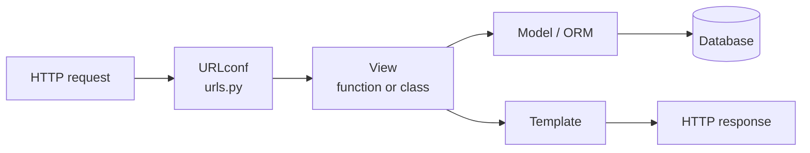

# Django Conventions & Philosophy

Django is a "batteries-included" Python web framework: the default install ships an
ORM, a templating engine, a form library, an auth system, a session framework, an
admin interface, and a management CLI. The philosophy is that the common needs of a
database-backed web application are *already solved problems*, so the framework should
provide opinionated, integrated answers rather than leaving each team to assemble a
stack from scratch. This is the opposite pole from the micro-framework approach of
[FastAPI](fastapi.md), and it rests on the same language substrate — see [python.md](python.md).

## The design philosophies

Django publishes an explicit set of design philosophies, and they explain most of its
conventions:

- **Loose coupling, tight cohesion.** The layers do not know about each other unless
  strictly necessary — the template engine knows nothing about HTTP, the ORM knows
  nothing about presentation, the view layer is agnostic to which template system runs.
  You can swap or bypass any layer.
- **Less code / rapid development.** Applications should use as little boilerplate as
  possible and take advantage of Python's dynamism. Ship fast.
- **Don't repeat yourself (DRY).** Every distinct concept lives in exactly one place.
  The model definition, for instance, is the single source of truth from which the ORM,
  admin, and forms are derived.
- **Explicit is better than implicit.** A direct nod to the Zen of Python. Magic is
  used sparingly and, where present, is documented and predictable.
- **Consistency.** The framework and its APIs are consistent at every level, so that
  learning one part transfers to the rest.

## Apps as the unit of structure

A Django **project** is composed of **apps** — each app is a self-contained, ideally
reusable module addressing one concern (a blog, a billing system, user accounts). An
app is just a Python package with a conventional layout: `models.py`, `views.py`,
`urls.py`, `admin.py`, `apps.py`, `migrations/`, `templates/`, `tests.py`. The
convention is that an app should be *pluggable* — droppable into another project with
minimal rewiring — which is loose coupling made concrete. Register apps in
`INSTALLED_APPS`; keep them small and focused rather than growing one monolithic app.

## MTV: the request pipeline

Django calls its pattern **MTV** (Model–Template–View), which maps onto the classic MVC
but relabels the pieces. The "view" in Django is the controller-like callable that
receives a request and returns a response; the "template" is the presentation layer.

URL routing lives in `urls.py` as an ordered list of path patterns mapping to views.
The URL design philosophy is that URLs should be decoupled from the code that serves
them (you can rename a view without changing its URL) and should look clean and
"definitive" — one canonical URL per resource.

## The ORM and migrations

Models are Python classes subclassing `models.Model`; fields are class attributes. The
model is the **single point of definition** for a table's schema, and the "include all
relevant domain logic" philosophy means model classes are expected to carry behavior
(methods, validation, computed properties), not just data.

- **Migrations are generated, then applied.** `makemigrations` diffs your models
  against the recorded migration state and writes a migration file; `migrate` applies
  it. Migrations are code, are committed to version control, and form an ordered,
  dependency-aware history — never hand-edit applied migrations.
- The Database API philosophy: terse and powerful for the common case, SQL-efficient
  (avoid gratuitous queries — watch for the N+1 problem, reach for `select_related` /
  `prefetch_related`), with an escape hatch to raw SQL when the ORM is the wrong tool.

## Fat models, thin views — and the services debate

The community-idiomatic default is **fat models, thin views**: business logic belongs on
the model (or a model manager), and views stay small — parse the request, call domain
logic, render a response. This follows directly from "include all relevant domain logic."

As apps grow, a recurring debate is whether to introduce a **service layer** (plain
functions/modules that orchestrate across models) to keep models from becoming god
objects. There is no framework-blessed answer: Django does not ship a services concept.
The pragmatic convention is to start with fat models and extract a services module only
when logic genuinely spans multiple models or has no natural home — resisting speculative
layering. This mirrors the broader tradeoff in [../software-architecture/index.md](../software-architecture/index.md)
between cohesion and premature abstraction.

## The admin

The auto-generated admin site is a signature feature: register a model and get a
full CRUD interface for free, driven entirely off the model definition (DRY again). The
convention is that the admin is an internal, staff-facing tool — not a customer UI and
not a substitute for a real API. Customize it with `ModelAdmin` classes, but do not
overload it into application logic.

## Settings and twelve-factor config

Configuration lives in `settings.py`. The critical convention — and a frequent source of
security incidents when ignored — is that **secrets and environment-specific values must
not be committed**. Read `SECRET_KEY`, database URLs, and `DEBUG` from the environment,
per the config principle of the [../distributed-systems/twelve-factor-app.md](../distributed-systems/twelve-factor-app.md):
strict separation of config from code, one codebase deployed to many environments. Common
patterns are `django-environ` or split settings modules (`base.py`, `dev.py`, `prod.py`)
selected via `DJANGO_SETTINGS_MODULE`. `DEBUG = True` in production is a classic and
dangerous anti-pattern.

## Testing conventions

Django ships a test framework built on the stdlib `unittest`, with a `TestCase` that
wraps each test in a database transaction and rolls it back afterward (fast, isolated).
The `Client` simulates requests end-to-end through the URL/view/template stack without a
running server. Fixtures or factory libraries (`factory_boy`) build test data; many teams
prefer `pytest-django` for its terser syntax and fixtures. The convention is to test at
the level that matters — model methods and views — rather than mocking the ORM.

## Patterns and anti-patterns

- **Do** keep apps small, models rich, views thin, URLs clean.
- **Do** treat migrations as committed, ordered history.
- **Don't** put business logic in templates — the template philosophy explicitly
  separates logic from presentation and discourages redundancy (hence template
  inheritance).
- **Don't** commit secrets or run with `DEBUG = True` in production.
- **Don't** ignore query counts; the ORM makes N+1 queries easy to write invisibly.

## References

- [Django design philosophies](https://docs.djangoproject.com/en/stable/misc/design-philosophies/)
- [Django documentation](https://docs.djangoproject.com/en/stable/)
- [The Twelve-Factor App — Config](https://12factor.net/config)
