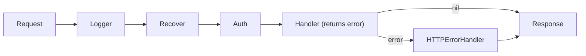

# Echo Conventions

Echo (`labstack/echo`) is a high-performance, minimalist HTTP framework for
[Go](go.md). Like its peer [Gin](gin.md), its conventions are really *Go's*
conventions applied to the web — small surface area, explicit over implicit,
composition over magic, standard-library compatibility — but Echo makes a few
distinct ergonomic bets that shape how idiomatic Echo code is written. The two
occupy the same niche; choosing between them is mostly a matter of which
handler signature and which batteries you prefer.

## Minimalist core, opinionated ergonomics

Echo gives you a fast radix-tree router, a request `Context`, a middleware chain,
and a handful of built-in conveniences (binding, a default error handler,
common middleware). It is *not* batteries-included in the
[Rails](rails.md)/[Laravel](laravel.md) sense — you still assemble your own ORM,
config, and logging — but it ships a little more out of the box than Gin, and it
leans on interfaces (`echo.Context`, `echo.Binder`, `echo.Validator`,
`echo.HTTPErrorHandler`) so you can swap the defaults without leaving the
framework's model. The philosophy remains Go-minimal: what you write is what runs,
and the mental model stays small and greppable.

## The Context abstraction

`echo.Context` is the single object threaded through every handler and middleware.
It carries the request/response, path and query params, bound bodies, per-request
key/value storage (`c.Set`/`c.Get`), and response helpers (`c.JSON`, `c.String`,
`c.NoContent`). Two things distinguish it from Gin's `*gin.Context`:

- **`echo.Context` is an interface**, not a concrete struct. That makes it
  mockable and lets advanced users supply a custom implementation — an interface
  boundary in the spirit of idiomatic Go.
- **Response helpers return an `error`.** `return c.JSON(http.StatusOK, payload)`
  is the norm. This ties directly into Echo's defining convention below.

## Handlers return errors

This is the biggest ergonomic difference from Gin. An Echo handler is
`func(c echo.Context) error` — it **returns an error** rather than aborting the
chain itself. Idiomatic Echo lets errors bubble up:

```go
func getUser(c echo.Context) error {
    id := c.Param("id")
    u, err := users.Find(c.Request().Context(), id)
    if err != nil {
        return err // handled centrally, not encoded here
    }
    return c.JSON(http.StatusOK, u)
}
```

This mirrors Go's "errors are values, handled explicitly" model (see
[Go](go.md)) and pushes response-encoding decisions to one place instead of
scattering `c.AbortWithStatusJSON(...)` calls through every handler — the pattern
Gin uses. Return `echo.NewHTTPError(status, msg)` to signal a specific HTTP status.

## Centralized error handling

Because handlers return errors, Echo funnels every one through a single
**`HTTPErrorHandler`** on the `Echo` instance. Override it once
(`e.HTTPErrorHandler = ...`) to map domain and validation errors to a consistent
error envelope, set the status code, and log. This is the convention that most
distinguishes Echo from Gin architecturally: **one place owns the shape of every
error response.** Handlers stay ignorant of the wire format; middleware and the
error handler own it. It is the same discipline as a Rails `rescue_from`, achieved
with plain Go values.

## Routing and groups

Routes are registered by verb (`e.GET`, `e.POST`, …) against a path, with named
parameters (`/users/:id`) and wildcards. `e.Group("/api/v1")` factors a shared
prefix and shared middleware. The convention matches Gin's: group by API version
and by authorization boundary — a public group and an authenticated group that
mounts auth middleware once for all its routes. Groups nest, so structure follows
the URL hierarchy.

## Middleware model

Middleware is the primary composition mechanism. An Echo middleware has the
signature `func(echo.HandlerFunc) echo.HandlerFunc` — it wraps the next handler,
doing work before and after the inner call, and can short-circuit by returning an
error instead of calling through. Conventions:

- Register global middleware (recovery, logger, request ID) on the `Echo`
  instance with `e.Use(...)`; scope auth, CORS, or rate-limiting to groups or
  routes.
- Prefer Echo's **built-in middleware** (`middleware.Recover`, `middleware.Logger`,
  `middleware.CORS`, `middleware.Gzip`, `middleware.JWT`, `middleware.RateLimiter`)
  before writing custom — one of Echo's "slightly more batteries" advantages.
- Write custom middleware as the wrapper closure and keep it single-purpose.



## Binding and validation

Echo binds request data into structs via `c.Bind(&dto)`, which reads the body
(JSON/XML/form) plus path and query params according to struct tags (`json:`,
`query:`, `param:`, `form:`). Validation is *not* automatic: Echo defines a
`Validator` interface and you register an implementation
(`e.Validator = ...`), conventionally wrapping `go-playground/validator`, then call
`c.Validate(dto)` in the handler. Conventions:

- Define an explicit **request DTO** per endpoint with binding tags; don't bind
  directly into domain or persistence models.
- Bind, then validate, then delegate — and let both `Bind` and `Validate` errors
  return up to the central handler.
- Contrast with Gin, where `ShouldBindJSON` binds and validates in one call via the
  `binding:` tag; Echo separates the two steps and makes validation an explicit,
  swappable interface.

## Keep handlers thin

The most important architectural convention — shared with Gin and every
well-factored web app: **handlers are the transport layer, not the application.**
A handler binds and validates input, delegates to a service/use-case, and encodes
output. Business rules, persistence, and orchestration live in packages that know
nothing about Echo or HTTP. This keeps the core testable without a router and lets
you swap the transport later. Echo's error-returning signature reinforces the
discipline: a handler that just returns `service.Do(...)`'s error has nowhere to
hide business logic.

## Project layout

Echo imposes no layout. Teams adopt the community
[Standard Go Project Layout](go.md): `cmd/` for entry points (`cmd/api/main.go`),
`internal/` for private application code (handlers, services, repositories), `pkg/`
for genuinely reusable libraries. Wiring — building the `Echo` instance,
registering middleware, routes, the validator, and the error handler — is isolated
in a `server`/`internal/http` package so `main` stays tiny. Start flat and grow
into folders only when they earn it. Read config from the environment per the
[Twelve-Factor App](../distributed-systems/twelve-factor-app.md) so the same binary
runs across environments.

## Echo vs. Gin vs. net/http

- **vs. [Gin](gin.md):** Same niche and performance class. Gin handlers are
  `func(*gin.Context)` and abort explicitly; Echo handlers are
  `func(echo.Context) error` and rely on a central `HTTPErrorHandler`. Echo's
  `Context` is an interface (mockable, replaceable); Gin's is a concrete struct.
  Echo ships more built-in middleware and treats binding/validation as separate,
  swappable interfaces; Gin folds validation into binding via struct tags. Neither
  is "more correct" — Echo suits teams who want error-as-value flow and a single
  error-shaping seam; Gin suits teams who want the leanest possible core.
- **vs. idiomatic `net/http`:** Both frameworks are thin sugar over the standard
  library's `http.Handler` model, not replacements for it. They add a fast router,
  path params, a request context object, and a middleware chain — ergonomics you'd
  otherwise hand-roll. For a small service, plain `net/http` with `http.ServeMux`
  (much stronger since Go 1.22's method+pattern routing) is often enough; reach for
  Echo when you want grouped routes, built-in middleware, and centralized error
  handling without building them yourself. Echo stays `net/http`-compatible, so you
  can drop down to raw handlers where needed.

## Patterns and anti-patterns

- **Do** return errors from handlers and shape them once in `HTTPErrorHandler`;
  **don't** encode ad-hoc error responses in each handler.
- **Do** define per-route DTOs with binding tags; **don't** bind into DB models.
- **Do** prefer built-in middleware; **don't** reimplement recovery, CORS, or gzip.
- **Do** register a `Validator` and call `c.Validate`; **don't** scatter manual
  field checks through handlers.
- **Don't** put business logic, SQL, or long transactions in handlers.
- **Don't** bring a heavyweight framework mindset — Echo rewards Go minimalism.

## Related

- Built on [Go](go.md) and its `net/http` model; the direct peer of [Gin](gin.md).
- Configure via the environment per the
  [Twelve-Factor App](../distributed-systems/twelve-factor-app.md).

## References

- [Echo documentation](https://echo.labstack.com/)
- [Echo repository](https://github.com/labstack/echo)
