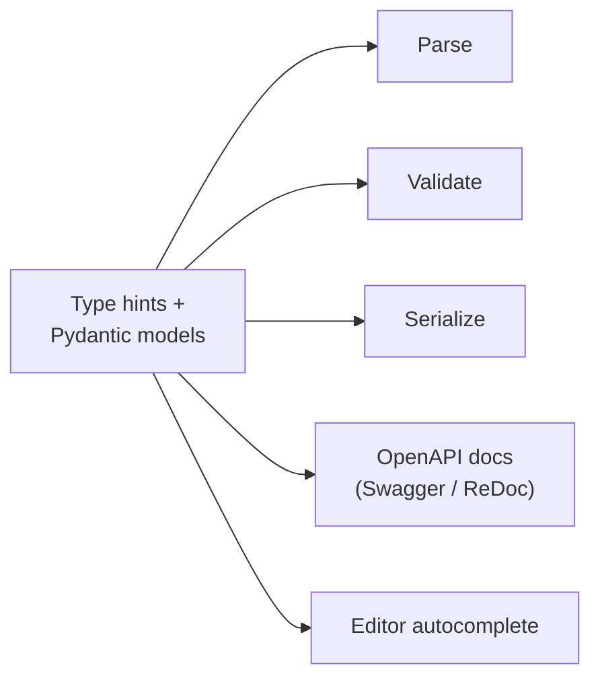

# FastAPI Conventions & Philosophy

FastAPI is a modern Python web framework whose central idea is that **type hints are the
contract**. Where an older framework asks you to *wire up* validation, serialization, and
documentation by hand, FastAPI asks you only to *declare* the shapes — via standard Python
type annotations and Pydantic models — and then derives the rest. This "declare, don't
wire" stance is the framework's whole personality, and it depends on modern
[python.md](python.md) (type hints, `async`/`await`, dataclasses-era ergonomics). It sits
at the opposite end of the spectrum from batteries-included [django.md](django.md): FastAPI
ships a small, sharp core and expects you to compose the rest.

## Type-hints-as-contract

You annotate a function parameter with a type, and that single declaration drives:

- **parsing** — the incoming request value is coerced to that type,
- **validation** — bad input is rejected with a structured error automatically,
- **serialization** — response models are validated and serialized on the way out,
- **documentation** — an OpenAPI schema (and interactive Swagger UI / ReDoc) is generated,
- **editor support** — autocompletion and type checks everywhere, so you rarely return
  to the docs and rarely mistype a field name.

Pydantic models are the workhorse: define a `BaseModel` subclass once and it becomes both
the request body schema and (via `response_model`) the response contract. The convention
is to model your data explicitly with Pydantic rather than passing around loose dicts.



## Dependency injection: "declare, don't wire"

FastAPI's dependency-injection system is the mechanism that makes declaration compose. A
dependency is just a callable declared as a parameter default via `Depends(...)`. The
framework resolves the graph — dependencies can depend on other dependencies — and injects
results, handling shared resources (DB sessions, current user, settings), authentication,
and per-request setup/teardown. Dependencies also augment the OpenAPI schema and
validation. The convention: express cross-cutting concerns (auth, DB access, pagination)
as dependencies rather than threading them manually through every handler.

## Async-first

FastAPI is built on ASGI and Starlette; handlers can be `async def` and the framework runs
them on an event loop. The convention is to use `async` for I/O-bound work (network, DB
with async drivers) and plain `def` for CPU-bound or blocking calls (FastAPI offloads those
to a threadpool automatically). The anti-pattern to avoid is calling blocking I/O inside an
`async def` handler, which stalls the event loop. This async orientation is what makes
FastAPI a common backbone for streaming LLM responses — see [langchain.md](langchain.md).

## Structure: routers and project layout

Small apps live in one file. Beyond that, the convention is to split by feature using
`APIRouter` — each feature module defines its own router, and the top-level `app`
includes them with a prefix and tags:

```
app/
  main.py            # creates FastAPI(), includes routers
  api/
    routes/
      users.py       # APIRouter() for users
      items.py       # APIRouter() for items
  models/            # Pydantic schemas
  db/                # session, engine, dependencies
  core/              # config, security, settings
```

Settings are typically a Pydantic `BaseSettings` object read from the environment, keeping
config out of code. Response models are declared per-route with `response_model=` so the
output contract is explicit and the docs stay accurate.

## Sensible defaults, optional everywhere

A stated principle: it has sensible defaults for everything and optional configuration
everywhere — by default "it just works," but every parameter can be fine-tuned. The
convention is to lean on the defaults and only reach for configuration when a real need
appears, rather than pre-configuring speculatively.

## Testing conventions

FastAPI provides `TestClient` (backed by `httpx`) that drives the app in-process without a
running server, so tests exercise the full parse/validate/serialize pipeline. The
dependency system doubles as the test seam: use `app.dependency_overrides` to swap a real
DB session or auth dependency for a test double — no monkeypatching required. This is a
direct payoff of the DI design. `pytest` is the near-universal choice.

## Patterns and anti-patterns

- **Do** model everything with Pydantic; let types drive validation and docs.
- **Do** express shared concerns as dependencies; override them in tests.
- **Do** declare `response_model` so the output contract is explicit.
- **Don't** block the event loop with synchronous I/O inside `async def`.
- **Don't** hand-roll validation the type system already gives you for free.
- **Don't** pass untyped dicts where a Pydantic model belongs.

## References

- [FastAPI features](https://fastapi.tiangolo.com/features/)
- [FastAPI documentation](https://fastapi.tiangolo.com/)
- [Pydantic documentation](https://docs.pydantic.dev/)
