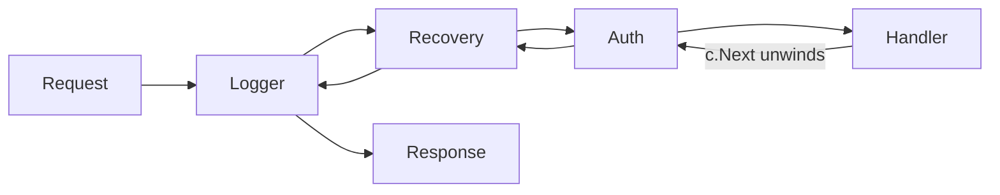

# Gin Conventions

Gin is a fast, minimalist HTTP web framework for [Go](go.md). Its conventions are
really *Go's* conventions applied to the web: small surface area, explicit over
implicit, composition over magic, and standard-library compatibility. Gin gives you
a fast router (built on `httprouter`), a request `Context`, and a middleware chain —
and deliberately little else. It is not a batteries-included framework like
[Laravel](laravel.md) or [Rails](rails.md); it expects you to assemble your own
stack (ORM, validation strategy, config via [Cobra](cobra.md), logging).

## Idiomatic-Go minimalism

The framework's philosophy mirrors Go's: prefer a thin, comprehensible core over a
large abstraction you must learn. Handlers are plain functions with the signature
`func(*gin.Context)`; there is no controller base class, no dependency-injection
magic, no reflection-heavy routing. What you write is what runs. This keeps the
mental model small and the code greppable — a core Go value.

## The Context and handler pattern

`*gin.Context` is the single object threaded through every handler and middleware. It
carries the request/response, path and query params, bound bodies, per-request
key/value storage (`c.Set`/`c.Get`), and the response helpers (`c.JSON`,
`c.String`, `c.AbortWithStatus`). Conventions:

- Handlers are short: parse input, call a service, write a response.
- Use `c.JSON(http.StatusOK, payload)` with real `net/http` status constants, not
  magic numbers.
- On error, `c.AbortWithStatusJSON(...)` stops the chain and returns cleanly.
- Store request-scoped values (auth user, request ID) in the context via middleware,
  not globals.

## Middleware chains

Middleware is the primary composition mechanism. A middleware is itself a
`gin.HandlerFunc`; it does work before/after calling `c.Next()`, and can short-circuit
with `c.Abort()`. The convention is a layered chain: global middleware (recovery,
logging) on the `Engine`, then group- or route-scoped middleware for concerns like
auth, rate limiting, or CORS.

## Router groups

`router.Group("/api/v1")` factors shared prefixes and shared middleware. The
convention is to group by API version and by authorization boundary — e.g. a public
group and an authenticated group that mounts an auth middleware once for all its
routes. Groups nest, so structure follows the URL hierarchy.

## Binding & validation

Gin binds request bodies into structs via `c.ShouldBindJSON(&dto)` (and query/form/
URI variants). Validation is declared with struct tags using the `binding:` tag
(backed by `go-playground/validator`): `binding:"required,email"`. Conventions:

- Define an explicit **request DTO** struct per endpoint with binding tags; don't
  bind directly into domain/persistence models.
- Prefer `ShouldBind*` (returns an error you handle) over `MustBind*` (writes a 400
  itself) so you control the error response shape.
- Map validation errors to a consistent error envelope in one place.

## Keep business logic out of handlers

The most important architectural convention: **handlers are the transport layer, not
the application.** A handler should decode input, delegate to a service/use-case, and
encode output. Business rules, persistence, and orchestration live in packages that
know nothing about Gin or HTTP. This keeps the core testable without spinning up a
router and lets you swap the transport later. It is the same "thin controller"
discipline seen in other frameworks, enforced here by Go's package boundaries.

## Project layout

Gin imposes no layout, so teams adopt the community
[Standard Go Project Layout](go.md): `cmd/` for entry points (`cmd/api/main.go`),
`internal/` for private application code (handlers, services, repositories),
`pkg/` for genuinely reusable libraries, and `configs/` for config. Wiring — building
the `Engine`, registering middleware and routes — is typically isolated in a
`router`/`server` package or `internal/http` so `main` stays tiny. Note the community
debates whether the "standard layout" is over-structured for small services; the
Go-idiomatic move is to start flat and grow into folders only when they earn it.

## Patterns & anti-patterns

- **Do** define per-route DTOs with binding tags; **don't** bind into DB models.
- **Do** put cross-cutting concerns in middleware; **don't** repeat them per handler.
- **Do** use `net/http` status constants and a consistent error envelope.
- **Don't** stuff business logic, SQL, or long transactions into handlers.
- **Don't** reach for a heavy framework mindset — Gin rewards Go minimalism.

## Related

- Built on [Go](go.md) and its standard-library HTTP model; pairs with
  [Cobra](cobra.md) for layered configuration.

## References

- [Gin documentation](https://gin-gonic.com/en/docs/)
- [Gin repository](https://github.com/gin-gonic/gin)
- [Standard Go Project Layout](https://github.com/golang-standards/project-layout)
- [Effective Go](https://go.dev/doc/effective_go)
