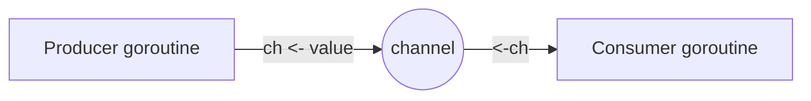

# Go Conventions and Philosophy

Go's design is a reaction against the accidental complexity of large-scale C++ and Java
systems. Its guiding value is **simplicity that scales to large teams and large codebases**:
a small language that many engineers can read the same way, compile fast, and change
safely. "Less is more" is not a slogan here but a design constraint — features are left
*out* deliberately (no inheritance, no exceptions, no generics until Go 1.18, no operator
overloading) so that there is usually one obvious way to do a thing. The result is code
that is boring in the best sense: predictable, uniform, and legible to someone who did not
write it.

## One canonical format: gofmt

The single most consequential convention is that **Go has no style debate about
formatting**. `gofmt` (and its superset `goimports`) rewrites source into one canonical
layout — tabs for indentation, fixed brace placement, aligned struct fields. Because the
tool is authoritative and ships with the toolchain, every Go file in the world looks the
same, and code review never spends a comment on whitespace. This is a philosophy as much
as a tool: **the machine owns formatting so humans can own meaning.** Idiomatic naming
follows suit — short, lower-case package names; `MixedCaps` for exported identifiers and
`mixedCaps` for unexported (capitalization *is* the visibility rule); short receiver names
(`r`, not `this`); getters named `Owner()` not `GetOwner()`.

## Errors are values, handled explicitly

Go has no exceptions. Functions return errors as ordinary values, and the caller handles
them inline:

```go
f, err := os.Open(name)
if err != nil {
    return fmt.Errorf("opening config: %w", err)
}
```

The `if err != nil` block is the most recognizable Go idiom. It is verbose by design —
error handling is made visible in the control flow rather than hidden in a stack-unwinding
mechanism. Errors are wrapped with `%w` to preserve a chain that `errors.Is` /
`errors.As` can inspect. `panic`/`recover` exist but are reserved for truly unrecoverable
situations (programmer bugs, unrecoverable init), not ordinary control flow. This mirrors
the [twelve-factor app](../distributed-systems/twelve-factor-app.md) preference for
explicit, observable behavior over hidden magic.

## Composition over inheritance; implicit interfaces

There are no classes and no inheritance. Behavior is assembled by **composition** —
embedding structs and interfaces — and reuse comes from small interfaces rather than deep
type hierarchies. Interfaces are **satisfied implicitly**: a type implements an interface
merely by having the right methods, with no `implements` declaration. This decouples the
definition of an interface from its implementations, so consumers can define the narrow
interface they need (`io.Reader`, `io.Writer`) and any type that fits it just works. The
idiom is **"accept interfaces, return structs,"** and interfaces are kept tiny — often a
single method (the `-er` convention: `Reader`, `Stringer`, `Closer`).

## Concurrency: share memory by communicating

Go's concurrency model is built on **goroutines** (cheap, runtime-scheduled green threads
launched with `go f()`) and **channels** (typed conduits for passing values between them).
The governing proverb is **"Do not communicate by sharing memory; instead, share memory by
communicating."** Rather than guarding shared state with locks, idiomatic Go passes
ownership of data through a channel so that only one goroutine touches it at a time. The
`select` statement multiplexes channel operations, and `context.Context` threads
cancellation and deadlines through call trees. Mutexes still exist for the cases where they
fit better, but channels are the default mental model.



## Project layout and the standard toolchain

Go deliberately unifies tooling. A single `go` command builds, tests, formats, vets,
fetches dependencies, and generates documentation — no separate build system needed for
most projects.

- **Modules** (`go.mod`/`go.sum`) define a project and pin its dependency graph;
  import paths are URLs, and versioning follows semantic import versioning.
- **Packages** map to directories; a package is the unit of compilation and encapsulation.
  Keep packages cohesive and named for what they provide, not what they contain (`http`,
  not `utils`).
- **Testing** lives beside code in `_test.go` files, run by `go test`. **Table-driven
  tests** are the community standard — a slice of test cases iterated in a loop — and
  `testing.T` plus the standard library is usually all you need (no assertion framework).
- `go vet` and `staticcheck` catch suspicious constructs; `go doc` renders documentation
  straight from comments, which is why exported identifiers get a doc comment beginning
  with their own name.

Idiomatic Go favors the standard library and a few well-chosen dependencies over sprawling
frameworks. When frameworks are used, they stay thin and idiomatic — see
[gin](gin.md) for HTTP routing and [cobra](cobra.md) for configuration, both of which layer
lightly on top of the standard library rather than replacing it.

## The Go way, distilled

- Clear is better than clever; readability is the primary metric.
- A little copying is better than a little dependency.
- Make the zero value useful.
- Errors are values — handle them, don't hide them.
- The bigger the interface, the weaker the abstraction.
- Don't design speculatively; the tooling and format are non-negotiable, the code is simple.

## References

- [Effective Go](https://go.dev/doc/effective_go)
- [Go Style Guide (Google)](https://google.github.io/styleguide/go/)
- [Go Proverbs](https://go-proverbs.github.io/)
- [Go Code Review Comments](https://go.dev/wiki/CodeReviewComments)
- [Go Modules Reference](https://go.dev/ref/mod)
