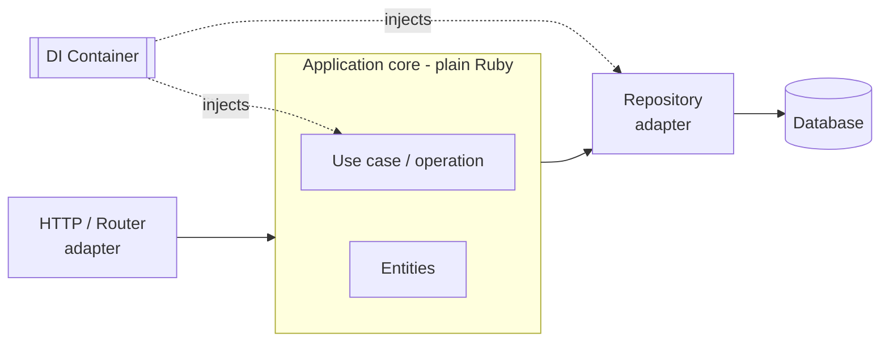

# Hanami Conventions & Philosophy

Hanami is a full-stack [Ruby](ruby.md) framework built as a deliberate philosophical
counterpoint to [Rails](rails.md). Where Rails optimizes for a fast start via
convention and magic, Hanami optimizes for **long-term maintainability via
explicitness and architectural boundaries**. Its tagline — "Ruby apps that grow with
you" — is the whole pitch: keep concerns separated, business logic explicit, and the
architecture modular so a large app stays a pleasure to work on.

## The core stance: explicitness over magic

Rails infers structure from names and mixes framework behavior into your objects
(Active Record models *are* the framework). Hanami inverts this:

| Concern | Rails default | Hanami default |
| --- | --- | --- |
| Object–framework coupling | inheritance/mixin (`< ApplicationRecord`) | plain objects, framework at the edges |
| Wiring | inferred by convention | explicit via a DI container |
| Persistence | Active Record (row = object) | Repository + Entity (persistence separated) |
| Growth strategy | majestic monolith | modular **slices** |
| Bias | programmer happiness / speed | maintainability / clarity |

The guiding rule is **"keep the framework at the edges."** Your domain logic should
be plain Ruby that knows nothing about HTTP, the router, or the ORM — the framework
adapts to it at the boundary, not the reverse. This is
[hexagonal architecture](../software-architecture/hexagonal-architecture-ports-and-adapters.md)
applied to a Ruby web app: the application core is isolated behind ports, and
Hanami's HTTP layer, persistence, and views are adapters plugged into it.

## Slices: modular boundaries

A Hanami app is composed of **slices** — self-contained subsystems with their own
components, each mapping naturally to a subdomain or
[bounded context](../software-architecture/domain-driven-design.md). Slices declare
whether and how they depend on one another, so coupling is visible and deliberate
rather than accidental. This gives you clean internal boundaries inside a single
deployable — a monolith you can reason about and later carve apart, without starting
from microservices.

## Dependency injection and the container

The mechanism that makes explicitness ergonomic is the **container**. Components
register themselves, and dependencies are injected rather than reached for globally.
Instead of calling a global constant or a Rails-style singleton, an object declares
what it needs (`include Deps["...")`) and the container provides it. Benefits:

- Dependencies are named and visible at the top of each class.
- Objects are trivially unit-testable in isolation — swap a real dependency for a
  fake without stubbing globals.
- No hidden action-at-a-distance; the wiring graph is inspectable.

## Entities and repositories

Hanami splits what Active Record fuses:

- **Entities** are the domain objects — data and behavior, with no knowledge of the
  database. They are persistence-ignorant, closer to DDD's aggregates than to a
  Rails model.
- **Repositories** are the only objects that talk to persistence. They translate
  between the datastore and entities, exposing intention-revealing query methods.

The payoff is a domain model you can grow and test without the database, at the cost
of more upfront ceremony than an Active Record model.

## Conventions and philosophy summary

- **You choose how much framework you want** — full-stack app, lean API, stream
  processor. Components live in the `Gemfile` and can be removed or swapped.
- **Fast development interactions** — smart code loading keeps console, tests, and
  server boot quick even as the app grows.
- **Testing** favors fast, isolated unit tests of core objects (the DI container
  makes seams cheap), with integration tests at the adapter edges.

The trade against Rails is the classic one: Hanami asks for more structure and
explicit wiring upfront in exchange for an architecture that resists the god-object
decay Rails apps tend toward at scale. It is Rails's answer question — "what happens
when the app gets big?" — taken as the *starting* design constraint.

## References

- [Hanami](https://hanamirb.org/)
- [Hanami Guides — Architecture](https://guides.hanamirb.org/v2.2/app/container-and-components/)
