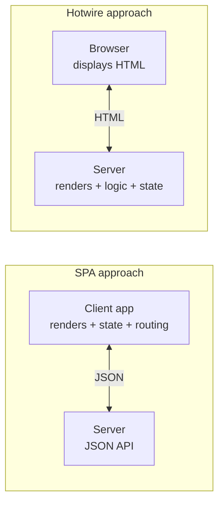

# Hotwire Methodology (HTML Over The Wire)

Hotwire ("HTML Over The Wire") is an approach to building modern, interactive web
apps by **sending HTML instead of JSON** over the wire and keeping template rendering
on the server. It is the default front-end story for [Rails](rails.md) but is
framework- and language-agnostic. The thesis: most of the interactivity that pushed
teams toward heavy single-page apps can be delivered with server-rendered HTML plus a
thin sprinkle of [JavaScript](javascript.md), giving fast first loads, a simpler
programming model, and far less client-side code to maintain.

## The philosophy: keep the logic on the server

The core conviction is that **the majority of your application logic should live on
the server**, in one language and one codebase, rather than being duplicated into a
client-side app that talks to an API. The browser's job is mostly to display HTML the
server produced. This is the direct antithesis of the SPA architecture, where the
server degrades to a JSON API and rendering, routing, and state all move to the
client (see [SPA design and
architecture](../web-frontend/spa-design-and-architecture.md)).

Hotwire embraces **progressive enhancement**: the app is functional HTML first, and
Turbo layers speed and interactivity on top without you hand-writing the JavaScript.
Turbo is estimated to cover ~80% of the interactivity that once required custom JS;
the remaining ~20% is handled with small, sanctioned Stimulus controllers.

## The three pieces of Turbo

- **Turbo Drive** — intercepts full-page link clicks and form submissions, fetches
  the new page over AJAX, and swaps the `<body>` while keeping the process alive. You
  get SPA-like navigation speed with zero custom code — it is the successor to
  Turbolinks.
- **Turbo Frames** — decompose a page into independent chunks (`<turbo-frame>`). A
  link or form inside a frame updates only that frame, letting you build things like
  inline editing, lazy-loaded sections, and tabbed content declaratively, no JS.
- **Turbo Streams** — deliver targeted, live page mutations. A `<turbo-stream>`
  element with an action (`append`, `prepend`, `replace`, `update`, `remove`,
  `before`, `after`, `refresh`) and a `target` DOM id encodes a change. Streams
  arrive in response to form submissions *or* pushed over WebSocket/SSE — this is how
  a page updates in real time (e.g. a new chat message appearing) while all the
  rendering still happens server-side.

## Stimulus: the dash of JavaScript

**Stimulus** is a modest, HTML-centric JS framework for the interactions Turbo does
not cover. Rather than owning the DOM (React-style) it *augments* server-rendered
HTML: you annotate markup with `data-controller`, `data-action`, and `data-*-target`
attributes, and Stimulus wires small controllers to those elements. State lives in
the DOM and on the server, not in a client-side store. The convention is **minimal
custom JS, tied to markup, never a parallel application**.

## Contrast with SPA frameworks

| Dimension | Hotwire | SPA ([React](react.md)/[Vue](vue.md)/[Svelte](svelte.md)) |
| --- | --- | --- |
| What crosses the wire | HTML | JSON |
| Where rendering happens | server | client |
| Source of truth for state | server + DOM | client store |
| Custom JS volume | minimal (Stimulus) | substantial |
| First-load speed | fast (real HTML) | slower (JS bundle boot) |
| Duplicated logic | none (one codebase) | client + server |

Hotwire is closely aligned in spirit with [htmx](htmx.md): both reject the
JSON-API-plus-client-app default and return generation of HTML to the server, using
HTML attributes to drive partial updates. Hotwire is the more opinionated, batteries-
included bundle (Drive + Frames + Streams + Stimulus + native bridges); htmx is a
smaller, single-library take on the same "hypermedia as the engine" idea.

## References

- [Hotwire — HTML Over The Wire](https://hotwired.dev/)
- [Turbo Handbook](https://turbo.hotwired.dev/handbook/introduction)
- [Stimulus Handbook](https://stimulus.hotwired.dev/handbook/introduction)
