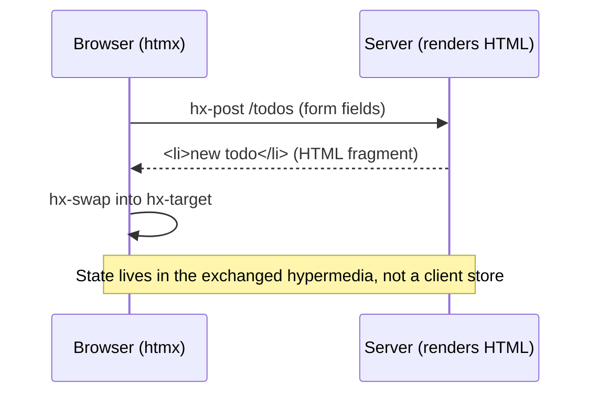

# htmx & the Hypermedia Methodology

htmx is a small [JavaScript](javascript.md) library, but its real contribution is a
**methodology**: return to hypermedia as the architecture of the web application, rather
than treating the browser as a thin client for a JSON API. It is the mirror image of the
[React](react.md)/[Vue](vue.md)/[Svelte](svelte.md) approach — instead of a rich
client that fetches data and renders it, htmx keeps rendering on the server and lets the
browser exchange **HTML fragments**.

## HATEOAS, revisited

The core idea is **HATEOAS** — Hypermedia As The Engine Of Application State. In a
hypermedia system, the server sends HTML that contains not just data but the *controls*
(links, forms, and with htmx, any element) for the next possible interactions. The
client is generic (the browser); it doesn't know the application's domain model, only
how to render hypermedia and follow its controls. Application state lives in the
hypermedia exchanged, not in a client-side store.

This is the original REST as Roy Fielding described it — see
[The HTTP Query Method](../distributed-systems/http-query-method.md) for how HTTP method
semantics underpin such exchanges. Most "REST APIs" are actually RPC-over-JSON and drop
the hypermedia constraint entirely; htmx puts it back.

## HTML attributes drive behavior

htmx generalizes what plain HTML already does (a link GETs a URL and swaps the whole
page; a form POSTs). With htmx, **any element can issue any HTTP request and swap the
response into any part of the DOM**, all declared in attributes:

- `hx-get` / `hx-post` / `hx-put` / `hx-delete` — which request to make
- `hx-trigger` — which event fires it (click, change, keyup, revealed, every 2s…)
- `hx-target` — where the response goes
- `hx-swap` — how it's inserted (innerHTML, outerHTML, beforeend, …)

The server responds with an **HTML fragment**, and htmx swaps it in. No JSON, no
client-side templating, no manual DOM code. Behavior is readable directly in the markup.

## "You probably don't need a SPA"

The htmx argument is that a large share of applications adopted the SPA architecture for
interactivity they could get from server-rendered fragments — while paying the SPA's
full cost: a duplicated domain model on the client, a JSON API contract to version, a
build toolchain, client-side routing and state management, and the hydration/bundle
tax. For CRUD-shaped, content-and-forms apps, htmx delivers the interactivity without
that cost. It does **not** claim to replace genuinely client-heavy apps (canvas editors,
offline-first, real-time collaborative surfaces) — the honest framing is *choose the
architecture the app actually needs*. Weigh this against the tradeoffs in
[SPA Design and Architecture](../web-frontend/spa-design-and-architecture.md).

## Contrast with React/Vue/Svelte

| Dimension | htmx (hypermedia) | React / Vue / Svelte (SPA) |
|-----------|-------------------|----------------------------|
| Source of truth for state | Server + exchanged HTML | Client-side state tree |
| Wire format | HTML fragments | JSON |
| Rendering | Server | Client |
| Domain model | Server only | Duplicated client + server |
| API surface | Endpoints return views | Versioned JSON contract |
| Build step | Optional / none | Required bundler |

## Relation to Hotwire

[Hotwire](hotwire.md) (Turbo + Stimulus, from the Rails world) shares htmx's thesis —
send HTML over the wire, keep logic on the server. htmx is library-agnostic and
attribute-driven; Hotwire is a more prescribed stack. Both are expressions of the same
hypermedia philosophy.

## References

- [htmx essays](https://htmx.org/essays/)
- [The SPA Alternative](https://htmx.org/essays/spa-alternative/)
- [Hypermedia Systems (book)](https://hypermedia.systems/)
