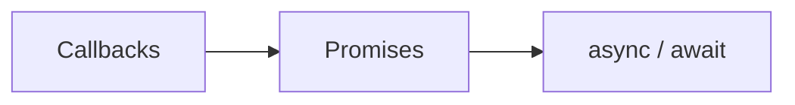

# JavaScript Conventions and Idioms

JavaScript is a language whose good ideas are surrounded by legacy footguns. Writing it
well is largely a discipline of **staying inside a sane subset** and knowing which built-in
behaviors to avoid. Douglas Crockford's framing in
[JavaScript: The Good Parts](../web-frontend/javascript-the-good-parts.md) still anchors the
convention: prefer the parts of the language that compose predictably (first-class
functions, object literals, closures) and steer clear of the parts that surprise (implicit
coercion with `==`, `with`, hoisting quirks, the many meanings of `this`). Modern practice
formalizes that subset with linters and standardized style guides rather than relying on
memory.

## The good-parts subset and the footguns

- **`===` over `==`.** Always use strict equality; the loose operator's coercion table is a
  reliable source of bugs.
- **`const` first, then `let`, never `var`.** `var` is function-scoped and hoisted; block
  scoping with `const`/`let` matches how people actually reason about code.
- **Prefer immutability.** Treat data as read-only — build new arrays/objects with spread
  (`{...obj, x}`, `[...arr]`) and array methods rather than mutating in place. This is the
  central lesson of [Simplifying JavaScript](../web-frontend/simplifying-javascript.md):
  small, declarative transformations over stateful loops.
- **Avoid the truthiness traps.** `0`, `''`, `NaN`, `null`, `undefined` are all falsy;
  guard explicitly when the distinction matters.

## Functional array methods over imperative loops

Idiomatic modern JS treats arrays declaratively. `map`, `filter`, `reduce`, `find`, `some`,
`every`, and `flatMap` replace hand-written `for` loops for transformation and aggregation,
producing shorter code with fewer off-by-one and mutation bugs:

```js
const activeNames = users
  .filter((u) => u.active)
  .map((u) => u.name);
```

Reserve explicit loops for genuinely imperative work (early exit with side effects,
performance-critical hot paths).

## Modules: ESM is the standard

The ecosystem has converged on **ES Modules** (`import`/`export`) as the canonical module
system, superseding CommonJS (`require`/`module.exports`) in new code. Conventions:

- Prefer **named exports** for discoverability and tree-shaking; reserve `default` exports
  for the one obvious thing a module provides.
- Keep modules small and single-purpose; the file is the unit of encapsulation.
- Side-effect-free modules enable bundlers to shake out dead code.

## Async idioms: promises and async/await

Asynchronous control flow evolved from callbacks (and callback hell) to promises to
`async`/`await`, the subject of [Async JavaScript](../web-frontend/async-javascript.md).
Modern conventions:

- Use **`async`/`await`** for sequential clarity; wrap awaits in `try`/`catch` for errors.
- Use **`Promise.all`** for concurrent independent work, not sequential `await`s in a loop.
- Never leave a promise unhandled; a rejected promise with no `.catch` is a latent crash.
- Don't mix callbacks and promises in the same flow — pick one and promisify the boundary.



## Style guides and tooling

Because the language permits many styles, teams adopt an authoritative guide and enforce it
with tooling rather than debate:

- **Airbnb JavaScript Style Guide** — the most widely cited opinionated guide (ES6-first,
  strong on immutability and arrow functions).
- **StandardJS** — a zero-config, no-semicolons style that ends the debate by removing the
  choices.
- **Prettier** for formatting (the JS analogue of gofmt — the tool owns whitespace) and
  **ESLint** for correctness and style rules. The pairing is near-universal: Prettier
  formats, ESLint lints.

## The churn problem

A defining trait of the JS ecosystem is **rapid, sometimes exhausting churn** — build
tools, frameworks, and best practices turn over faster than in most languages. The
conventional defense is to lean on the stable core (the language itself, ESM, the standard
web platform APIs) and treat the tooling layer as replaceable. Skills in the durable subset
transfer across frameworks; skills tied to a specific build tool age quickly.

## Related

JavaScript is the substrate for typed and framework layers built on top of it:
[typescript](typescript.md) (types as a design tool), and the UI frameworks
[react](react.md), [vue](vue.md), [svelte](svelte.md), and the hypermedia approach of
[htmx](htmx.md).

## References

- [Airbnb JavaScript Style Guide](https://github.com/airbnb/javascript)
- [StandardJS](https://standardjs.com/)
- [Google JavaScript Style Guide](https://google.github.io/styleguide/jsguide.html)
- [MDN JavaScript Guide](https://developer.mozilla.org/en-US/docs/Web/JavaScript/Guide)
- [Prettier](https://prettier.io/) · [ESLint](https://eslint.org/)
