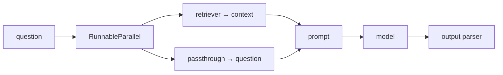

# LangChain Conventions & Patterns

LangChain is a framework for building LLM applications by **composing small, uniform
units** — models, prompts, output parsers, retrievers, tools — into pipelines. Its value
proposition is not any single feature; it is a *common interface* that lets those units
snap together and swap out (this OpenAI model for that Anthropic one, this vector store
for that one) without rewriting the surrounding code. The mental model is plumbing: you
assemble a graph of transformations, data flows through, and each stage has the same
shape as the next.

This is a conventions note — idioms, structure, and judgement calls. For API specifics,
reach for the docs (or Context7). For the framework-choice question, see
[langchain-vs-langgraph](../agentic-coding/langchain-vs-langgraph.md); for the durable
state-machine layer, [langgraph-patterns](langgraph-patterns.md). It builds on the
Python idioms in [python](python.md) and the model itself in
[large-language-models](../ai/large-language-models.md).

## The core abstraction: the Runnable

Everything composable in LangChain implements the **Runnable** interface. A Runnable is
any unit that exposes a uniform set of methods:

- `invoke(input)` — run once, sync
- `ainvoke(input)` — run once, async
- `stream(input)` — yield tokens/chunks as they arrive
- `batch(inputs)` — run many inputs, parallelised

Because every unit shares this contract, they are *interchangeable and combinable*. A
prompt template, a chat model, a parser, and a retriever are all Runnables, so a chain of
them is itself a Runnable with the same four methods. This uniformity is the whole idea:
compose freely, and streaming/async/batching come for free at every level.

## LCEL: composition via the pipe

**LangChain Expression Language (LCEL)** is the declarative, pipe-based way to wire
Runnables together. The `|` operator composes left-to-right, the way a Unix pipeline
does — the output of one stage is the input to the next.

```python
chain = prompt | model | output_parser
chain.invoke({"topic": "otters"})
```

Read it as: fill the prompt, send it to the model, parse the model's output. The
composed `chain` is a Runnable, so it streams and batches without extra code. Two more
building blocks show up constantly:

- **`RunnableParallel`** (dict form) — run several Runnables on the same input and
  collect the results into a dict. This is how you fan out, e.g. retrieve context *and*
  pass the raw question through at once.
- **`RunnablePassthrough`** — forward the input unchanged, often to keep the original
  question alongside retrieved context.



The convention: **build small chains, then compose them**. Prefer declarative LCEL over
hand-written glue code, because the declarative form is what unlocks streaming, tracing,
and parallelism uniformly.

## Chains vs. agents

Two composition styles, and the choice matters:

| | Chain | Agent |
|---|---|---|
| Control flow | Fixed, author-defined | Decided by the model at runtime |
| Predictability | High — same path every time | Lower — the model picks tools/steps |
| Use when | The steps are known in advance | The path depends on the input |

A **chain** is a deterministic pipeline you laid out. An **agent** hands control to the
model: give it tools and a goal, and it loops — reason, call a tool, observe, repeat —
until done. Modern LangChain exposes this via a prebuilt harness (`create_agent`): a
minimal, configurable loop of *model + tools + system prompt*, with middleware to shape
behaviour. This is the "Agent = Model + Harness" framing shared with
[building-effective-agents](../agentic-coding/building-effective-agents.md), whose central
advice applies here too: **don't reach for an agent when a chain will do.** A fixed
workflow is cheaper, faster, and far easier to debug.

## Retrievers and tools

- **Retrievers** are Runnables that take a query and return documents. They are the front
  half of RAG: retriever → prompt (stuffed with context) → model. Because a retriever is
  just a Runnable, it drops straight into an LCEL chain.
- **Tools** are typed functions the model may call. The convention is a clear name, a
  docstring that reads as a spec, and a typed signature — the tool's schema is what the
  model sees, so it doubles as the prompt for *when* to use it. Keep tools small and
  single-purpose; a tool that does three things is three tools.

## When LangChain helps vs. adds indirection

The most common and fair critique of LangChain is **too much abstraction**. Its layers
can hide the actual prompt and the actual API call behind several wrappers, so when
something misbehaves you are debugging the framework instead of your logic. Weigh it
honestly:

**LangChain earns its place when:**

- You genuinely swap providers or vector stores and want that to be a one-line change.
- You want streaming, async, batching, and tracing uniformly without wiring each yourself.
- You are composing many standard pieces (RAG, tool-calling, multi-step chains) and the
  shared interface saves real glue code.

**It adds indirection when:**

- The task is a single prompt-and-parse — one `client.chat()` call is clearer than a
  chain, and you own every token.
- You need precise control over the exact bytes sent to the model; wrappers can obscure it.
- You are fighting the abstraction more than the problem — a signal to drop to the raw SDK.

The boring-solution rule holds: **start with the plainest thing that works** (a direct
SDK call), and adopt LangChain when its uniform interface is paying for itself in code you
would otherwise write by hand. When control flow itself becomes complex — branches, loops,
retries, human checkpoints — that is the signal to move up to LangGraph rather than pile
more chains on top; see [langgraph-patterns](langgraph-patterns.md).

## Project structure conventions

- Keep **prompts** as named templates, separate from the wiring — they change most often.
- Keep **tools** in their own module, each a small typed function with a spec-quality
  docstring.
- Build **small named chains** and compose them, rather than one monolithic chain.
- Isolate the **model/provider config** so the swap-a-provider promise is real.
- Turn on **tracing** (LangSmith or equivalent) early — the composability that makes
  LangChain pleasant to write also makes failures opaque without a trace.

## References

- [LangChain Expression Language (LCEL)](https://python.langchain.com/docs/concepts/lcel/)
- [LangChain conceptual guide](https://python.langchain.com/docs/concepts/)
- [Runnable interface](https://python.langchain.com/docs/concepts/runnables/)
