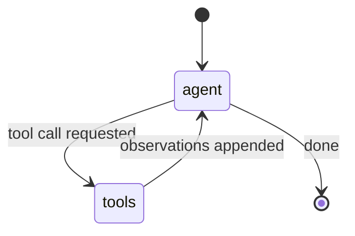

# LangGraph Conventions & Patterns

LangGraph models an agent as an **explicit, typed state machine**: a graph of nodes
connected by edges, passing a shared state object between them. Where LangChain composes
a *pipeline* (data flows one way through Runnables), LangGraph composes a *graph* — with
branches, loops, and cycles that the framework executes durably. It is a low-level
orchestration layer: it does not decide what your agent does, it gives you a rigorous way
to express and run the control flow.

This is the conventions/idioms note. The framework overview — what LangGraph is and where
it sits — lives at [langgraph](../agentic-coding/langgraph.md); the framework-choice
question is in [langchain-vs-langgraph](../agentic-coding/langchain-vs-langgraph.md); the
pipeline-composition layer is [langchain](langchain.md); and the Python idioms are in
[python](python.md). LangGraph is the concrete realisation of the ideas in
[loop-engineering](../harness-engineering/loop-engineering.md) — the agent loop made into
a first-class, inspectable object.

## The mental model: control flow as a typed graph

The core move is to stop treating the agent loop as implicit control flow buried in a
`while` loop and instead **draw it as a graph you can read, test, and resume**:

- **State** — a typed object (a `TypedDict` or Pydantic model) that every node reads and
  writes. It is the single source of truth threaded through the whole run.
- **Nodes** — functions that take the current state and return a partial update. A node is
  a step: call a model, run a tool, transform data.
- **Edges** — the wiring. A plain edge always goes A → B. A **conditional edge** routes
  based on the state (a function inspects state and returns the name of the next node),
  which is how you express branching and looping.



The classic agent is exactly this: an `agent` node (the model) and a `tools` node, with a
conditional edge that loops back to `agent` while the model keeps requesting tools and
exits when it stops. Making that loop an explicit graph — rather than implicit code — is
the whole point.

## The shared state object and reducers

State updates are not blind overwrites. Each field can declare a **reducer**: a function
that says *how* a node's update merges into the existing value. The canonical case is a
message list — you want each node to **append** to the conversation, not replace it, so
the field uses an add/append reducer:

```python
from typing import Annotated
from langgraph.graph.message import add_messages

class State(TypedDict):
    messages: Annotated[list, add_messages]   # appended, not overwritten
    result: str                                # last-write-wins (default)
```

Convention: **keep state minimal and typed.** Put only what nodes actually need to pass
between each other; overloaded state becomes as hard to reason about as a bag of globals.
Choose the reducer deliberately — append for accumulating logs/messages, last-write-wins
for scalar results.

## Durability: checkpointing

LangGraph can **checkpoint** state after every node via a checkpointer (in-memory,
SQLite, Postgres, …). This is the feature that separates it from a plain loop:

- A run that crashes or is killed **resumes from the last checkpoint** instead of starting
  over — durable execution for long or expensive agents.
- Every prior state is inspectable, giving **time-travel** debugging: rewind to a node,
  change the state, and continue.
- Threads (keyed by a thread id) give each conversation its own persisted history.

This is the same reliability instinct as [hightower-the-retry](../harness-engineering/hightower-the-retry.md):
a long agent run is a distributed operation, and it should survive a restart. Checkpointing
makes resume the default rather than an afterthought.

## Human-in-the-loop: interrupts

Because state is persisted and the graph can pause, LangGraph supports **interrupts**: a
node signals "stop and wait for a human," the run suspends at a checkpoint, and it resumes
later with the human's input folded into state. This is the idiomatic way to build
approval gates, edits, and review steps — the human is a first-class step in the graph,
not a hack bolted onto the loop.

## Subgraphs

A whole graph can be used as a **node inside another graph** — a subgraph. This is how you
compose and reuse: build a self-contained agent (its own nodes, edges, state) and drop it
into a larger orchestration as a single step. The convention mirrors good function design:
a subgraph should have a clear input/output contract with its parent's state, so it can be
reasoned about and swapped independently.

## Patterns and anti-patterns

**Patterns**

- **Make the loop explicit.** If the agent has branching, retries, or cycles, model them
  as nodes and conditional edges — not as nested `if`/`while` inside one giant node.
- **Small, single-purpose nodes.** One node, one responsibility, easy to test in isolation
  by feeding it a state and checking the update.
- **Reason about state transitions, not call stacks.** Ask "what does this node read and
  write," and the graph stays legible.
- **Checkpoint anything long-running.** Resume-on-failure should be the default posture.
- **Reach for LangGraph when control flow is the hard part** — deterministic + agentic
  steps mixed, human checkpoints, durable long runs. If it is a straight pipeline, stay in
  [langchain](langchain.md).

**Anti-patterns**

- **God node** — cramming the entire agent into one node with all the logic inside kills
  every benefit; you are back to an opaque loop.
- **Overwriting accumulating state** — forgetting a reducer and clobbering the message
  history is a classic bug; be explicit about merge semantics.
- **Bloated state** — dumping everything into the state object so nodes are implicitly
  coupled through fields they should not touch.
- **Graph for a straight line** — a linear three-step flow with no branching does not need
  a state machine; the graph is ceremony there. Use the right layer for the job.

## References

- [LangGraph low-level concepts (graph, state, nodes, edges)](https://langchain-ai.github.io/langgraph/concepts/low_level/)
- [LangGraph persistence & checkpointing](https://langchain-ai.github.io/langgraph/concepts/persistence/)
- [LangGraph human-in-the-loop](https://langchain-ai.github.io/langgraph/concepts/human_in_the_loop/)
