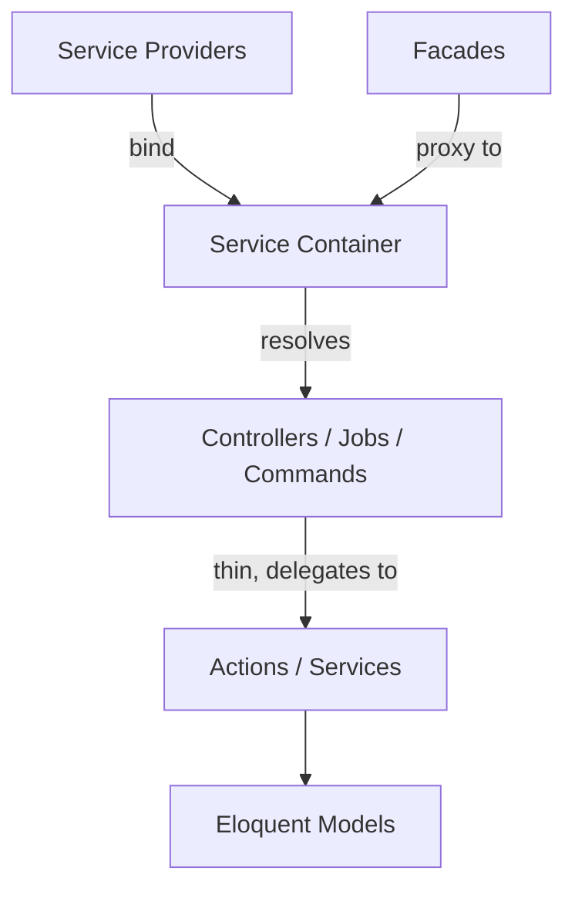

# Laravel Conventions & Philosophy

Laravel is the dominant [PHP](php.md) web framework, and its defining trait is a
relentless focus on **developer experience** — what the community calls "elegance."
Where a language like PHP is famously loose and pragmatic, Laravel layers on an
opinionated, expressive framework that makes the common path pleasant and the
idiomatic path obvious. The stated goal is to let a developer be *happy and
productive*, and that value judgement drives most of the framework's design.

## Expressive, readable syntax

Laravel optimizes for code that reads like a sentence. Fluent, chainable APIs
(`Route::get(...)->middleware(...)`, query builder chains, collection pipelines)
and higher-order collection methods (`$users->map(...)->filter(...)->pluck(...)`)
are preferred over verbose imperative loops. The aesthetic is deliberate: readable
code is maintainable code, and the framework will trade a little "magic" for a lot
of clarity at the call site.

## Convention over configuration

Like [Rails](rails.md) before it, Laravel assumes sensible defaults so you write
configuration only when you deviate. A `User` model maps to a `users` table; a
foreign key is `user_id`; a controller resolves its dependencies from the container
without wiring. You *can* override every convention, but following them means
near-zero boilerplate. This is the single biggest lever on productivity and the
thing that makes one Laravel codebase feel like the next.

## Eloquent ORM (Active Record)

Eloquent is Laravel's ORM and follows the **Active Record** pattern: each model
class *is* a table, and a model *instance* is a row that knows how to save itself.
This contrasts with the Data Mapper pattern (Doctrine, or JPA in Java) where
persistence is a separate concern.

Conventions that matter:

- **Naming.** Singular `PascalCase` model → plural `snake_case` table. Pivot tables
  are the two model names, singular, alphabetical, underscore-joined
  (`role_user`).
- **Relationships as methods.** `hasMany`, `belongsTo`, `belongsToMany`, `hasOne`,
  polymorphic morphs — declared as methods, accessed as dynamic properties.
- **Mass assignment guarding.** `$fillable` (allowlist) or `$guarded` (denylist)
  gate which attributes can be bulk-set — a deliberate security convention.
- **Eager loading** (`with(...)`) is the idiomatic answer to the N+1 query problem;
  lazy loading is the trap.
- **Casts, accessors, mutators, scopes** keep row-level logic on the model rather
  than scattered through controllers.

The tradeoff is the classic Active Record critique: models tend to grow fat and
couple domain logic to the database. The idiomatic mitigation is to push behavior
into **actions**, **services**, or **jobs** and keep controllers thin — see below.

## Artisan, the command line

`artisan` is the framework's CLI and the entry point to nearly everything:
scaffolding (`make:model`, `make:controller`, `make:migration`), running migrations,
queue workers, the scheduler, `tinker` (a REPL against the app), and custom commands.
Generators are a first-class convention — you rarely hand-create the boilerplate for
a model, migration, and factory; `artisan make:model -mf` does it.

## Service container, providers, and facades

The **service container** is an IoC/dependency-injection container at the heart of
the framework. Type-hint a dependency in a constructor or controller method and the
container resolves it automatically (autowiring). **Service providers** are the
central place to bind implementations into the container and bootstrap packages —
the framework's own features are registered the same way, so there is one mechanism
to learn.

**Facades** provide a static-looking API (`Cache::get(...)`, `Log::info(...)`) that
is actually a proxy to a container-resolved instance. They are Laravel's most
debated feature: critics argue static calls hide dependencies and hurt testability;
defenders point out facades are *swappable and mockable* (unlike true statics) and
that the readability win is real. The pragmatic convention: use facades freely in
application code, but inject dependencies in code you want to unit-test in isolation
or reuse as a library.

## The ecosystem — the "Laravel way"

A large part of Laravel's value is a batteries-included, first-party ecosystem that
defines the idiomatic solution to whole problem categories: **Breeze/Jetstream/Fortify**
(auth), **Sanctum/Passport** (API tokens/OAuth), **Horizon** (queues), **Telescope**
(debugging), **Forge/Vapor/Envoyer** (deploy), **Cashier** (billing), **Scout**
(search), **Livewire** and **Inertia** (frontend). The convention is to reach for the
official package before rolling your own; the ecosystem is coherent because one team
sets the direction.

## Testing conventions

Testing is expected, not optional. Newer Laravel defaults to **Pest** (an expressive,
function-style test runner) while **PHPUnit** remains fully supported and underlies
Pest. Conventions:

- **Feature tests** exercise the app through HTTP (`$this->get('/')->assertOk()`),
  hitting real routes, middleware, and the container — the primary testing style.
- **Unit tests** isolate a single class.
- **Model factories** and **database seeders** generate test data; `RefreshDatabase`
  resets state between tests.
- Rich, fluent assertions (`assertDatabaseHas`, `assertRedirect`, JSON structure
  assertions) match the expressive-syntax philosophy.

## Patterns & anti-patterns

- **Thin controllers, fat... elsewhere.** Controllers coordinate; business logic
  belongs in actions/services/jobs. Fat controllers are the classic anti-pattern.
- **Form Requests** for validation and authorization instead of inline validation.
- **Eager load** to kill N+1; **queue** slow work instead of blocking the request.
- **Don't fight conventions** — renaming tables/keys to non-standard forms costs you
  the zero-config benefit and confuses the next developer.

## Related

- Built on [PHP](php.md); shares convention-over-configuration DNA with
  [Rails](rails.md) (contrast: Laravel leans harder on a first-party ecosystem and
  static-facade ergonomics).

## References

- [Laravel documentation](https://laravel.com/docs)
- [Directory structure](https://laravel.com/docs/13.x/structure)
- [Eloquent: Getting Started](https://laravel.com/docs/13.x/eloquent)
- [Pest testing framework](https://pestphp.com/)
