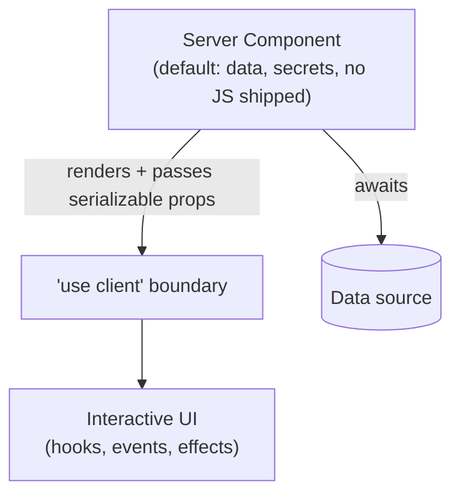

# Next.js Conventions & Philosophy

Next.js is a full-stack meta-framework built on [React](react.md): you still write
React components, but Next.js supplies routing, data fetching, rendering, bundling, and
server infrastructure so you don't assemble them yourself. Its governing philosophy is
**the framework decides so you don't** — lower-level tooling (bundler, compiler, code
splitting, caching) is auto-configured, and structure is imposed by *convention* rather
than configuration. It runs on [JavaScript](javascript.md), is idiomatically written in
[TypeScript](typescript.md), and inherits React's UI-as-a-function-of-state model while
extending it across the server/client boundary.

## Convention over configuration

The defining habit of Next.js is that **the file system is the configuration**. You do
not register routes, wire a bundler, or declare code-split points; you place files in
conventional locations and the framework infers behavior from their names and paths.
This trades flexibility for a decision you never have to make — the same bargain
[Rails](rails.md) struck for the backend, applied to the React frontend.

## File-based routing (the App Router)

The **App Router** (the modern default; the older **Pages Router** still exists and is
maintained) maps directories under `app/` to URL segments. Behavior comes from
**special files** in each segment:

- `page.tsx` — the route's UI (makes the segment publicly routable).
- `layout.tsx` — shared UI that wraps a segment and its children; persists across
  navigation and nests.
- `loading.tsx` — a Suspense fallback shown while the segment streams.
- `error.tsx` — an error boundary for the segment.
- `route.ts` — a server-side API endpoint (route handler) instead of UI.
- Dynamic segments use bracket folders (`[id]`, `[...slug]`); route groups `(group)`
  organize without affecting the URL.

```
app/
  layout.tsx          # root layout (html/body shell)
  page.tsx            # /
  blog/
    layout.tsx        # wraps all /blog/* routes
    page.tsx          # /blog
    [slug]/
      page.tsx        # /blog/:slug
      loading.tsx     # streamed fallback for the slug route
```

## Server vs client components (RSC)

The App Router is built on **React Server Components**. The mental shift: **components
are server components by default**, running only on the server, never shipping their
code to the browser. They can `await` data directly, read secrets, and hit the database
— but they cannot use state, effects, or browser event handlers.

To opt a subtree into the browser, add the `'use client'` directive at the top of a
file. That marks a **client boundary**: the component and its imported children become
interactive (hooks, event handlers, effects) and their code is shipped to the client.

Conventions that follow:

- **Push client boundaries to the leaves.** Keep interactivity in small client
  components; leave data-fetching and composition on the server. The anti-pattern is a
  `'use client'` at the top of the tree, which drags everything into the bundle.
- **Pass server-rendered content into client components as `children`/props** rather
  than importing server components inside client ones.
- Props crossing the boundary must be **serializable** (no functions except server
  actions).



## Rendering strategies

Next.js unifies what used to be separate build modes into one composable model:

- **SSG (static)** — rendered at build time, served as static HTML. The default for
  routes with no dynamic data.
- **SSR (dynamic)** — rendered per request when the route reads request-time input
  (cookies, headers, search params).
- **ISR / revalidation** — static output regenerated on a schedule or on demand
  (`revalidate`, cache tags), blending static speed with fresh data.
- **Streaming** — `<Suspense>` and `loading.tsx` let the static shell flush immediately
  while slow parts stream in. The direction of travel is **Partial Prerendering**:
  a single route serves a prerendered static shell and streams the dynamic holes.

The convention is to **default to static and opt into dynamism deliberately**, isolating
the request-dependent parts behind Suspense so the rest can still be cached.

## Data fetching, caching, and server actions

- **Fetch on the server, in the component.** Server components `await` data where it's
  used; there is no separate data-loading lifecycle. Requests dedupe automatically
  within a render.
- **Caching is explicit and opt-in** in the current model: mark cacheable work (e.g.
  `'use cache'` with a lifetime and tags) so it joins the static shell, and
  **revalidate by tag** after mutations. The mental model: static shell + cached
  dynamic content + streamed runtime content on one page.
- **Server Actions** are `async` functions marked `'use server'` that run on the server
  but are callable from client components (e.g. from a form). They replace hand-written
  API routes for mutations — the client calls a function, the server runs it, and you
  `revalidateTag`/`revalidatePath` to refresh affected caches.

## Project structure conventions

- `app/` holds routes and their colocated files; components/utilities can live beside
  the routes that use them (colocation) since only `page`/`route` files are routable.
- `public/` for static assets; `middleware.ts` for edge/request middleware.
- Config in `next.config.js`, but the point of the framework is that you rarely need it.

## The tension: RSC complexity

The server/client split is powerful but is the framework's sharpest critique. The
model asks developers to hold **two execution environments in their head at once** and
reason about where each component runs, what serializes across the boundary, and when a
value is cached versus recomputed. The caching model in particular has been a moving
target across versions, and "why is my data stale/fresh?" is a common source of
confusion. Framework-managed magic reduces boilerplate but makes the failure modes
**less legible** — the cost of "the framework decides so you don't" is that when it
decides wrong, the seams are hard to see. For an interactive-heavy app with little
server data, a plain React SPA (see
[SPA design and architecture](../web-frontend/spa-design-and-architecture.md)) can be
the simpler, more honest choice.

## Patterns and anti-patterns

- **Do** keep components on the server by default; opt into `'use client'` at the leaves.
- **Do** default to static rendering and isolate dynamic parts behind `<Suspense>`.
- **Do** use server actions for mutations and revalidate by tag.
- **Don't** put `'use client'` high in the tree — it bloats the bundle and forfeits RSC.
- **Don't** import a server component into a client component; pass it as `children`.
- **Don't** treat caching as automatic — be explicit about what's cached and revalidated.

See also [React Conventions & Mental Model](react.md), the reusable
[Learning Patterns](../web-frontend/learning-patterns.md), and
[SPA design and architecture](../web-frontend/spa-design-and-architecture.md) for when a
meta-framework is more than you need.

## References

- [Next.js documentation](https://nextjs.org/docs)
- [Rendering: Server and Client Components](https://nextjs.org/docs/app/getting-started/server-and-client-components)
- [Caching and revalidating](https://nextjs.org/docs/app/getting-started/caching)
