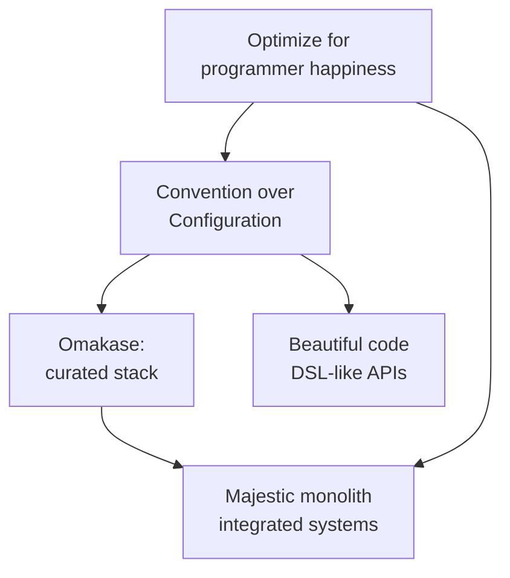

# Ruby on Rails Conventions & Doctrine

Rails is a full-stack web framework for [Ruby](ruby.md) whose staying power comes
less from any single technical feature than from a coherent set of opinions about
how software — and programmers — should work. DHH codified these opinions in *The
Rails Doctrine*. Understanding the doctrine is the fastest way to understand why
idiomatic Rails code looks the way it does: the conventions are downstream of the
philosophy.

## The doctrine: why Rails is shaped the way it is

The nine pillars, in descending order of importance:

1. **Optimize for programmer happiness.** The prime directive. Rails trades machine
   efficiency and even conceptual purity for developer joy and momentum. The
   "principle of least surprise" and expressive, near-English APIs exist to keep the
   programmer in flow.
2. **Convention over Configuration (CoC).** The single most consequential idea (see
   below). Decisions with no important reason to differ are made *for* you.
3. **The menu is omakase.** "Let the chef choose." Where CoC picks how you use one
   framework, omakase picks *which* frameworks and how they fit — Rails ships a
   curated, integrated stack (Active Record, Action Pack, Action Mailer, Hotwire,
   etc.) so newcomers eat well without being connoisseurs. You are free to swap
   components, but the default full meal is a value.
4. **No one paradigm.** Rails is not doctrinaire about OO, functional, or procedural
   style. It borrows freely — a "big tent" that resists single-paradigm zealotry.
5. **Exalt beautiful code.** Aesthetics is a first-class priority. The Active Record
   class declaration (`belongs_to`, `has_many`, `validates`) reads like a DSL but is
   plain Ruby — beauty emerges from Ruby idioms meeting CoC.
6. **Provide sharp knives.** Trust the programmer with powerful, potentially
   dangerous tools rather than babyproofing the framework.
7. **Value integrated systems.** The **majestic monolith** — Rails is optimized for
   the single, cohesive, full-stack app, not for premature decomposition into
   services. Extraction is possible but not the default aspiration.
8. **Progress over stability.** Rails evolves and occasionally breaks the past to
   keep improving.
9. **Push up a big tent.** Ideological diversity in the community over purity tests.

## Convention over Configuration in practice

Rails infers structure from names so you write almost no wiring config. This is the
convention machine most people mean by "the Rails way":

| You write | Rails infers |
| --- | --- |
| model `Project` | table `projects`, class file `app/models/project.rb` |
| `belongs_to :account` | foreign key `account_id` |
| controller `ProjectsController#show` | view `app/views/projects/show.html.erb` |
| RESTful `resources :projects` | seven standard routes/actions |

The cost of convention is that deviating is friction; the payoff is that a stranger
can navigate any Rails app because they all share the same skeleton.

## MVC and the Active Record pattern

Rails is MVC, but its **Model** layer is built on Martin Fowler's **Active Record**
pattern: a model object wraps a database row and carries both data and persistence
behavior. This is deliberate coupling of domain and persistence — the opposite of
[Hanami](hanami.md)'s repository/entity split and of the persistence-ignorant domain
models in [domain-driven design](../software-architecture/domain-driven-design.md).
It is fast to build with and pushes back when the domain grows complex.

- **Controllers** should be thin: parse params, invoke a model, render/redirect.
- **Views** use ERB (or Hotwire-friendly partials) and should hold no business logic.
- **Models** hold validations, associations, callbacks, and — historically — most
  logic.

## Fat model / skinny controller — and its discontents

The classic Rails maxim is **"fat model, skinny controller"**: keep controllers
dumb, put logic in the model. It scales poorly, because the model becomes a
god-object drowning in callbacks and mixins. The community's answers:

- **Concerns** — `ActiveSupport::Concern` modules mixed into models/controllers to
  share behavior. Useful, but easily abused as a junk drawer that hides rather than
  removes complexity.
- **Service objects / interactors, form objects, query objects, value objects, POROs**
  — plain Ruby objects that extract responsibility out of the model. This is where
  Rails meets [*Practical Object-Oriented Design in
  Ruby*](../software-engineering/practical-object-oriented-design-in-ruby.md): once
  the model has too many reasons to change, POODR's single-responsibility and
  dependency-management guidance is the corrective. Rails gives you a fast start; OO
  discipline keeps a large app maintainable.

The tension is real doctrine-vs-scale: CoC and fat models optimize the first 80% of
an app's life; deliberate object design saves the last 20%.

## Testing conventions

Rails ships Minitest and a fixtures-based test layout (`test/models`,
`test/controllers`, `test/system`), but a large share of the community prefers RSpec
with the given/when/then style (see [*Effective Testing with RSpec
3*](../software-engineering/effective-testing-with-rspec-3.md)). Conventional layers:
unit specs for models/POROs, request/controller specs for endpoints, and **system
tests** (Capybara-driven, real browser) for end-to-end flows — increasingly driving
Hotwire interactions.

## The front end: Hotwire is the default

Modern Rails answers the SPA question with [Hotwire](hotwire.md) (Turbo + Stimulus),
keeping rendering on the server and custom JavaScript minimal — the omakase choice
for the view layer, consistent with the majestic-monolith ethos.

For a hands-on tour of these conventions, [*Agile Web Development with Rails
6*](../web-frontend/agile-web-development-with-rails-6.md) walks the full MVC +
Active Record workflow.

## References

- [The Rails Doctrine](https://rubyonrails.org/doctrine)
- [Ruby on Rails Guides](https://guides.rubyonrails.org/)
