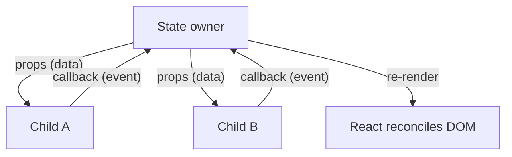

# React Conventions & Mental Model

React is not a framework so much as a **rendering discipline**: describe what the UI
should look like as a pure function of state, and let React reconcile the DOM to match.
Almost every convention below follows from that one idea. React is written in
[JavaScript](javascript.md) and is idiomatically paired with [TypeScript](typescript.md)
for typed props and state. Contrast its explicit, opt-in reactivity with [Vue](vue.md)'s
tracked reactivity and [Svelte](svelte.md)'s compiled reactivity.

## The mental model: UI = f(state)

"Thinking in React" is the canonical methodology for building a screen:

1. **Break the UI into a component hierarchy.** One component = one responsibility;
   the boundaries usually mirror the data model and the design mockup's boxes.
2. **Build a static version first** — no interactivity, props only, data flowing down.
   This forces the component tree before any state exists.
3. **Find the minimal representation of UI state.** Anything you can *compute* from
   props or other state is **not** state. Keep state DRY.
4. **Decide where each piece of state lives** — the closest common ancestor of every
   component that reads it (see *lifting state* below).
5. **Add inverse data flow** — child components call callbacks passed as props to
   request changes to state owned by an ancestor.

## Components and one-way data flow

- Components are **pure functions** of their props (and state/context). Given the same
  inputs, they render the same output and must not mutate their inputs during render.
- **Data flows down, events flow up.** Parents pass data via props; children signal
  changes by invoking callbacks. There is no two-way binding — the explicit round trip
  is the point.
- **Composition over inheritance.** React has no class-extension model for UI. Reuse is
  achieved by composing components, passing `children`, and — for logic — extracting
  **custom hooks**. If you reach for inheritance, you want composition.

## Hooks conventions

Hooks let function components hold state and side effects. Two rules are non-negotiable
(the linter enforces them because breaking them corrupts the internal hook order):

- **Only call hooks at the top level** — never inside conditionals, loops, or nested
  functions. The call order must be identical on every render.
- **Only call hooks from React functions** — components or other hooks, not plain
  functions.

Conventions that follow:

- **Custom hooks** (`useSomething`) are the primary unit of stateful-logic reuse. A
  custom hook is just a function that calls other hooks; the `use` prefix is a signal
  to readers and the linter, not magic.
- Derive, don't duplicate: compute values during render instead of storing them in
  extra state and syncing with an effect.
- Reach for `useMemo`/`useCallback` for referential stability or measured performance,
  not reflexively.

## Where state lives

- **Lift state up** to the lowest common ancestor when two components must share it.
- **Colocate state** as low as possible otherwise — state that only one subtree needs
  should live there, not at the root. Colocation limits re-render scope and keeps
  components independent.
- For cross-cutting state, escalate deliberately: local state → lifted state →
  Context → a state library. Don't jump to global state prematurely.

## Effects are an escape hatch

`useEffect` synchronizes React with **external systems** (network, subscriptions, DOM
APIs, timers) — it is *not* a general "run some code after render" hook. The most common
React anti-pattern is using effects to transform data for rendering or to react to prop
changes. If the work doesn't touch an external system, you probably don't need an
effect: compute during render, or handle it in an event handler.

## Common anti-patterns

- **Effects that derive state** — compute during render instead.
- **Mutating state directly** (`state.push(...)`) — always produce new
  objects/arrays; React compares by reference.
- **Redundant/duplicated state** that must be manually kept in sync.
- **Prop drilling** many levels deep — lift to Context or restructure.
- **Overusing `useMemo`/`useCallback`** as cargo-cult optimization.
- **Container vs presentational split as dogma.** Historically components were sorted
  into "smart" containers (data, logic) and "dumb" presentational components (markup).
  Hooks largely dissolved the need: custom hooks now carry logic into any component, so
  treat the split as an occasionally-useful pattern, not a rule.

See also the practitioner notes: [React for Real](../web-frontend/react-for-real.md) and
[Learning Patterns](../web-frontend/learning-patterns.md) for reusable component/state
patterns.

## References

- [Thinking in React](https://react.dev/learn/thinking-in-react)
- [Rules of React (incl. Rules of Hooks)](https://react.dev/reference/rules)
- [You Might Not Need an Effect](https://react.dev/learn/you-might-not-need-an-effect)
