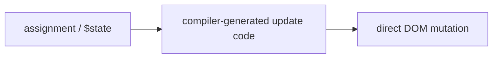

# Svelte Conventions & Philosophy

Svelte's defining bet is that the framework should be a **compiler, not a runtime**.
Where [React](react.md) and [Vue](vue.md) ship a library that interprets your components
in the browser (a virtual DOM, a reactivity engine), Svelte compiles components at build
time into small, imperative [JavaScript](javascript.md) that surgically updates the DOM.
There is no framework runtime to download and no VDOM diffing at runtime. It has
first-class [TypeScript](typescript.md) support.

## "Write less code"

The guiding aesthetic is to minimize the code the developer writes. The reasoning: bugs
scale with code volume, and boilerplate is where intent gets lost. Concretely:

- A component is a `.svelte` file with plain-looking `<script>`, markup, and `<style>` —
  no wrapper function, no `return`, no `render()`.
- Local variables *are* component state; assigning to them updates the UI. No
  `useState`, no `setState`, no `ref().value`.
- No import ceremony for reactivity primitives in classic Svelte, and minimal ceremony
  with runes.

The claim isn't merely fewer characters — it's that less code means less surface for
defects and easier change, which aligns with treating maintainability as the goal.

## Reactivity: assignment, then runes

Svelte's reactivity model has evolved:

- **Classic (Svelte 3/4):** reactivity is triggered by **assignment**. `count += 1`
  re-renders; `count = count` is even a valid way to nudge an array update. Derived
  values use the `$:` reactive-label syntax. This is compiler magic — the compiler
  instruments assignments to know what changed.
- **Runes (Svelte 5):** explicit reactivity primitives — `$state`, `$derived`,
  `$effect`, `$props`. Runes make reactivity a visible signal rather than implicit
  compiler behavior, which scales to reactive logic *outside* components (`.svelte.js`
  modules) and removes the "why did assignment not update?" footguns.

The through-line across both: the reactivity cost is paid at **compile time**, so the
runtime does the minimum necessary work.

## Stores

For state shared across components, Svelte provides **stores** — objects with a
`subscribe` contract. The `$store` auto-subscription syntax in markup means you read a
store value with a leading `$` and Svelte handles subscribe/unsubscribe. Runes
(`$state` in a shared module) increasingly cover the same ground with less indirection.

## Scoped styles by default

`<style>` in a component is **scoped automatically** — the compiler rewrites selectors
with a component-unique hash so styles can't leak. This is a default, not an opt-in, and
it removes an entire class of CSS-collision problems without a naming methodology.

## Conventions and idioms

- **Minimal boilerplate** is the house style: prefer the platform and the language over
  abstractions.
- **Component = file**; markup, logic, and scoped style colocated (like [Vue](vue.md)
  SFCs).
- **Props** are declared and (in runes) destructured via `$props()`; data flows down,
  events/callbacks flow up.
- Lean on the compiler's warnings — they catch accessibility and reactivity mistakes at
  build time.

## References

- [Svelte docs — overview](https://svelte.dev/docs/svelte/overview)
- [What are runes?](https://svelte.dev/docs/svelte/what-are-runes)
- [Write less code (blog)](https://svelte.dev/blog/write-less-code)
