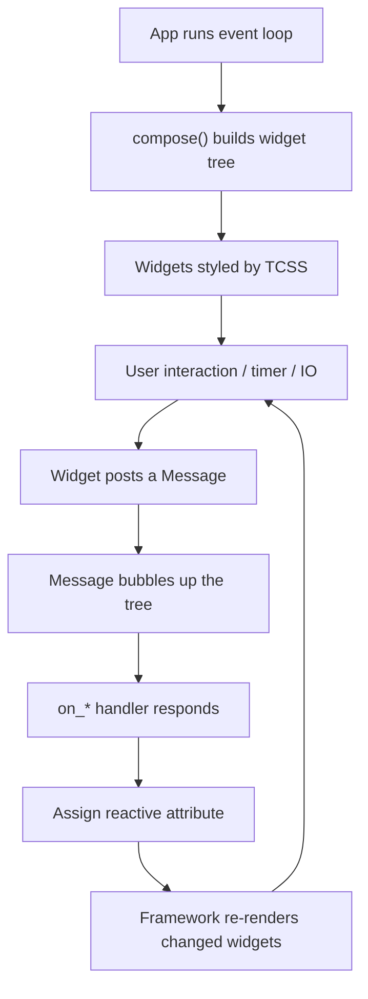

Textual is a Python framework for building sophisticated text user interfaces (TUIs)
that run in the terminal — and, unchanged, in a web browser. It comes from Textualize,
authored by the same person behind [Rich](python.md), and it inherits Rich's rendering
philosophy: the terminal is a capable rendering target, not a fallback. Where Rich
paints static output, Textual adds a full application runtime — an event loop, a widget
tree, styling, and reactivity — so the mental model is much closer to a modern web/GUI
framework than to a print-loop CLI.

## The mental model

A Textual program is an **application** made of **widgets** arranged on **screens**,
driven by an async event loop. You do not write an imperative "read input, redraw"
loop; you declare structure, attach styling, and respond to events. The framework owns
the loop, diffs the widget tree, and repaints only what changed.

The core conventions:

- **`App` / `Widget` / `Screen`.** `App` is the root object you run. `Widget`s are the
  composable UI units (a button, an input, a data table, or your own subclass).
  `Screen`s are full-window layers you push and pop like a navigation stack — modals,
  wizards, and distinct "pages" are screens, not ad-hoc state flags.
- **`compose()` builds the tree.** Instead of imperatively appending children, you
  define a `compose()` method that *yields* child widgets. The framework consumes that
  generator to build the layout. Composition is declarative: the method describes what
  the UI *is*, not the steps to assemble it.
- **Reactive attributes.** State lives in `reactive()` attributes on widgets. Assigning
  to a reactive automatically schedules a re-render and can fire watcher methods
  (`watch_<name>`). This is the same "state changes, UI follows" contract as reactive
  web frameworks — you mutate data, not the screen.
- **Async-first.** The runtime is built on `asyncio`. Handlers may be `async def`, so
  network calls, timers, and long work integrate without blocking the UI. Background
  work is scheduled as workers rather than threads you manage by hand.

## TCSS: styling separated from logic

Textual's signature convention is **TCSS** (Textual CSS) — a CSS-like language for
styling the terminal. Layout, color, spacing, borders, and docking live in `.tcss`
files (or a `CSS` string), keyed by widget type, id (`#name`), and class (`.name`),
exactly like web CSS. This enforces a clean separation: Python defines *behavior and
structure*, TCSS defines *appearance and layout*. You restyle an app without touching
its logic, and layout is expressed declaratively (flex-like containers, docking,
grids) rather than by manual coordinate math.

## Messages and event handlers

Widgets communicate by **passing messages**, not by calling each other directly. A
button posts a `Button.Pressed` message; it bubbles up the widget tree until something
handles it. The convention for handling is the **`on_` handler**: a method named
`on_button_pressed` (snake_case of the message class) is auto-dispatched when that
message arrives. This keeps widgets decoupled — a child announces *what happened*, and
an ancestor decides *what to do* — which is the same loosely-coupled, event-driven
discipline that keeps larger UIs maintainable.

## Why the conventions matter

The payoff of these idioms is that a TUI stops being a special, hard-to-maintain corner
of the codebase. Declarative `compose()`, external TCSS, reactive state, and message
bubbling are the same separation-of-concerns patterns that make web front ends
manageable — applied to the terminal. The "run in the browser too" capability falls out
of the same architecture: because the app is a declarative tree over an abstract
renderer, the terminal is just one backend.

Textual pairs naturally with [Python](python.md) CLI tooling — a [Typer](typer.md) app
can launch a Textual interface for its richer, interactive commands, giving the same
program both a scriptable CLI surface and a full-screen UI.

## References

- [Textual documentation](https://textual.textualize.io/)
- [Textualize/textual on GitHub](https://github.com/textualize/textual)
