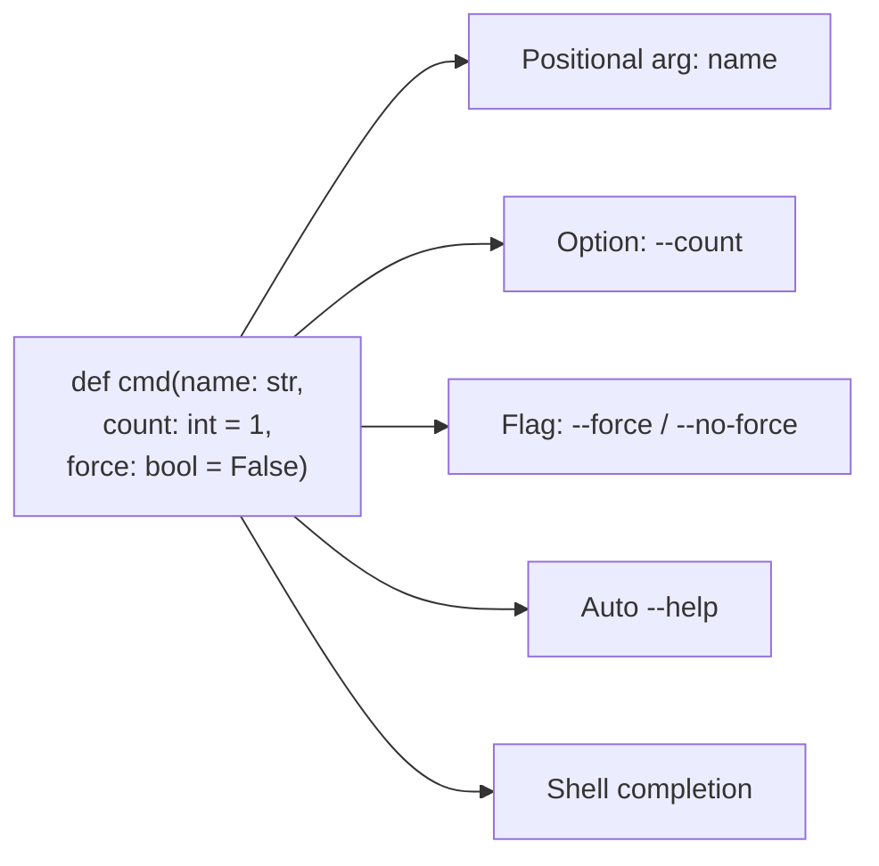

# Typer Conventions & Philosophy

Typer is a library for building command-line applications, from the author of
[fastapi.md](fastapi.md), and it carries the same governing idea into a different domain:
**type hints define the interface**. Where FastAPI turns annotated function signatures into
an HTTP API, Typer turns them into a CLI. You declare parameter types once, in standard
[python.md](python.md), and Typer derives argument parsing, validation, help text, and
shell completion. Its tagline captures the two audiences it optimizes for: CLIs that
*users love using* and developers *love creating*.

## Type hints define the CLI

A command is an ordinary Python function. Its parameters become the CLI's arguments and
options, and their annotations do the work:

- a positional parameter with a type (`total: int`) becomes a **CLI argument**, type-checked
  and coerced;
- a parameter with a default becomes a **CLI option** (`--name`);
- a `bool` becomes a **flag** (`--force` / `--no-force`);
- `Path`, `enum`, and file types map to path handling, choices, and file arguments.

You declare the types **once**, as function parameters, and get — for you — editor
completion and type checks everywhere, and — for your users — automatic `--help` and
shell auto-completion (Bash, Zsh, Fish, PowerShell). There is no separate parser-config
DSL to learn; the function signature *is* the specification.

## Commands as functions, apps by composition

The unit is the function. For a single-command tool you can hand a function straight to
`typer.run(...)`. For a multi-command tool you create a `typer.Typer()` app and register
commands with the `@app.command()` decorator — each decorated function is a subcommand.
**Subcommand groups** are built by *composition*: create nested `Typer()` apps and mount
them with `app.add_typer(sub_app, name="...")`, producing `tool group subcommand` command
trees. This mirrors FastAPI's `APIRouter` composition — small pieces assembled into a tree
rather than one monolithic dispatcher.

## The shared philosophy: types drive everything

Typer and FastAPI are two applications of one conviction: **standard Python type hints are
enough of a declarative language to generate the machinery around them.** The developer
declares intent (the types); the framework supplies parsing, validation, documentation,
and tooling. The consequences are consistent across both: less boilerplate, fewer
mistakes (the editor catches them), less time reading docs, and generated artifacts
(OpenAPI for FastAPI, `--help`/completion for Typer) that can never drift from the code
because they *are* derived from the code.

## CLI UX conventions

Because it is built on Click, Typer inherits solid CLI ergonomics and adds rich defaults:
colored help, clear error messages, and automatic completion install. Conventions worth
following:

- Give every command a concise docstring — it becomes the `--help` description.
- Use `typer.Argument(...)` / `typer.Option(...)` (via `Annotated`) to attach help text,
  defaults, validation, and prompts without abandoning the type-driven model.
- Prefer explicit exit codes via `typer.Exit(code=...)`; print user-facing output with
  `typer.echo` / `rich` rather than bare `print` so it composes with completion and colors.
- Keep commands thin — parse and delegate to library code — so the same logic is testable
  and reusable outside the CLI.

## Contrast: Typer vs. Viper

Typer sits in a different tradition from Go's [cobra.md](cobra.md). Typer is a
*type-hint-driven command/argument layer* for Python — its job is defining commands and
parsing their inputs. Viper is a *configuration layer* for Go CLIs (usually paired with
Cobra for the command layer): it merges config from files, environment variables, flags,
and remote stores into a precedence-ordered whole. The philosophies barely overlap — Typer
generates the interface from Python's own type system and declares as little as possible;
Viper is explicit, imperative Go configuration plumbing with a defined override hierarchy.
The comparison is a study in how a language's idioms (Python's annotations vs. Go's
explicit, minimal-magic style) shape the tools built for it.

## Testing conventions

Typer provides `CliRunner` (via `typer.testing`) to invoke commands in-process and assert
on exit codes, stdout, and stderr — no subprocess spawning. Because commands are ordinary
functions delegating to library code, the strongest convention is to test the underlying
functions directly and use `CliRunner` only for the thin argument-parsing/UX layer.

## References

- [Typer documentation](https://typer.tiangolo.com/)
- [Typer — First Steps / philosophy](https://typer.tiangolo.com/tutorial/first-steps/)
- [FastAPI features (shared type-driven design)](https://fastapi.tiangolo.com/features/)
