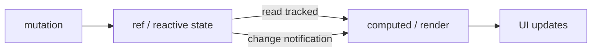

# Vue Conventions & Style Guide

Vue's philosophy is the **progressive framework**: you can adopt it as a sprinkle of
reactivity on an existing page or scale it up to a full single-page app, and the
conventions grow with you. It is written in [JavaScript](javascript.md) and ships
first-class [TypeScript](typescript.md) support. Compared with [React](react.md), Vue
tracks reactivity *automatically* rather than requiring explicit state setters, and it
leans on a template dialect of HTML rather than JSX.

## The official Style Guide (priority tiers)

Vue is unusual in publishing an official, opinionated style guide organized by how much
the rule matters. This tiering is the convention:

| Priority | Meaning | Examples |
|----------|---------|----------|
| **A — Essential** | Prevents errors | Multi-word component names; `key` on `v-for`; avoid `v-if` with `v-for` on the same element; component `data` must be a function |
| **B — Strongly Recommended** | Readability | One component per file; PascalCase filenames; base/single-instance/tightly-coupled naming conventions; ordered attributes |
| **C — Recommended** | Consistency | Consistent option ordering; element-attribute order |
| **D — Use with Caution** | Potentially dangerous | `v-if`/`v-else` without `key`; scoped-selector escape hatches; implicit parent-child communication |

The point isn't to memorize the list — it's that Vue treats convention as a first-class,
versioned artifact, so teams inherit a shared baseline.

## Single-file components (SFCs)

The idiomatic unit is the `.vue` **single-file component**: `<template>`, `<script>`,
and `<style>` colocated in one file. `<style scoped>` scopes CSS to the component by
adding data attributes — no naming discipline required. This colocation of markup,
logic, and style is Vue's answer to separation of concerns: separate by *component*, not
by *language*.

## Composition API vs Options API

Two ways to author component logic:

- **Options API** — organize by *option type*: `data`, `methods`, `computed`, `watch`,
  lifecycle hooks. Approachable, class-like, good for smaller components and learners.
- **Composition API** (`<script setup>`) — organize by *logical concern*. State and the
  functions that operate on it sit together, and reusable logic factors out into
  **composables** (functions named `useX`, Vue's analogue to React's custom hooks).

Convention: Composition API scales better for large components and logic reuse; Options
API remains fully supported. Teams typically standardize on one. Both compile to the
same runtime.

## Reactivity model

Vue's reactivity is **automatic dependency tracking**. `ref()` and `reactive()` wrap
values in proxies; any computed value or effect that reads them is re-run when they
change — you mutate normally and Vue notices.

This is the key contrast with [React](react.md): no `setState`, no immutable-update
discipline, no dependency arrays. The tradeoff is that the reactivity is "magic" you
must understand (e.g. `.value` on refs, losing reactivity when destructuring a
`reactive` object).

## Data down, events up

Like React, Vue enforces **one-way data flow**: props flow down (and are read-only in
the child), and children communicate up by **emitting events** (`defineEmits` /
`$emit`). `v-model` is syntactic sugar over a prop + event pair, so even "two-way
binding" is the same down/up contract underneath. Mutating a prop is an anti-pattern.

## Project structure conventions

- One component per file; components in `components/`, route-level views in `views/` (or
  `pages/`).
- **Base components** (presentational, app-wide) share a prefix like `Base` or `App`.
- **Single-instance components** that only ever exist once share a `The` prefix.
- Composables live in `composables/`; global state in a store (Pinia is the current
  standard).

## References

- [Vue Style Guide](https://vuejs.org/style-guide/)
- [Composition API FAQ](https://vuejs.org/guide/extras/composition-api-faq.html)
- [Reactivity in Depth](https://vuejs.org/guide/extras/reactivity-in-depth.html)
