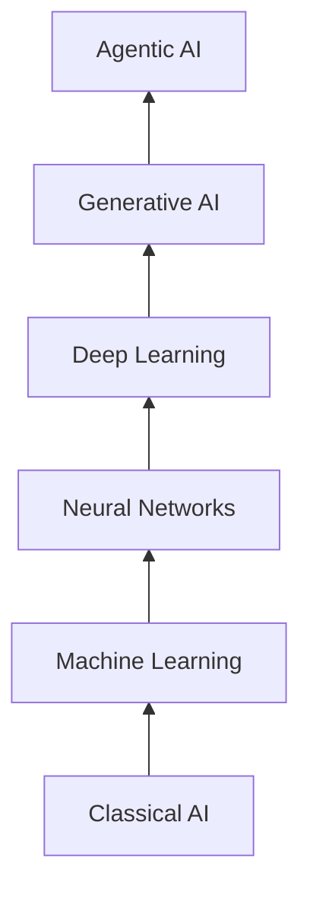

# Layers of AI

A stacked taxonomy (GenAI.works) putting AI into six layers, foundation at the bottom,
each built on the one below.

| Layer (bottom → top) | Contains |
|---|---|
| Classical AI | Symbolic AI, expert systems, knowledge representation, logic & reasoning |
| Machine Learning | Supervised, unsupervised, classification, reinforcement learning, regression |
| Neural Networks | Perceptrons, cost functions, backpropagation, activation functions, hidden layers |
| Deep Learning | Transformers, LSTMs, RNNs, CNNs, autoencoders |
| Generative AI | LLMs, diffusion models, multimodal models, VAEs |
| Agentic AI | Memory, planning, tool use, autonomous execution |

## The stack

## Cross-links

Same "each layer stands on the one below" framing as [The AI Learning Ladder](ai-learning-ladder.md),
but organized by *technique family* rather than *learning order*. Note the ordering
differs: here Neural Networks sit below Deep Learning as a distinct rung.
