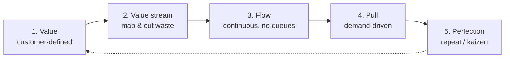

# Lean Thinking

James P. Womack and Daniel T. Jones (first ed. 1996; revised 2003). The book that
generalized the Toyota Production System into five principles any organization can
apply, coining much of the vocabulary — *value stream*, *muda* (waste) — that lean
practice now takes for granted. The premise: define value from the customer's point
of view, then relentlessly strip out everything that doesn't create it.

## The five principles

1. **Value** — Specify value precisely, as the *end customer* defines it, for a
   specific product. Value is not what's easy for you to make or what your
   departments are organized around; it's what the customer will actually pay for.
2. **Value stream** — Map every step required to bring that product from concept to
   customer. Each step is one of three kinds: creates value, creates no value but is
   currently unavoidable (type-one *muda*), or creates no value and can be removed
   now (type-two *muda* — eliminate immediately).
3. **Flow** — Make the value-creating steps flow continuously. Abandon
   batch-and-queue and department silos; a product should move without stopping,
   waiting, or piling up in inventory between steps.
4. **Pull** — Let the customer *pull* value from you: produce only what is needed,
   when it's needed, signaled by actual downstream demand. Nothing is made "just in
   case." Pull replaces forecast-driven overproduction.
5. **Perfection** — Repeat the cycle. As value, stream, flow, and pull improve,
   hidden waste becomes visible and new targets appear. Perfection is the
   asymptote — the point of continuous improvement (*kaizen*) is the pursuit, not an
   endpoint.

## Why it matters

Lean Thinking is the intellectual source upstream of the software-delivery ideas
elsewhere in HAL. [Accelerate](accelerate.md) explicitly draws on lean product
management (small batches, fast feedback) and Womack/Jones are among its
influences. [Toyota Kata](toyota-kata.md) supplies the daily *practice routine* for
pursuing the perfection principle. The waste-elimination lens also motivates the
toil-reduction discipline in
[Site Reliability Engineering](site-reliability-engineering.md), and lean's
customer-value framing runs through [Effective DevOps](effective-devops.md).

## References

- [Lean Thinking and Practice — Lean Enterprise Institute](https://www.lean.org/lexicon-terms/lean-thinking/)
