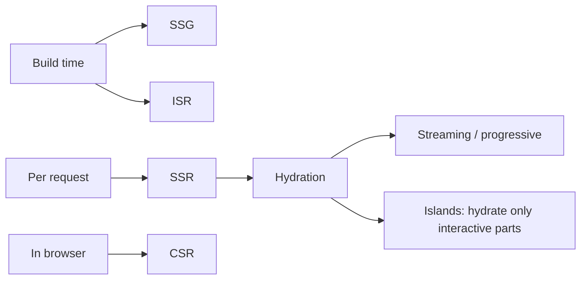

# Learning Patterns (patterns.dev)

A field guide by Lydia Hallie and Addy Osmani to the patterns that shape modern
front-end web development. It reframes classic software design patterns for an
ES2015+ and React world, then extends the survey into how apps are *rendered* and
how they *perform*. It treats React as the running example — components, props,
state, and Hooks — because React's popularity reshaped which patterns still earn
their keep and which have been rewritten. The value is the map: three families of
patterns and where each fits.

## Family 1 — Design patterns in modern JavaScript / React

Classic patterns updated for ES modules, closures, and React composition. Each is a
reusable solution to a recurring structural problem, not a piece of library code.

- **Singleton** — one shared instance across the app; useful for shared state, risky
  as a global that couples everything together.
- **Proxy** — intercept and control access to an object (validation, logging, lazy
  work), often via the JavaScript `Proxy`/`Reflect` API.
- **Provider** — push data down a tree without prop-drilling; in React this is Context.
- **Prototype** — share behavior across instances through the prototype chain instead
  of copying methods onto every object.
- **Container / Presentational** — split *how things work* (data, logic) from *how
  things look* (markup), a separation Hooks have since softened.
- **Hooks** — reuse stateful logic across function components; often replaces class
  lifecycles, HOCs, and render props.
- **Higher-Order Component (HOC)** — a function that wraps a component to inject shared
  behavior; a composition tool that predates Hooks.
- **Render Props** — pass a render function as a prop so a component shares logic while
  the caller controls markup.
- **Observer** — subjects notify subscribers on change; the backbone of reactive/event
  systems.
- **Module** — encapsulate and expose a controlled public surface, native via ES modules.
- **Mixin** — layer reusable behavior onto objects/classes without inheritance.
- **Mediator** — route communication through a central hub so components don't reference
  each other directly, reducing coupling.

These build on the JavaScript language mechanics — closures, prototypes, modules —
surveyed in [JavaScript: The Good Parts](javascript-the-good-parts.md), and are the
component-level patterns applied in practice in [React for Real](react-for-real.md).

## Family 2 — Rendering patterns

How and where markup gets produced and made interactive. The tradeoff running through
all of them is time-to-content versus time-to-interactive versus server cost.

- **Client-Side Rendering (CSR)** — browser downloads JS and renders; fast navigation
  after load, but slow first paint and weak for SEO.
- **Server-Side Rendering (SSR)** — HTML built per request on the server; fast first
  paint, higher server cost, then hydrated on the client.
- **Static Site Generation (SSG)** — HTML built once at build time; cheapest and fastest
  to serve, but stale until the next build.
- **Incremental Static Regeneration (ISR)** — SSG that re-generates pages on a schedule
  or on demand, blending static speed with fresher content.
- **Progressive / Streaming Hydration** — stream HTML and hydrate it in pieces so the
  page becomes interactive incrementally instead of all at once.
- **Islands** — ship mostly static HTML with small isolated interactive "islands,"
  hydrating only the pieces that need JavaScript.

The rendering-model tradeoffs here are the architectural core of
[Single-Page Application Design and Architecture](spa-design-and-architecture.md).

## Family 3 — Performance patterns

Techniques to ship less JavaScript, ship it later, and ship it in the right order —
mostly build-tooling and loading strategies.

- **Code splitting** — break the bundle into chunks loaded on demand (by route or
  component) instead of one large download.
- **Tree shaking** — drop unused exports at build time so dead code never ships.
- **Bundling** — combine modules into optimized artifacts for delivery.
- **Preload / Prefetch** — hint the browser to fetch critical resources early
  (`preload`) or likely-next resources during idle time (`prefetch`).
- **List virtualization** — render only the rows currently visible in a long list,
  recycling DOM nodes as the user scrolls.
- **Import on interaction** — defer loading a component's code until the user actually
  interacts with it (click, hover).
- **Import on visibility** — defer loading until an element scrolls into view, via
  `IntersectionObserver`.

## References

- [patterns.dev](https://www.patterns.dev/) — Lydia Hallie & Addy Osmani (CC BY-NC 4.0)
