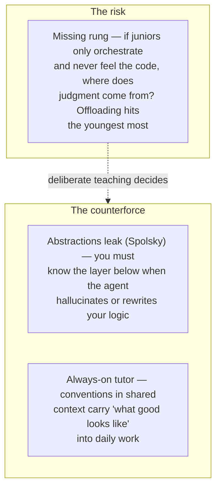

# Learning the Craft

How do you learn to engineer when the **agent writes the first draft?** The
craft doesn't disappear — **it inverts:** systems thinking, debugging, reading
code, and judgment matter **more**, while raw syntax recall matters **less**.

Across ~400,000 Claude Code sessions, success tracked **domain expertise, not
coding background** — "expert" sessions reached verified success **more than
twice** as often as "novice" ones (echoing
[agentic coding vs AI engineering](agentic-coding-vs-ai-engineering.md)). So a
curriculum for the AI era teaches **diagnosing and reviewing as much as
writing**, and uses the agent to learn *faster* rather than to *skip* learning —
treating its output *"like an inexperienced intern: verify everything"* (Osmani).

## Two forces pulling against each other

Which wins depends on **how deliberately you teach.**

- **The worry — a missing rung.** If juniors only orchestrate agents and never
  feel the code underneath, where does judgment come from? The grunt work that
  built intuition is exactly what agents absorb. Fournier: *"how do people become
  'senior engineers' if they don't start out as junior ones?"* Majors: skipping
  junior training is *"cannibalizing our own future."* Skill atrophies through
  **cognitive offloading** — an effect that "always affects the youngest the
  most." (The learning-side face of [comprehension debt](comprehension-debt.md).)
- **But the abstraction leaks.** Moving up a layer is the craft's normal arc
  (assembly → frameworks → agents), and good developers always know enough of the
  layer *below*. Spolsky's **law of leaky abstractions** holds: when the agent
  hallucinates or quietly rewrites your logic, you must know what's really
  happening underneath. **Fundamentals still have to be taught.**
- **AI makes teaching them more accessible.** A junior now has an **always-on
  tutor** inside the work. When a team's conventions and good patterns live in
  the agent's [shared context](context-engineering.md) (`AGENTS.md`, rules,
  worked examples), its suggestions carry *"what good looks like"* into the
  day-to-day — easier to absorb than hunting through a wiki.

## The takeaway

The craft survives by **inverting, not vanishing** — and juniors are the group
most exposed to getting it wrong. Teach the fundamentals *through* the agent
(active, question-driven use), don't let it become a rung-skipping crutch.

## Related

- [Comprehension Debt](comprehension-debt.md) — the individual-skill version of
  the same atrophy risk.
- [From Coder to Orchestrator](from-coder-to-orchestrator.md) — the role shift
  that removes the free-from-typing learning.
- [The AI Learning Ladder](ai-learning-ladder.md) — a concrete skills roadmap.

## References
- [Learning the Craft — Tessl Patterns](https://tessl.io/patterns/changing-roles/learning-the-craft/)
