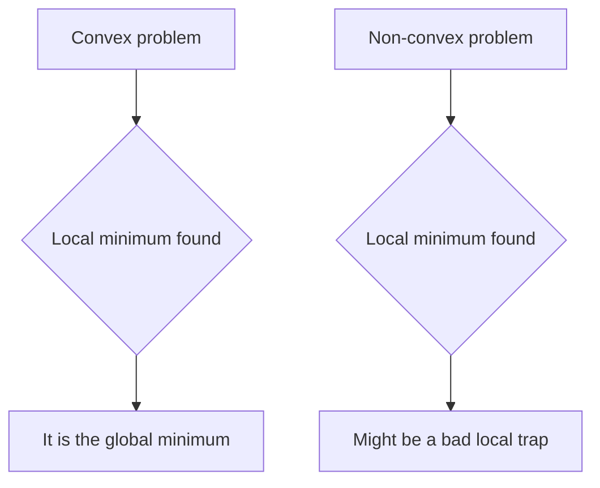

# Convex Optimization

Convex optimization is the study of minimizing a convex function over a convex set. It is the
sharp dividing line in [optimization](optimization-problems.md) between problems we can solve
reliably and at scale, and problems where we settle for local guesses. The reason is a single
structural fact: in a convex problem, **every local minimum is a global minimum**. There are
no false valleys to get trapped in, so a method that keeps going downhill until it can go no
further has found *the* answer, not merely *an* answer.

## Convex sets

A set $C \subseteq \mathbb{R}^n$ is **convex** if the line segment between any two of its
points stays inside it: for all $x, y \in C$ and $\theta \in [0,1]$,

$$ \theta x + (1-\theta) y \in C. $$

Half-spaces, hyperplanes, balls, ellipsoids, and their intersections are all convex.
Polyhedra — the feasible regions of [linear programs](linear-programming.md), defined by
finitely many linear inequalities — are the canonical example. Convexity is preserved under
intersection, so building a feasible region by piling on convex constraints keeps it convex.

## Convex functions

A function $f: \mathbb{R}^n \to \mathbb{R}$ is **convex** if its domain is convex and it lies
below its chords:

$$ f(\theta x + (1-\theta) y) \le \theta f(x) + (1-\theta) f(y). $$

Geometrically the graph curves upward — a bowl, never a saddle or a wave. If $f$ is twice
differentiable, convexity is equivalent to the **Hessian** $\nabla^2 f$ being positive
semidefinite everywhere (see [linear algebra](../math/linear-algebra.md) for definiteness,
and [multivariable calculus](../math/multivariable-calculus.md) for the Hessian). The
one-variable intuition — nonnegative second derivative means the slope only increases — lifts
directly to many dimensions.

## Why convexity is the whole game

The payoff is a theorem worth memorizing: **for a convex objective over a convex set, any
local minimum is global.** The proof is short — if a nearby point were strictly better, the
segment toward it would (by convexity) descend, contradicting local optimality. Combined with
the [KKT conditions](lagrange-multipliers-and-kkt.md), this means a point satisfying first-order
optimality conditions is not just a candidate but the certified solution. This is why a plain
[gradient method](gradient-descent-and-first-order-methods.md) that only ever moves downhill
can be *trusted* on a convex problem, and why we can prove convergence rates rather than merely
hope for them.

## The convex hierarchy

Convex programs form a ladder of increasing generality, each solvable by mature
interior-point methods in polynomial time:

- **LP (linear program)** — linear objective, linear constraints. See
  [linear programming](linear-programming.md).
- **QP (quadratic program)** — convex quadratic objective, linear constraints. Least squares
  and SVM training live here.
- **SOCP (second-order cone program)** — constraints of the form
  $\lVert Ax + b \rVert_2 \le c^\top x + d$. Captures robust least squares and many robust
  designs.
- **SDP (semidefinite program)** — optimizes over matrices constrained to be positive
  semidefinite. The most general of the common classes; underlies relaxations of hard
  combinatorial problems.

Each level contains the ones above it. The practical skill is **recognizing** or
**reformulating** a problem into one of these classes — once you can, off-the-shelf solvers
handle the rest.

## Tractability

The deep lesson from [Boyd & Vandenberghe](boyd-vandenberghe-convex-optimization.md) is that
the meaningful frontier is **convex vs. non-convex**, not linear vs. nonlinear. Convex
problems admit efficient, globally optimal, certifiable solutions; general non-convex problems
(see [nonlinear and numerical optimization](nonlinear-and-numerical-optimization.md) and
[integer optimization](integer-and-combinatorial-optimization.md)) do not. [Duality](duality.md)
adds a bonus: convex problems come with certificates of optimality (the dual bound meets the
primal value), so a solver can *prove* it is done.

## Why it matters for AI

Convexity is the bedrock of classical [machine learning](../ai/machine-learning.md). Linear and
logistic regression, support vector machines, LASSO and ridge
[regularization](../ai/generalization-and-regularization.md), and many
[estimation](../statistics/estimation.md) procedures are convex programs with unique global
optima — you get the same answer every run, no seed-dependence. [Deep learning](../ai/deep-learning.md)
is famously *non-convex*, yet convex theory still frames the discussion: we understand deep
optimization largely by contrast with the convex ideal, and convex sub-steps (proximal
operators, trust regions, per-layer least squares) recur throughout. Knowing what convexity
buys you is knowing what you give up when you leave it.

## References

- [Convex Optimization](boyd-vandenberghe-convex-optimization.md) — Boyd & Vandenberghe
- [Numerical Optimization](nocedal-wright-numerical-optimization.md) — Nocedal & Wright
- [Algorithms for Optimization](kochenderfer-algorithms-for-optimization.md) — Kochenderfer & Wheeler
