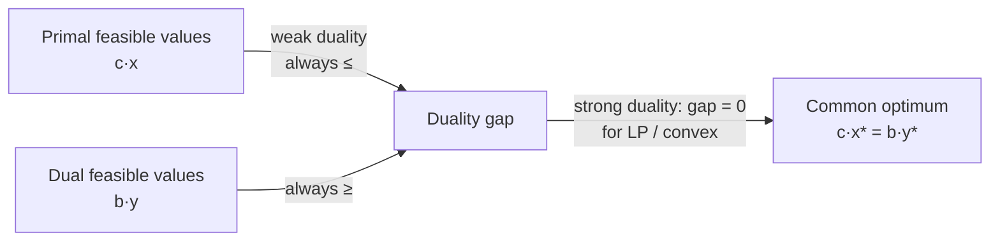

# Duality

**Duality** is the deep and useful fact that every optimization problem has a shadow twin.
Attached to any [linear-programming.md](linear-programming.md) problem — call it the
**primal** — is a second LP, the **dual**, built from the same data but "transposed": the
primal's constraints become the dual's variables and vice versa. Solving one solves the
other, and the relationship between them yields optimality certificates, economic prices, and
sensitivity information. Duality is arguably the most important idea in
[linear-programming.md](linear-programming.md) and it generalizes, via the Lagrangian, to all
of [convex-optimization.md](convex-optimization.md).

## The primal and its dual

Take a primal in the form

$$
\max_{\mathbf{x}}\; \mathbf{c}^\top \mathbf{x} \quad\text{s.t.}\quad A\mathbf{x} \le \mathbf{b},\; \mathbf{x} \ge \mathbf{0}.
$$

Its **dual** introduces one variable $y_i$ per primal constraint and reads

$$
\min_{\mathbf{y}}\; \mathbf{b}^\top \mathbf{y} \quad\text{s.t.}\quad A^\top \mathbf{y} \ge \mathbf{c},\; \mathbf{y} \ge \mathbf{0}.
$$

The transformation is mechanical: a maximization becomes a minimization, the constraint
right-hand side $\mathbf{b}$ becomes the dual objective, the objective $\mathbf{c}$ becomes
the dual right-hand side, and $A$ is transposed. Taking the dual of the dual returns the
primal — duality is an involution.

## Weak and strong duality

Two theorems bind the pair together.

- **Weak duality.** For *any* primal-feasible $\mathbf{x}$ and *any* dual-feasible
  $\mathbf{y}$, $\mathbf{c}^\top\mathbf{x} \le \mathbf{b}^\top\mathbf{y}$. Every feasible dual
  solution is an upper bound on the primal optimum (and every feasible primal is a lower
  bound on the dual). This holds always, even for hard non-linear problems, and is what makes
  duality a source of *bounds* — the engine behind branch-and-bound for
  [integer-and-combinatorial-optimization.md](integer-and-combinatorial-optimization.md).
- **Strong duality.** For LPs (and any convex problem meeting a mild constraint
  qualification), the two optima are *equal*: $\mathbf{c}^\top\mathbf{x}^\* =
  \mathbf{b}^\top\mathbf{y}^\*$. The bounds meet. This means a matching primal-dual pair is a
  **certificate of optimality** — you can *prove* a solution is optimal by exhibiting a dual
  solution of equal value, exactly what the [simplex-method.md](simplex-method.md) produces on
  termination.

## Complementary slackness

At an optimal primal-dual pair, a precise pairing links the two solutions:

> **For each constraint/variable pair, at least one of the two is "tight."** A dual variable
> $y_i > 0$ forces its primal constraint to bind exactly ($A_i\mathbf{x} = b_i$); a primal
> constraint with slack ($A_i\mathbf{x} < b_i$) forces its dual variable $y_i = 0$. The same
> holds with primal variables and dual constraints.

**Complementary slackness** is the algebraic heart of optimality — the
[lagrange-multipliers-and-kkt.md](lagrange-multipliers-and-kkt.md) conditions are exactly this
statement generalized to nonlinear convex problems, with the dual variables playing the role
of Lagrange multipliers.

## Shadow prices and the economic reading

The dual variables are not just bookkeeping — they are **shadow prices**. Each $y_i^\*$ is the
marginal value of the $i$-th resource: how much the optimal objective would improve if
constraint $i$'s budget $b_i$ were relaxed by one unit. If labor-hours have a shadow price of
\$4, then a one-hour increase in the labor budget is worth \$4 of extra profit — and it is
never worth paying more than \$4 to acquire another hour. This is why duality is central to
[../economics/index.md](../economics/index.md): the dual solution *prices the constraints*,
turning an allocation problem into a market. Complementary slackness then says a resource has
positive price only when it is fully used, and a slack (surplus) resource is free at the
margin — the mathematical statement of scarcity determining value.

## Lagrangian duality

Beyond LP, duality is obtained by forming the **Lagrangian**
$\mathcal{L}(\mathbf{x}, \mathbf{y}) = f(\mathbf{x}) + \sum_i y_i g_i(\mathbf{x})$, folding
the constraints into the objective with multipliers $y_i$
([lagrange-multipliers-and-kkt.md](lagrange-multipliers-and-kkt.md)). Minimizing over
$\mathbf{x}$ for fixed $\mathbf{y}$ gives the **dual function**, whose maximization over
$\mathbf{y} \ge 0$ is the dual problem. Weak duality always holds; strong duality holds for
convex problems under a constraint qualification (Slater's condition). LP duality is just this
construction applied to linear $f$ and $g$.

## Canonical example

Recall the factory: maximize $3x_A + 5x_B$ subject to labor $x_A + 2x_B \le 40$ and material
$x_A + x_B \le 30$. Its dual assigns a price $y_1$ to labor and $y_2$ to material and *minimizes*
$40y_1 + 30y_2$ subject to $y_1 + y_2 \ge 3$ and $2y_1 + y_2 \ge 5$, $\mathbf{y}\ge 0$ — the
cheapest set of resource prices that make no product worth producing at a loss. Strong duality
says the minimum total resource value equals the maximum profit; complementary slackness tells
you which resources are the binding bottlenecks (positive shadow price) and which sit with
slack (price zero).

## Why it matters (and the AI role)

Duality gives optimization its certificates, its bounds, and its economic meaning. Practically,
the dual solution powers **sensitivity analysis** — how the optimum responds to changing data —
which is what makes an LP model a decision tool rather than a one-off answer. Bounds from weak
duality drive exact solvers for hard combinatorial problems. In machine learning, duality is
everywhere: the support-vector machine is most naturally solved in its dual (where the *kernel
trick* lives), and Lagrangian duality is the standard tool for handling constrained training
objectives (see [optimization-in-machine-learning.md](optimization-in-machine-learning.md)).
Optimal transport, a rising tool in generative modeling, is defined by a primal-dual pair.
Understanding duality is understanding the other half of every optimization problem.

## References

- [Introduction to Linear Optimization](bertsimas-tsitsiklis-linear-optimization.md) — Bertsimas & Tsitsiklis
- [Convex Optimization](boyd-vandenberghe-convex-optimization.md) — Boyd & Vandenberghe (Lagrangian duality, KKT)
- [Linear Programming: Foundations and Extensions](vanderbei-linear-programming.md) — Vanderbei
