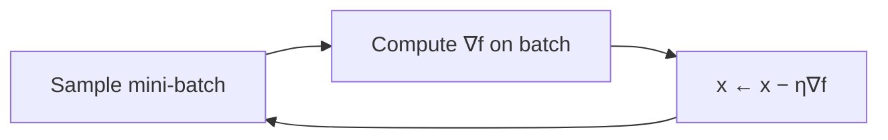

# Gradient Descent and First-Order Methods

First-order methods are optimization algorithms that use only the **gradient** — the vector of
first derivatives — to decide where to step. They ignore curvature (the second derivatives that
[Newton-type methods](nonlinear-and-numerical-optimization.md) use), which makes each step cheap
and memory-light. That trade — cheap steps, more of them — is exactly what wins at the scale of
modern [machine learning](../ai/machine-learning.md), where a model may have billions of
parameters. Gradient descent is the workhorse that trains nearly every
[deep learning](../ai/deep-learning.md) system.

## Gradient descent

The gradient $\nabla f(x)$ points in the direction of steepest *increase*. To minimize, step
the opposite way:

$$ x_{t+1} = x_t - \eta \, \nabla f(x_t). $$

The scalar $\eta > 0$ is the **step size** (in ML, the **learning rate**), and it is the single
most consequential hyperparameter. Too large and the iterates overshoot and diverge; too small
and progress crawls. The gradient itself comes from
[multivariable calculus](../math/multivariable-calculus.md); in neural networks it is computed
by [backpropagation](../ai/backpropagation-and-gradient-descent.md).

## Convergence: what the gradient buys you

Convergence behavior hinges on the geometry of $f$:

- On a **convex** function (see [convex optimization](convex-optimization.md)), gradient
  descent converges to the *global* minimum. For smooth convex $f$ the error shrinks like
  $O(1/t)$; add strong convexity and it becomes *linear* (geometric) — each step cuts the gap
  by a constant factor.
- On a **non-convex** function — a neural-network loss — there is no global guarantee. Gradient
  descent finds a stationary point (gradient near zero), which may be a local minimum, a saddle,
  or a plateau.

**Conditioning** governs speed: when the level sets are stretched ellipses (a large ratio of
largest to smallest Hessian eigenvalue), the gradient points across the valley rather than down
it, and plain descent zig-zags. This ill-conditioning is what the refinements below fight.

## Stochastic gradient descent

Computing the true gradient over a whole dataset is expensive. **Stochastic gradient descent
(SGD)** replaces it with a cheap, noisy estimate from a single example or a **mini-batch**:

$$ x_{t+1} = x_t - \eta \, \nabla f_i(x_t), \qquad i \text{ a random sample}. $$

Each step is far cheaper, so you take vastly more of them per unit compute. The gradient noise
is not purely a cost — it helps the iterates skip past saddle points and shallow traps, which is
part of why SGD generalizes well. A decaying learning rate (or a schedule / warmup) is usually
needed for the noise to average out near the optimum.

## Accelerating: momentum, Nesterov, adaptive rates

Plain SGD wastes steps oscillating in narrow valleys. The standard accelerations:

- **Momentum** accumulates a velocity — an exponentially decaying average of past gradients —
  so consistent directions build speed while oscillations cancel:
  $v_{t+1} = \mu v_t - \eta \nabla f(x_t)$, then $x_{t+1} = x_t + v_{t+1}$.
- **Nesterov accelerated gradient** evaluates the gradient at the *look-ahead* point
  $x_t + \mu v_t$ rather than at $x_t$. This "peek before you leap" correction gives a provably
  better convergence rate ($O(1/t^2)$ on smooth convex problems) — the optimal rate for a
  first-order method.
- **Adaptive methods** scale the step per-parameter using a running record of gradient
  magnitudes:
  - **AdaGrad** divides by the accumulated sum of squared gradients — good for sparse features,
    but the effective rate decays monotonically and can stall.
  - **RMSProp** uses an *exponential* moving average of squared gradients instead, so the rate
    stops decaying and adapts to the recent landscape.
  - **Adam** combines momentum (first moment) with RMSProp's per-parameter scaling (second
    moment), plus bias correction. It is robust to poor scaling and is the de facto default
    optimizer for deep learning.

## Constraints and non-smoothness

For constrained or non-smooth problems, first-order methods extend cleanly: **projected
gradient descent** takes a step then projects back onto the feasible set, and **proximal
gradient methods** handle terms like the $\ell_1$ penalty behind LASSO — the backbone of
sparse [regularization](../ai/generalization-and-regularization.md).

## Why it matters for AI

Every large model in production is trained by a first-order method — almost always mini-batch
SGD or Adam driven by [backpropagation](../ai/backpropagation-and-gradient-descent.md). Their
appeal is precisely their frugality: they need only one gradient per step, scale to enormous
parameter counts, and parallelize across GPUs. The entire practical enterprise of
[deep learning](../ai/deep-learning.md) rests on the fact that these methods, despite offering
no global guarantees on non-convex losses, reliably find weights that generalize well.

## References

- [Numerical Optimization](nocedal-wright-numerical-optimization.md) — Nocedal & Wright (Ch. 3, line search)
- [Convex Optimization](boyd-vandenberghe-convex-optimization.md) — Boyd & Vandenberghe (Ch. 9)
- [Algorithms for Optimization](kochenderfer-algorithms-for-optimization.md) — Kochenderfer & Wheeler
