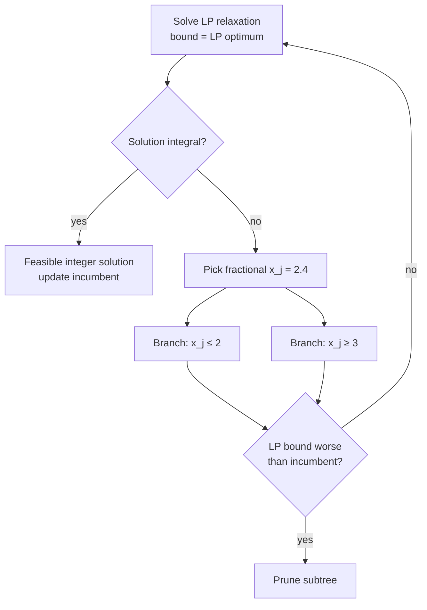

# Integer and Combinatorial Optimization

**Integer programming (IP)** is [linear programming](linear-programming.md) with the extra
requirement that some or all variables take integer values. A **pure integer program**
constrains every variable to the integers; a **mixed-integer program (MIP)** mixes
integer and continuous variables; a **0–1 (binary) program** restricts variables to
{0, 1}, which is the natural language of yes/no decisions. The general form is

$$\max\; c^\top x \quad \text{s.t.}\quad Ax \le b,\ x \ge 0,\ x_j \in \mathbb{Z}\ \text{for } j \in I.$$

Combinatorial optimization is the same idea seen from the discrete side: choosing the
best object (a subset, a permutation, an assignment, a route) from a finite but
astronomically large collection. Almost every combinatorial problem can be written as an
integer program over binary decision variables, which is why the two subjects are studied
together.

## Why integrality is hard

Drop the integrality requirement and you get the **LP relaxation** — an ordinary linear
program solvable in polynomial time by the [simplex method](simplex-method.md) or interior
points. Adding integrality changes everything. The feasible region stops being a convex
polyhedron and becomes a scatter of lattice points; you can no longer "slide to a corner"
and stop. Most integer and combinatorial problems are **NP-hard**: no known algorithm
solves every instance in polynomial time, and the number of candidate solutions grows
combinatorially (a route over $n$ cities has $(n-1)!/2$ possibilities). This complexity
barrier is the discrete counterpart of the tractability enjoyed in
[convex optimization](convex-optimization.md), and it connects directly to the theory of
NP-completeness in [../computer-science/introduction-to-algorithms.md](../computer-science/introduction-to-algorithms.md)
and the counting/structure arguments of
[../math/discrete-mathematics.md](../math/discrete-mathematics.md).

The LP relaxation is still the workhorse, because its optimum is a **bound**: for a
maximization it upper-bounds the integer optimum. The gap between the relaxation and the
true integer optimum — the **integrality gap** — is what solvers spend their effort
closing.

## Branch-and-bound

Branch-and-bound is the dominant exact method. It searches the space of integer
solutions as a tree while pruning aggressively using LP bounds.

Each node solves an LP relaxation. If the relaxed solution is already integral it is a
candidate; if a variable comes out fractional (say $x_j = 2.4$), the algorithm **branches**
into two subproblems, $x_j \le 2$ and $x_j \ge 3$, that together cover all integer
possibilities. A subtree is **pruned** whenever its LP bound is no better than the best
integer solution found so far (the *incumbent*), so large regions are discarded without
being enumerated. The tighter the relaxation, the more pruning, the faster the search.

## Cutting planes

Cutting planes tighten the relaxation instead of splitting it. A **cut** is a valid linear
inequality that every integer-feasible point satisfies but that slices off part of the
fractional LP optimum. Adding cuts (Gomory cuts, cover cuts, and many families) drags the
relaxation's feasible region toward the *integer hull* — the convex hull of the true
integer points. Modern MIP solvers interleave the two ideas as **branch-and-cut**:
generate cuts at nodes, then branch on what remains. This combination is why solvers like
CPLEX, Gurobi, and open-source CBC/SCIP routinely crack problems with millions of
variables that would be hopeless by enumeration.

## Canonical combinatorial problems

- **0–1 Knapsack** — choose items with values and weights to maximize value under a
  weight budget: $\max \sum v_i x_i$ s.t. $\sum w_i x_i \le W$, $x_i \in \{0,1\}$.
  Solvable by dynamic programming in pseudo-polynomial time.
- **Traveling Salesman Problem (TSP)** — find the shortest cycle visiting every city
  once. The archetypal hard combinatorial problem; solved to optimality via
  branch-and-cut with subtour-elimination constraints, or approximately with heuristics.
- **Scheduling and assignment** — assign jobs to machines or time slots to minimize
  makespan or cost. Many variants are NP-hard, but the plain
  [assignment problem](network-flows.md) is polynomial because its constraint matrix is
  special.

## Why it matters

Integer optimization is the mathematics of *decisions*: which facilities to open, which
crews to route, which trades to execute, which features to ship under a budget. It sits at
the operational core of logistics, telecom, manufacturing, and finance. In AI and OR it
appears wherever a model must commit to discrete structure — combinatorial
[reinforcement learning](../ai/reinforcement-learning.md) action spaces, structured
prediction, feature selection, and neural-network verification all reduce to MIPs. It also
frames the ongoing dialogue between exact solvers and learned heuristics: machine learning
is increasingly used to guide branching and cut selection inside branch-and-cut, while IP
provides the certificates of optimality that pure heuristics cannot. See
[optimization-problems.md](optimization-problems.md) for where integer programs sit in the
broader taxonomy, and [network-flows.md](network-flows.md) for the special discrete
problems that stay easy.

## References

- [Bertsimas & Tsitsiklis, *Introduction to Linear Optimization*](bertsimas-tsitsiklis-linear-optimization.md)
- [Kochenderfer & Wheeler, *Algorithms for Optimization*](kochenderfer-algorithms-for-optimization.md)
- [Cormen et al., *Introduction to Algorithms*](../computer-science/introduction-to-algorithms.md)
