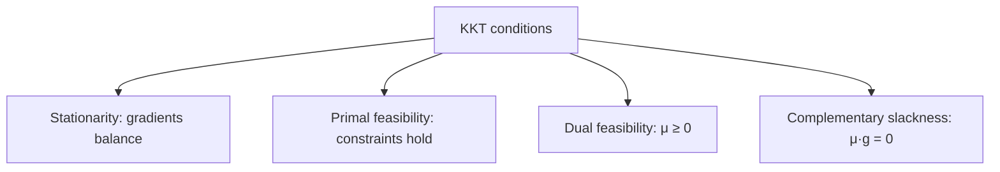

# Lagrange Multipliers and KKT Conditions

Most real optimization is **constrained**: minimize something, but only over points that
satisfy some equalities and inequalities. Lagrange multipliers and the Karush–Kuhn–Tucker (KKT)
conditions are the machinery for turning a *constrained* problem into a set of algebraic
optimality equations you can solve or reason about. They are the theoretical hinge connecting
[convex optimization](convex-optimization.md), [duality](duality.md), and the whole
[optimization](optimization-problems.md) enterprise.

## The equality-constrained problem and the Lagrangian

Consider minimizing $f(x)$ subject to $g(x) = 0$. Geometrically, at the optimum you cannot
decrease $f$ while staying on the constraint surface — which happens exactly when the gradient
of $f$ is **parallel** to the gradient of $g$ (see
[multivariable calculus](../math/multivariable-calculus.md) for gradients as normal vectors):

$$ \nabla f(x^\star) = \lambda \, \nabla g(x^\star). $$

The scalar $\lambda$ is the **Lagrange multiplier**. Rather than track this parallelism by hand,
bundle everything into the **Lagrangian**:

$$ \mathcal{L}(x, \lambda) = f(x) - \lambda\, g(x), $$

and set all its partial derivatives to zero. The stationarity conditions in $x$ recover the
parallel-gradient equation; the condition in $\lambda$ recovers the constraint $g(x)=0$. One
tidy system replaces the geometric argument, and it generalizes to many constraints (one
multiplier each).

## The KKT conditions: adding inequalities

Real problems also carry inequalities. The general form is

$$ \min_x f(x) \quad \text{s.t.} \quad g_i(x) \le 0, \; h_j(x) = 0. $$

Form the Lagrangian with a multiplier $\mu_i \ge 0$ for each inequality and $\lambda_j$ for each
equality. A point $x^\star$ is a candidate optimum when the **KKT conditions** hold:

- **Stationarity** — $\nabla f + \sum_i \mu_i \nabla g_i + \sum_j \lambda_j \nabla h_j = 0$.
  The objective gradient is balanced by the constraint gradients.
- **Primal feasibility** — $g_i(x^\star) \le 0$ and $h_j(x^\star) = 0$. The point is legal.
- **Dual feasibility** — $\mu_i \ge 0$. Inequality multipliers can only push inward.
- **Complementary slackness** — $\mu_i \, g_i(x^\star) = 0$ for every $i$. For each inequality,
  *either* it is active ($g_i = 0$, so its multiplier may be positive) *or* it is slack
  ($g_i < 0$, forcing $\mu_i = 0$). Inactive constraints exert no force.

Complementary slackness is the subtle one, and it carries the key economic reading: **a
constraint that is not binding has a zero multiplier — it costs nothing at the margin.**

## What the multipliers mean

A multiplier is a **shadow price**: it is the rate at which the optimal value would improve if
you relaxed the corresponding constraint by one unit. A large multiplier flags a constraint that
is expensive to satisfy; a zero multiplier flags one you could ignore. This interpretation is
the doorway to [duality](duality.md), where the multipliers become the variables of the dual
problem, and to sensitivity analysis in [linear programming](linear-programming.md).

## Necessary vs. sufficient

For a general (non-convex) problem the KKT conditions are only **necessary** — they identify
candidates, some of which may be saddles or maxima, and they require a constraint-qualification
regularity assumption to apply. For a **convex** problem (convex $f$ and $g_i$, affine $h_j$),
KKT is both necessary **and sufficient**: any KKT point is a certified global optimum. This is
the payoff [convex optimization](convex-optimization.md) promises, and why convex problems come
with proofs of optimality rather than mere hope.

## Example: support vector machines

The maximum-margin classifier minimizes $\tfrac12 \lVert w \rVert^2$ subject to every training
point being correctly classified with margin. Applying KKT, complementary slackness forces the
multipliers to be nonzero *only* for the points lying exactly on the margin — the **support
vectors**. The solution depends on those few points alone, and the multipliers become the dual
variables that expose the kernel trick. A textbook constrained-optimization result that shaped a
generation of [machine learning](../ai/machine-learning.md).

## Why it matters for AI

Constrained optimization pervades AI: SVMs, maximum-entropy models, constrained policy
optimization in reinforcement learning, and any training objective with hard limits. Even
[regularization](../ai/generalization-and-regularization.md) has a KKT reading — a penalty term
and a hard constraint on the parameter norm are two faces of the same Lagrangian, related by
the multiplier. Understanding KKT is understanding *why* the regularized and constrained forms
of a learning problem give the same answer.

## References

- [Convex Optimization](boyd-vandenberghe-convex-optimization.md) — Boyd & Vandenberghe (Ch. 5)
- [Numerical Optimization](nocedal-wright-numerical-optimization.md) — Nocedal & Wright (Ch. 12)
- [Algorithms for Optimization](kochenderfer-algorithms-for-optimization.md) — Kochenderfer & Wheeler
