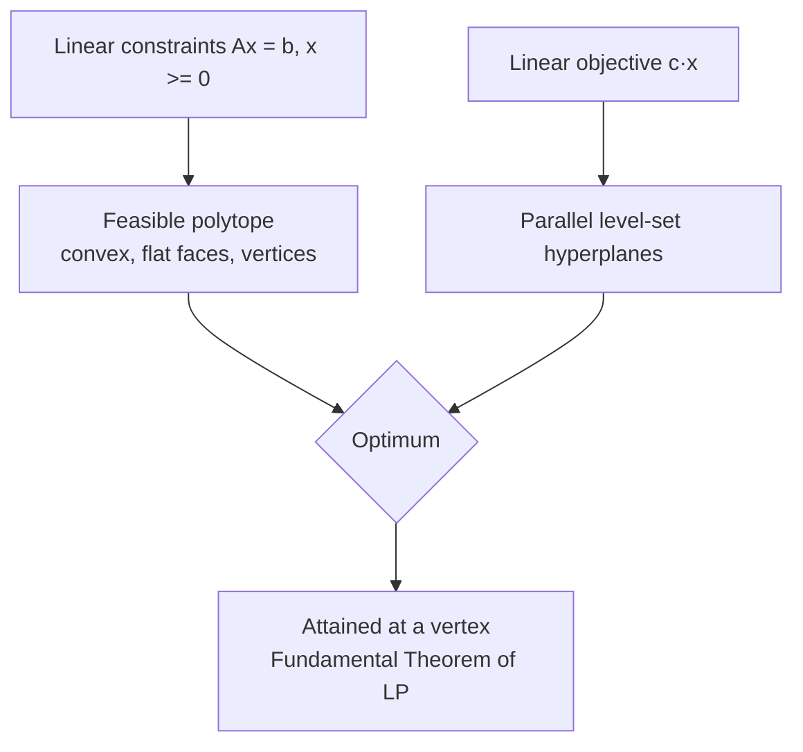

# Linear Programming

**Linear programming (LP)** is the special case of an
[optimization-problems.md](optimization-problems.md) in which the objective and *every*
constraint is a linear function of the decision variables. It is the workhorse of operations
research and the historical root of the whole field: George Dantzig's 1947 simplex algorithm
made LPs solvable at scale, and today problems with millions of variables are routine. LP is
also the cleanest possible convex problem — the entry point to
[convex-optimization.md](convex-optimization.md) — so its geometry is worth understanding in
full.

## Standard form

Any LP can be rewritten into a canonical **standard form**:

$$
\begin{aligned}
\min_{\mathbf{x}} \quad & \mathbf{c}^\top \mathbf{x} \\
\text{subject to} \quad & A\mathbf{x} = \mathbf{b} \\
& \mathbf{x} \ge \mathbf{0}
\end{aligned}
$$

where $\mathbf{c} \in \mathbb{R}^n$ is the **cost vector**, $A \in \mathbb{R}^{m\times n}$
encodes the constraints, and $\mathbf{b}$ is the right-hand side. Maximization becomes
minimization by negating $\mathbf{c}$; inequality constraints $\le$ become equalities by
adding nonnegative **slack variables**; free variables are split into a positive and
negative part. Because everything reduces to this form, one algorithm suffices — the
matrix-and-vector language here is exactly the
[../math/linear-algebra.md](../math/linear-algebra.md) machinery.

## The feasible polytope

The feasible set of an LP — all $\mathbf{x}$ satisfying $A\mathbf{x} = \mathbf{b}$,
$\mathbf{x} \ge 0$ — is an intersection of finitely many half-spaces (one per inequality).
Such a set is a **polyhedron**; if bounded, a **polytope**. It is a convex region with flat
faces, straight edges, and **vertices** (corner points), like a cut gem in $n$ dimensions.
The linear objective $\mathbf{c}^\top\mathbf{x}$ has constant-value **level sets** that are
parallel hyperplanes; optimizing slides that hyperplane across the polytope as far as it will
go in the direction $-\mathbf{c}$.

## The fundamental theorem

> **If an LP has an optimal solution, then an optimal solution is attained at a vertex
> (extreme point) of the feasible polytope.**

The intuition is geometric: pushing a flat objective hyperplane across a convex polytope, the
last point of contact is always a corner (or, in a tie, an entire edge or face containing
corners). This theorem is the reason LP is tractable — instead of searching a continuous
region we need only examine the *finite* set of vertices. The
[simplex-method.md](simplex-method.md) exploits exactly this: it walks from vertex to
adjacent vertex, improving the objective at each step, rather than searching the interior.
Every LP also has a **dual** LP that certifies optimality and prices the constraints — see
[duality.md](duality.md).

## Classic applications

LP earned its place through problems that recur everywhere:

- **The diet problem** — Dantzig's original: choose quantities of foods to meet nutritional
  requirements at minimum cost. Variables are servings, constraints are nutrient minimums,
  objective is total cost.
- **The transportation problem** — ship goods from warehouses (supplies) to stores (demands)
  at minimum shipping cost. This is a structured LP living on a bipartite graph, the gateway
  to [network-flows.md](network-flows.md).
- **Blending / product mix** — combine raw inputs (crude oil fractions, alloys, feed
  ingredients) to hit quality specs at least cost, or to maximize profit from limited
  resources.

## Canonical example

Minimize the cost of a diet using two foods. Food 1 costs \$2/unit and food 2 costs \$3/unit.
You need at least 8 units of protein and 6 of vitamin; food 1 supplies (protein 1, vitamin 2)
per unit, food 2 supplies (protein 3, vitamin 1). The LP is:

$$
\min\; 2x_1 + 3x_2 \quad\text{s.t.}\quad x_1 + 3x_2 \ge 8,\;\; 2x_1 + x_2 \ge 6,\;\; x_1,x_2 \ge 0.
$$

The feasible region is an unbounded polygon; its vertices are the candidate optima. Checking
the corners (as the fundamental theorem licenses) finds the cheapest diet meeting both
requirements.

## Why it matters (and the AI role)

LP is the most solved and most solvable optimization problem, and it anchors an enormous
range of practical work — supply chains, scheduling, network design, portfolio construction,
and the economics of scarce resources (its shadow-price interpretation ties directly to
[../economics/index.md](../economics/index.md)). In AI and machine learning, LPs appear as
subroutines: LP relaxations bound
[integer-and-combinatorial-optimization.md](integer-and-combinatorial-optimization.md)
problems, $L_1$-regularized regression and support-vector formulations reduce to LPs or
closely related convex programs, and LP duality underlies the theory of optimal transport
used in modern generative modeling. Fluency in LP is the foundation for everything else in
[index.md](index.md).

## References

- [Introduction to Linear Optimization](bertsimas-tsitsiklis-linear-optimization.md) — Bertsimas & Tsitsiklis
- [Linear Programming: Foundations and Extensions](vanderbei-linear-programming.md) — Vanderbei
- [Convex Optimization](boyd-vandenberghe-convex-optimization.md) — Boyd & Vandenberghe
