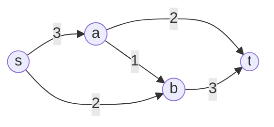

# Network Flows

Network-flow problems optimize the movement of some quantity — traffic, goods, current,
probability — through a graph of nodes and directed arcs, each arc with a capacity and
often a cost. They are a beautiful special case of [linear programming](linear-programming.md):
structured enough to have dedicated combinatorial algorithms that run far faster than
general LP, yet expressive enough to model an enormous range of routing, matching, and
allocation tasks. The graph machinery draws on [../math/graph-theory.md](../math/graph-theory.md),
and the algorithms below are staples of [../computer-science/introduction-to-algorithms.md](../computer-science/introduction-to-algorithms.md).

## Maximum flow and minimum cut

In the **max-flow** problem we push as much flow as possible from a source $s$ to a sink
$t$, respecting arc capacities and *conservation* (flow in = flow out at every
intermediate node). A **cut** partitions the nodes into a set containing $s$ and a set
containing $t$; its capacity is the total capacity of arcs crossing from the $s$-side to
the $t$-side.

The **max-flow / min-cut theorem** is the centerpiece: the maximum $s$–$t$ flow equals the
minimum $s$–$t$ cut capacity. It is a concrete instance of LP [duality](duality.md) — the
flow is the primal, the cut is the dual, and they meet at the same value. Algorithms like
Ford–Fulkerson (augmenting paths), Edmonds–Karp, Dinic, and push–relabel compute the flow
constructively.

Cutting the graph anywhere between $s$ and $t$ gives an upper bound on flow; the tightest
such cut is achieved exactly.

## Shortest paths

The **shortest-path** problem finds a minimum-cost route between nodes. Dijkstra's
algorithm handles non-negative arc costs; Bellman–Ford tolerates negative costs and detects
negative cycles. As an LP, shortest path is the dual of a simple flow problem, and its cost
structure underlies distance metrics used throughout routing, planning, and dynamic
programming — including value iteration in [reinforcement learning](../ai/reinforcement-learning.md),
which is shortest-path reasoning over a stochastic graph.

## Assignment, transportation, and matching

- **Transportation problem** — ship a commodity from supply nodes to demand nodes at
  minimum total cost; a bipartite flow with supplies and demands as node balances.
- **Assignment problem** — the special case of matching $n$ workers to $n$ tasks
  one-to-one at minimum cost, solved elegantly by the **Hungarian algorithm**.
- **Bipartite matching** — pair up two disjoint sets (workers/jobs, applicants/slots) so
  as to maximize matched pairs; reducible to a max-flow instance by adding a source
  feeding one side and a sink draining the other.

## The magic of total unimodularity

Why do these problems yield *whole-number* answers even though we solve a continuous LP?
The constraint matrix of a network-flow problem is **totally unimodular** — every square
submatrix has determinant $0$, $+1$, or $-1$. A classic theorem guarantees that when the
constraint matrix is totally unimodular and the right-hand sides are integers, every basic
feasible solution of the LP is automatically integral. So the LP relaxation *is* the
integer solution: no branch-and-bound needed.

This is precisely the structure that
[integer-and-combinatorial-optimization.md](integer-and-combinatorial-optimization.md)
lacks in general. Network problems are the sweet spot where discrete decisions come for
free from continuous methods — which is why they are the first place to look when modeling
a combinatorial task: if you can cast it as a flow, you get integrality and speed together.

## Why it matters

Flows model the physical and logical plumbing of the modern world: internet packet
routing, supply chains, airline crew scheduling, power grids, and bipartite matching in
ad auctions, ride-hailing, and organ-donor exchanges. In AI and OR they appear as
subroutines — matching in data association and tracking, min-cut in image segmentation and
Markov-random-field inference, and shortest paths inside planners. Their tractability makes
them the reliable core that harder [optimization problems](optimization-problems.md) are
often decomposed into.

## References

- [Bertsimas & Tsitsiklis, *Introduction to Linear Optimization*](bertsimas-tsitsiklis-linear-optimization.md)
- [Cormen et al., *Introduction to Algorithms*](../computer-science/introduction-to-algorithms.md)
