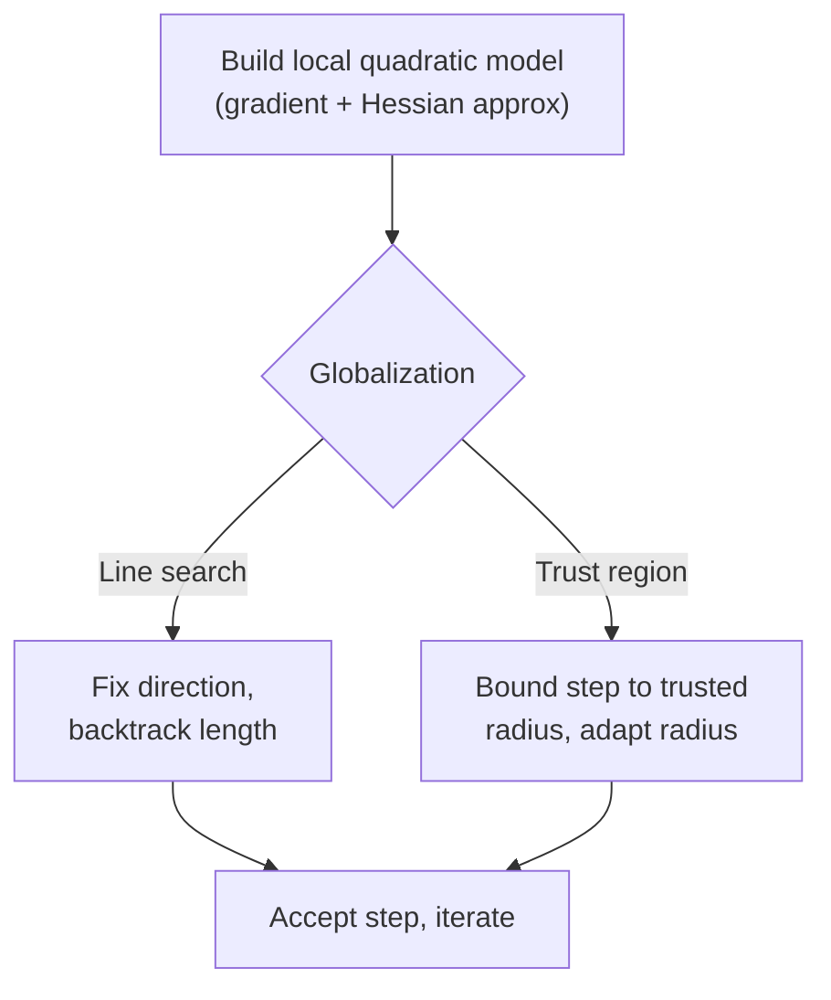

# Nonlinear and Numerical Optimization

When the objective is a general smooth nonlinear function, we still minimize it iteratively —
but now we can do better than following the gradient blindly. Numerical optimization is the
craft of using **curvature** (second-derivative information) to take smarter steps, and of doing
so in finite-precision arithmetic without blowing up. This is the territory beyond
[first-order methods](gradient-descent-and-first-order-methods.md): fewer, more expensive, far
more informed steps.

## Newton's method: use the curvature

A [first-order](gradient-descent-and-first-order-methods.md) step follows the gradient with a
guessed step size. **Newton's method** instead builds a local *quadratic* model of $f$ using the
gradient and the **Hessian** $\nabla^2 f$ (the matrix of second partials; see
[multivariable calculus](../math/multivariable-calculus.md)), then jumps to that model's minimum:

$$ x_{t+1} = x_t - \big[\nabla^2 f(x_t)\big]^{-1} \nabla f(x_t). $$

Near a well-behaved minimum this converges **quadratically** — the number of correct digits
roughly doubles each step, a spectacular improvement over gradient descent's linear crawl. The
Hessian automatically rescales and rotates the step to match the local geometry, curing the
zig-zagging that ill-[conditioning](#conditioning-why-second-order-helps) inflicts on
first-order methods.

The catch: forming and inverting the Hessian costs $O(n^3)$ per step and $O(n^2)$ memory. For a
model with millions of parameters that is impossible, which is exactly why deep learning stays
first-order.

## Quasi-Newton: BFGS and L-BFGS

**Quasi-Newton** methods capture most of Newton's benefit at a fraction of the cost by
*building up* an approximation to the Hessian (or its inverse) from the sequence of observed
gradients — never computing a single second derivative.

- **BFGS** maintains a dense inverse-Hessian approximation, updating it by a rank-two correction
  each step. Superlinear convergence, but $O(n^2)$ memory.
- **L-BFGS** ("limited-memory BFGS") stores only the last few gradient/step pairs and
  reconstructs the action of the approximate inverse Hessian on the fly. Memory is linear in
  $n$, making it the standard workhorse for smooth medium-scale problems — including many
  classical [machine learning](../ai/machine-learning.md) fits like logistic regression and CRFs.

## Globalization: line search and trust regions

A raw Newton or quasi-Newton step can overshoot when far from the optimum, since the local
quadratic model is only trustworthy nearby. Two strategies make the methods robust globally:

- **Line search** — accept the computed *direction*, but scale its *length*: try the full step,
  then backtrack until it produces "enough" decrease (the Armijo / Wolfe conditions). Direction
  from the model, distance from a safeguard.
- **Trust region** — pick a radius within which the quadratic model is trusted, minimize the
  model inside that ball, and then grow or shrink the radius based on how well the model predicted
  the actual decrease. Step and length are chosen together.

## Conditioning: why second order helps

The **condition number** of the Hessian — the ratio of its largest to smallest eigenvalue (see
[linear algebra](../math/linear-algebra.md)) — measures how stretched the objective's level sets
are. A high condition number makes first-order methods crawl, because the gradient points across
the valley, not down it. Newton-type methods effectively *precondition* the problem by the
inverse Hessian, transforming the stretched bowl into a round one where a single step nearly
suffices. Numerically, ill-conditioning also amplifies floating-point error, so stable
factorizations (leaning on [real analysis](../math/real-analysis.md) notions of limits and
continuity for convergence proofs) matter as much as the algebra.

## When second order pays off

Second-order methods win when the problem is **smooth**, **moderate-dimensional**, and you want
**high accuracy** — classical statistical [estimation](../statistics/estimation.md), maximum
likelihood, and calibration problems, where a precise optimum matters and $n$ is thousands, not
billions. They lose at **deep learning** scale: the Hessian is intractable, gradients are noisy
mini-batch estimates that would corrupt a curvature model, and cheap-and-plentiful
[first-order steps](gradient-descent-and-first-order-methods.md) simply win the compute budget.
Adam's per-parameter scaling is, in spirit, a lightweight nod toward curvature without ever
forming a Hessian.

## Why it matters for AI

Nonlinear numerical optimization is the engine under classical ML and the theoretical baseline
against which [deep learning](../ai/deep-learning.md) optimization is understood. Knowing what
Newton's method *would* do — and why we cannot afford it at scale — explains the design of every
modern optimizer, and clarifies the recurring trade between the informed-but-expensive and the
cheap-but-blind.

## References

- [Numerical Optimization](nocedal-wright-numerical-optimization.md) — Nocedal & Wright
- [Convex Optimization](boyd-vandenberghe-convex-optimization.md) — Boyd & Vandenberghe (Ch. 9–11)
- [Algorithms for Optimization](kochenderfer-algorithms-for-optimization.md) — Kochenderfer & Wheeler
