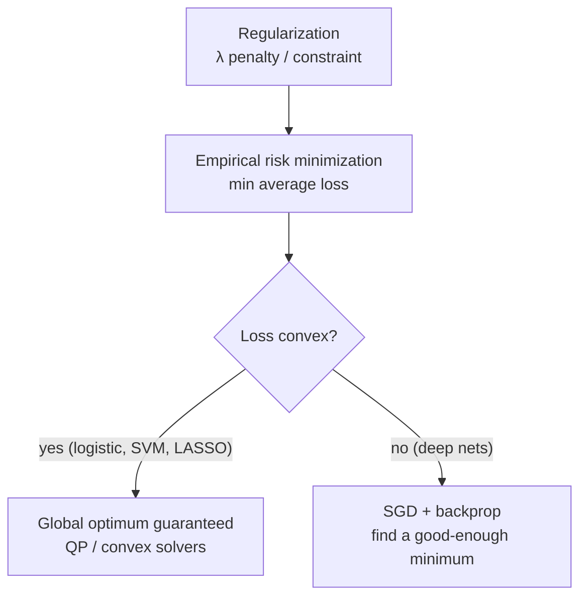

# Optimization in Machine Learning

Training a machine-learning model *is* solving an optimization problem. A model has
parameters $\theta$; learning means choosing the $\theta$ that makes the model fit the
data best according to a numeric measure of error. Every learning algorithm — from linear
regression to a trillion-parameter transformer — is, underneath, a search for the minimum
of a loss function. This note is the bridge between the optimization concepts in this
folder and the learning concepts in [../ai/machine-learning.md](../ai/machine-learning.md).

## Training as empirical risk minimization

We would like the model that minimizes the *true risk* — expected loss over the real data
distribution — but that distribution is unknown. So we minimize the **empirical risk**:
the average loss over the training set,

$$\min_{\theta}\; \frac{1}{n}\sum_{i=1}^{n} \ell\big(f_\theta(x_i),\, y_i\big).$$

This is exactly the sample average approximation of
[stochastic-optimization.md](stochastic-optimization.md): the training set is a finite
sample standing in for the population, and minimizing over it approximates minimizing the
expectation. The gap between empirical and true risk is the subject of
[../ai/generalization-and-regularization.md](../ai/generalization-and-regularization.md).

## The loss landscape

Plotting the loss as a function of $\theta$ gives the **loss landscape**, a surface whose
lowest points are the good models. Its *shape* determines how hard training is:

- **Convex landscapes** have a single bowl — every local minimum is the global minimum, so
  first-order methods provably converge. This is the world of
  [convex-optimization.md](convex-optimization.md).
- **Non-convex landscapes** are riddled with local minima, saddle points, and flat
  plateaus. Guarantees weaken, and empirical behavior takes over.

## Convex ML vs. non-convex deep learning

A large swath of classical machine learning is deliberately **convex**, and that is a
feature, not an accident:

- **Logistic regression** minimizes a convex cross-entropy loss.
- **Support vector machines (SVMs)** minimize a convex hinge-loss objective; the dual is a
  quadratic program handled with [Lagrange multipliers and the KKT conditions](lagrange-multipliers-and-kkt.md).
- **LASSO / ridge regression** add convex penalties to a convex least-squares loss.

For these, optimization is a *solved* problem: convexity guarantees the global optimum and
[duality](duality.md) gives certificates and efficient solvers.

**Deep learning** abandons convexity. Stacking nonlinear layers makes the loss wildly
non-convex, with no guarantee that the found minimum is global. Remarkably, this works
anyway. Empirically, in the huge parameter spaces of neural nets most local minima are
nearly as good as the global one, bad minima are rare, and the harder obstacles are saddle
points — which stochastic methods escape.

## Regularization as constrained optimization

Regularization curbs overfitting by penalizing complex models. The penalized objective

$$\min_{\theta}\; \frac{1}{n}\sum_i \ell(f_\theta(x_i), y_i) + \lambda\, \Omega(\theta)$$

is, by [Lagrangian](lagrange-multipliers-and-kkt.md) duality, equivalent to a
*constrained* problem: minimize the loss subject to $\Omega(\theta) \le t$. The penalty
weight $\lambda$ is the Lagrange multiplier of that constraint. So $L_2$ (ridge)
regularization is really "fit the data, but keep $\|\theta\|_2$ inside a ball," and $L_1$
(LASSO) keeps it inside a diamond — whose corners produce the sparse solutions LASSO is
prized for. This is the exact link the constrained-vs-penalized duality in
[../ai/generalization-and-regularization.md](../ai/generalization-and-regularization.md)
formalizes.

## Why SGD works in practice

Deep models are trained with **stochastic gradient descent** and its adaptive variants
(momentum, Adam), built on the first-order machinery of
[gradient-descent-and-first-order-methods.md](gradient-descent-and-first-order-methods.md)
and the gradient computation of
[../ai/backpropagation-and-gradient-descent.md](../ai/backpropagation-and-gradient-descent.md).
SGD succeeds on non-convex losses for reasons that are as much empirical as theoretical:

- **Scalability** — each step uses one minibatch, so cost per step is independent of
  dataset size; full-batch gradients would be infeasible.
- **Implicit regularization** — gradient noise biases SGD toward *flat* minima, which tend
  to generalize better than sharp ones.
- **Saddle escape** — the same noise perturbs iterates off saddle points that would trap a
  deterministic method.

The result is a pragmatic settlement: give up global-optimality guarantees, and in return
train models far larger than convex theory could ever handle.

## Why it matters

This is where the whole [linear-optimization](optimization-problems.md) field pays off for
AI. The optimizer is not an afterthought to a model — it *is* the learning algorithm. The
choice of loss defines what "good" means, convexity determines whether training is safe or
an art, regularization is a constrained-optimization dial on generalization, and the
scalability of SGD is the single reason modern models can be trained at all. Understanding
optimization is understanding how learning actually happens.

## References

- [Boyd & Vandenberghe, *Convex Optimization*](boyd-vandenberghe-convex-optimization.md)
- [Nocedal & Wright, *Numerical Optimization*](nocedal-wright-numerical-optimization.md)
- [Kochenderfer & Wheeler, *Algorithms for Optimization*](kochenderfer-algorithms-for-optimization.md)
