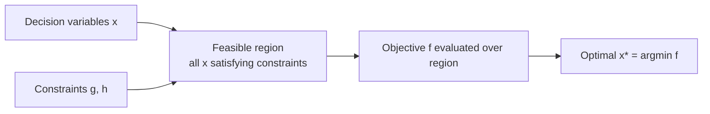

# Optimization Problems

**Optimization** is the discipline of choosing the *best* element from a set of
alternatives, where "best" is measured by a numerical objective. Almost every
quantitative decision — how to route trucks, price inventory, allocate a budget, or fit a
model to data — is an optimization problem in disguise. It is the connective tissue of the
entire [index.md](index.md) field folder: [linear-programming.md](linear-programming.md),
[convex-optimization.md](convex-optimization.md),
[integer-and-combinatorial-optimization.md](integer-and-combinatorial-optimization.md), and
the rest are all special cases of the single template below.

## The general problem

Every optimization problem is built from three ingredients:

$$
\begin{aligned}
\min_{\mathbf{x}} \quad & f(\mathbf{x}) && \text{(objective)}\\
\text{subject to} \quad & g_i(\mathbf{x}) \le 0, \quad i = 1,\dots,m && \text{(inequality constraints)}\\
& h_j(\mathbf{x}) = 0, \quad j = 1,\dots,p && \text{(equality constraints)}
\end{aligned}
$$

- **Decision variables** $\mathbf{x} \in \mathbb{R}^n$ — the quantities we get to choose.
- **Objective function** $f(\mathbf{x})$ — the scalar we want to make as small (or, by
  negating, as large) as possible. Maximizing $f$ is the same as minimizing $-f$, so the
  whole field is written in terms of minimization by convention.
- **Constraints** $g_i, h_j$ — the rules the choice must obey (capacities, budgets,
  physical laws, nonnegativity).

The **feasible region** (or feasible set) is the set of all $\mathbf{x}$ satisfying every
constraint. Optimization is the search for the best point *inside* that region. If no point
satisfies the constraints the problem is **infeasible**; if the objective can be driven to
$-\infty$ within the region it is **unbounded**.

## Global vs. local optima

A point $\mathbf{x}^\*$ is a **global minimum** if $f(\mathbf{x}^\*) \le f(\mathbf{x})$ for
*every* feasible $\mathbf{x}$. It is only a **local minimum** if that inequality holds merely
within some neighborhood of $\mathbf{x}^\*$. The gap between these two notions is the central
difficulty of the field: a hill-climbing algorithm like
[gradient-descent-and-first-order-methods.md](gradient-descent-and-first-order-methods.md)
finds local optima easily but can get trapped in one that is far from globally best.

## Convex vs. non-convex

The single most important structural distinction is whether the problem is **convex**. A
problem is convex when $f$ is a convex function and the feasible region is a convex set (any
line segment between two feasible points stays feasible). The payoff is decisive:

> **In a convex problem, every local minimum is a global minimum.**

That is why convexity is the dividing line between problems we can solve reliably at scale
and problems that are, in general, intractable. [convex-optimization.md](convex-optimization.md)
develops this; [linear-programming.md](linear-programming.md) is the cleanest convex case.
Non-convex problems (most of deep learning, most combinatorial problems) have many local
optima, valleys, and saddle points, and we settle for good-enough solutions via heuristics
or specialized structure. The theory of *when* a local optimum is optimal is captured by the
[lagrange-multipliers-and-kkt.md](lagrange-multipliers-and-kkt.md) conditions, which rest on
the gradient and Hessian machinery of [../math/multivariable-calculus.md](../math/multivariable-calculus.md).

## The modeling step

Before any algorithm runs, a real situation must be *translated* into the template above —
choosing what the variables are, writing the objective, and encoding the rules as
constraints. This **modeling** step is where most of the intellectual work lives, and it is
easy to get wrong: a subtly mis-stated constraint yields a mathematically optimal answer to
the wrong question. A good model is also chosen for tractability — casting a decision as an
LP or a convex program rather than a general non-convex one can turn an impossible problem
into a routine one.

## A taxonomy of the field

Optimization problems are classified by the shape of $f$ and the constraints:

- **Linear program (LP)** — $f$ and all constraints linear. See
  [linear-programming.md](linear-programming.md), solved by the
  [simplex-method.md](simplex-method.md) and interior-point methods.
- **Convex program** — convex $f$ over a convex set; the tractable frontier
  ([convex-optimization.md](convex-optimization.md)).
- **Nonlinear / continuous program** — smooth but possibly non-convex; solved numerically
  ([nonlinear-and-numerical-optimization.md](nonlinear-and-numerical-optimization.md)).
- **Integer / combinatorial** — variables constrained to be integers or discrete choices;
  generally NP-hard ([integer-and-combinatorial-optimization.md](integer-and-combinatorial-optimization.md)).
- **Network flow** — optimization on a graph, a richly structured LP
  ([network-flows.md](network-flows.md)).
- **Stochastic** — data or constraints are uncertain
  ([stochastic-optimization.md](stochastic-optimization.md)).

Every such problem also has a companion **dual** problem ([duality.md](duality.md)) that
bounds and illuminates it.

## Canonical example

A factory makes two products. Product A yields \$3 profit per unit, product B \$5. Each unit
of A needs 1 labor-hour, each unit of B needs 2, and only 40 labor-hours are available;
material limits cap total output at 30 units. Modeling: variables $x_A, x_B \ge 0$;
objective $\max\, 3x_A + 5x_B$; constraints $x_A + 2x_B \le 40$ and $x_A + x_B \le 30$. This
is a two-variable LP — its feasible region is a polygon, and (as the fundamental theorem of
[linear-programming.md](linear-programming.md) promises) its optimum sits at a corner of
that polygon.

## Why it matters (and the AI role)

Optimization is the mathematical engine underneath both operations research and machine
learning. In OR it directly answers resource-allocation, scheduling, and logistics
questions. In AI, **training a model is solving an optimization problem**: we minimize a
loss function over the model's parameters, which is exactly the template above with
$\mathbf{x}$ = weights and $f$ = loss (see
[optimization-in-machine-learning.md](optimization-in-machine-learning.md)). Understanding
feasibility, convexity, and local-vs-global optima explains why linear models train to a
unique optimum while deep networks do not, and why so much practical AI is the art of
reshaping a hard non-convex problem into a tractable one.

## References

- [Convex Optimization](boyd-vandenberghe-convex-optimization.md) — Boyd & Vandenberghe (problem taxonomy and modeling)
- [Numerical Optimization](nocedal-wright-numerical-optimization.md) — Nocedal & Wright
- [Algorithms for Optimization](kochenderfer-algorithms-for-optimization.md) — Kochenderfer & Wheeler
