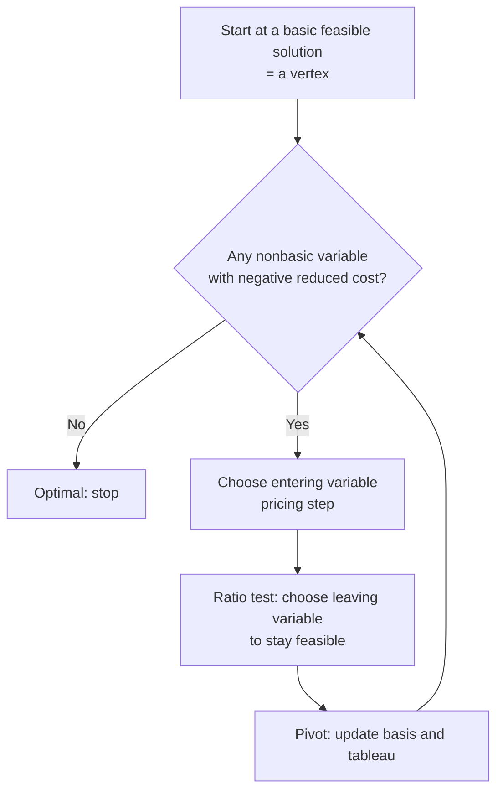

# Simplex Method

The **simplex method**, devised by George Dantzig in 1947, is the classical algorithm for
solving a [linear-programming.md](linear-programming.md) problem. Its idea is beautifully
direct: since the [linear-programming.md](linear-programming.md) fundamental theorem
guarantees an optimum at a **vertex** of the feasible polytope, just walk from vertex to
vertex along the edges, always moving to a neighbor with a better objective value, until no
improving neighbor exists. That terminal vertex is optimal. As an algorithm it is a specific
instance of the local-search patterns catalogued in
[../computer-science/introduction-to-algorithms.md](../computer-science/introduction-to-algorithms.md)
(see also [../computer-science/index.md](../computer-science/index.md)).

## Moving between vertices

Each vertex of the polytope corresponds algebraically to a **basic feasible solution**: a
choice of $m$ **basic** variables (allowed nonzero) with the remaining $n - m$ **nonbasic**
variables pinned at zero, such that solving $A\mathbf{x} = \mathbf{b}$ for the basics yields a
nonnegative point. Two vertices are **adjacent** when their bases differ by exactly one
variable. Simplex moves between adjacent vertices by a **pivot**: one nonbasic variable
*enters* the basis (its value rises from zero) while one basic variable *leaves* (falls to
zero).

## Pivoting and the tableau

The bookkeeping is organized in a **tableau** — the constraint matrix, right-hand side, and
objective row, all kept in terms of the current basis. Two rules drive each step:

- **Pricing (entering variable).** Compute each nonbasic variable's **reduced cost**, the net
  change in objective per unit it enters. A negative reduced cost (for a minimization) means
  bringing that variable in lowers the objective, so it is a candidate to enter.
- **Ratio test (leaving variable).** As the entering variable increases, the basic variables
  change linearly; the ratio test finds which one hits zero first, and that variable leaves.
  This keeps the new point feasible.

A pivot is then a Gaussian-elimination step ([../math/linear-algebra.md](../math/linear-algebra.md))
that rewrites the tableau around the new basis. When no nonbasic variable has a negative
reduced cost, the **optimality condition** is met: the current vertex cannot be improved, and
its reduced-cost vector is exactly the dual solution of [duality.md](duality.md) (this is how
simplex proves optimality — it produces a dual certificate for free).

## Fast in practice, slow in the worst case

Simplex has a striking theoretical wrinkle. Klee and Minty (1972) built polytopes on which
certain pivot rules visit an *exponential* number of vertices — so the worst-case running
time is exponential in the problem size. Yet in practice simplex is remarkably fast, typically
taking a number of pivots roughly linear in the number of constraints. The reconciliation is
**smoothed analysis** (Spielman & Teng): the pathological inputs are vanishingly rare, and on
essentially any perturbed real-world instance simplex runs in polynomial time. So the "bad"
cases exist but are measure-zero curiosities, not what you meet in the wild.

## The interior-point contrast

The other major family, **interior-point methods**, ignores the edges entirely. Instead of
walking the boundary, they drive toward the optimum *through the interior* of the polytope,
following a smooth "central path" using Newton steps
([nonlinear-and-numerical-optimization.md](nonlinear-and-numerical-optimization.md)). Karmarkar's
1984 algorithm was the first with a proven polynomial-time bound, and interior-point methods
generalize cleanly to the whole of [convex-optimization.md](convex-optimization.md). The
practical trade-off:

- **Simplex** — moves along vertices; excels on small-to-medium and highly structured LPs;
  warm-starts easily (great for re-solving after a small change, as in branch-and-bound for
  [integer-and-combinatorial-optimization.md](integer-and-combinatorial-optimization.md)).
- **Interior-point** — moves through the interior; polynomial-time guarantee; often wins on
  very large, dense LPs; harder to warm-start.

Modern solvers ship both and pick per problem.

## Canonical example

Maximize $3x_1 + 5x_2$ subject to $x_1 \le 4$, $2x_2 \le 12$, $3x_1 + 2x_2 \le 18$,
$x_1, x_2 \ge 0$. Adding slack variables gives an initial vertex at the origin
$(x_1, x_2) = (0,0)$. Simplex prices the objective, brings $x_2$ in (largest per-unit gain),
runs the ratio test to see which constraint binds first, pivots — and after two pivots lands
at the vertex $(2, 6)$ with objective $36$, where no further improvement is possible.

## Why it matters (and the AI role)

Simplex is one of the most consequential algorithms ever written — it turned linear
programming from a curiosity into the backbone of twentieth-century logistics, and it is the
reason LP models are worth building at all. Its pivoting-and-certificate structure recurs
throughout optimization: it is the inner loop of branch-and-bound and cutting-plane solvers
for integer programs, and its dual-solution output feeds the sensitivity analysis that turns
a model into a decision tool. In AI-adjacent work, simplex (and its interior-point cousin)
solves the LP subproblems inside optimal-transport, structured-prediction, and constrained
reinforcement-learning pipelines.

## References

- [Introduction to Linear Optimization](bertsimas-tsitsiklis-linear-optimization.md) — Bertsimas & Tsitsiklis
- [Linear Programming: Foundations and Extensions](vanderbei-linear-programming.md) — Vanderbei
- [Numerical Optimization](nocedal-wright-numerical-optimization.md) — Nocedal & Wright (interior-point methods)
