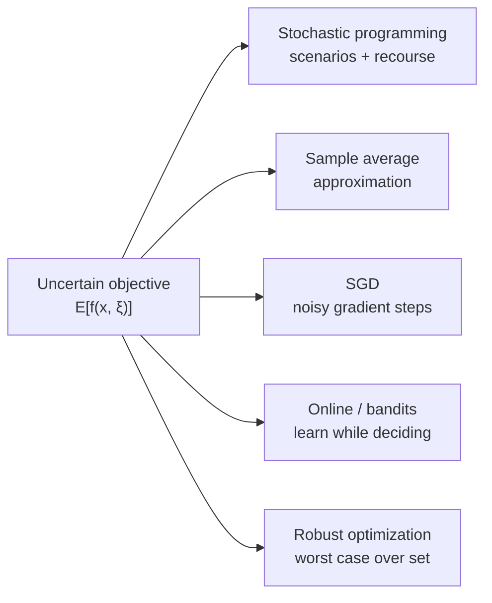

# Stochastic Optimization

Stochastic optimization is optimization when the problem data — costs, constraints,
demands, gradients — are uncertain, random, or revealed only over time. Instead of
minimizing a fixed objective, we optimize a quantity that depends on randomness, most
often an **expectation**:

$$\min_{x}\; \mathbb{E}_{\xi}\big[ f(x, \xi) \big],$$

where $\xi$ is a random variable capturing the uncertainty and $x$ is the decision. The
challenge is that the expectation is usually an intractable integral, so the whole field
is about *approximating* it well enough to optimize. This links tightly to
[../statistics/estimation.md](../statistics/estimation.md): we are estimating an objective
(or its gradient) from samples and optimizing the estimate.

## Stochastic programming

Classic **stochastic programming** models decisions made in stages as uncertainty unfolds.
The canonical **two-stage recourse** model chooses a first-stage decision now, observes a
random outcome, then takes a corrective *recourse* action:

$$\min_{x}\; c^\top x + \mathbb{E}_{\xi}\big[ Q(x, \xi) \big], \qquad
Q(x,\xi) = \min_{y}\{ q^\top y : Wy = h(\xi) - Tx \}.$$

If the distribution has finitely many *scenarios*, this expands into one large (often
[linear](linear-programming.md) or [integer](integer-and-combinatorial-optimization.md))
program with a block structure that decomposition methods (Benders, progressive hedging)
exploit.

## Sample average approximation

When the distribution is only accessible through samples, **sample average approximation
(SAA)** replaces the expectation with an empirical mean over $N$ draws:

$$\min_{x}\; \frac{1}{N}\sum_{i=1}^{N} f(x, \xi_i).$$

This turns a stochastic problem into an ordinary deterministic one, and as $N \to \infty$
its optimizer converges to the true one. SAA is the conceptual bridge between statistics
and optimization — and it is *exactly* the form of empirical risk minimization in
[optimization-in-machine-learning.md](optimization-in-machine-learning.md).

## SGD as stochastic optimization

**Stochastic gradient descent (SGD)** is the most consequential stochastic optimization
method in practice. Rather than compute the full (expensive or unavailable) gradient of
$\mathbb{E}[f(x,\xi)]$, it takes a step along a cheap *unbiased estimate* — the gradient
on a single sample or a minibatch:

$$x_{t+1} = x_t - \eta_t\, \nabla_x f(x_t, \xi_t).$$

Each step is noisy but correct in expectation, and a decreasing step size $\eta_t$ lets
the noise average out. SGD is the stochastic sibling of the deterministic methods in
[gradient-descent-and-first-order-methods.md](gradient-descent-and-first-order-methods.md);
its scalability is why it, not batch gradient descent, trains essentially every large model.

## Online and bandit optimization

In **online optimization** the objective is revealed one round at a time and the decision
must be made before seeing it; performance is measured by *regret* against the best
fixed decision in hindsight. **Multi-armed bandits** add partial feedback — you only learn
the outcome of the action you took — forcing an explicit **exploration–exploitation**
tradeoff. These are the theoretical foundations of sequential decision-making and connect
directly to [reinforcement learning](../ai/reinforcement-learning.md), where the agent
optimizes an unknown, stochastic long-run reward.

## Robust optimization

Where stochastic programming optimizes the *average* case, **robust optimization**
optimizes the *worst* case over an uncertainty set $U$:

$$\min_{x}\; \max_{\xi \in U}\, f(x, \xi).$$

It needs no probability distribution — only a set of plausible outcomes — and yields
solutions guaranteed against every scenario in that set. This is the tool of choice when
failures are costly and probabilities are unknown, and it reappears in adversarial
robustness for machine-learning models.

## Why it matters

Almost every real decision is made under uncertainty: portfolios face random returns,
supply chains face random demand, energy grids face random load, and learning systems face
random data. Stochastic optimization gives the vocabulary — expectation vs. worst case,
scenarios vs. samples, offline vs. online — to state these problems precisely and solve
them at scale. In AI it is foundational: SGD trains the models, bandits and RL drive
sequential decisions, and robust formulations harden them. See
[optimization-problems.md](optimization-problems.md) for how uncertainty extends the base
taxonomy and [nonlinear-and-numerical-optimization.md](nonlinear-and-numerical-optimization.md)
for the numerical machinery the deterministic subproblems rely on.

## References

- [Kochenderfer & Wheeler, *Algorithms for Optimization*](kochenderfer-algorithms-for-optimization.md)
- [Boyd & Vandenberghe, *Convex Optimization*](boyd-vandenberghe-convex-optimization.md)
- [Nocedal & Wright, *Numerical Optimization*](nocedal-wright-numerical-optimization.md)
