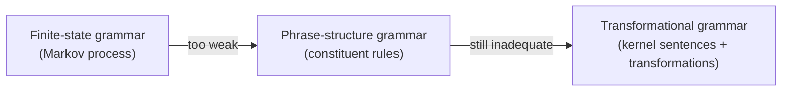

# Syntactic Structures

Noam Chomsky's 1957 monograph — barely a hundred pages, assembled from lecture notes he
prepared for MIT students — is the book that launched **generative grammar** and is widely
counted among the most influential linguistic works of the twentieth century. Reviewers at
the time called it a "Copernican revolution" for the field; it broke decisively with the
American structuralist (Bloomfieldian) tradition of cataloguing observed data and replaced
it with the goal of building an explicit, formal theory of the mental system that produces
language.

## The central move

Chomsky redefines the linguist's job. A **grammar** is not a description of a collected
corpus but a **finite device that generates all and only the grammatically well-formed
sentences of a language** — and, crucially, an infinite set of them, since sentences can
be indefinitely long. A theory of language must then supply a general method for choosing
the best such grammar for any language. This is the generative program: [syntax](syntax.md)
as a formal, rule-governed system prior to and independent of the data.

He famously separates grammaticality from meaning with the sentence **"Colorless green
ideas sleep furiously"** — perfectly well-formed, utterly meaningless — to argue for the
**autonomy of syntax** from [semantics](semantics.md). Grammaticality is also independent
of statistical likelihood: a never-before-uttered sentence can be fully grammatical.

## The argument, model by model

The book works through progressively more powerful models of grammar and shows each is
inadequate until the last:

1. **Finite-state / Markov models** — treating a sentence as a left-to-right chain of
   word transitions cannot capture the nested, long-distance dependencies of English
   (e.g. *if … then …*, *either … or …*).
2. **Phrase-structure grammar** — rewrite rules over constituents (immediate-constituent
   analysis) are stronger but still clumsy: many related sentences (active/passive,
   statement/question) would need independent, redundant derivations.
3. **Transformational grammar** — Chomsky's solution. A small set of *kernel sentences*
   generated by phrase-structure rules is mapped, by **transformations**, onto the full
   range of surface sentences. This later blossomed into the deep-structure / surface-structure
   distinction of his subsequent work and, ultimately, into the search for a
   [universal grammar](universal-grammar.md) common to all human languages.

## The Chomsky hierarchy

The formal spine of this argument — that grammars form a strict hierarchy of generative
power (finite-state ⊂ context-free ⊂ context-sensitive ⊂ unrestricted) — became the
**Chomsky hierarchy**, foundational not only to linguistics but to theoretical computer
science, formal-language theory, compiler design, and
[computational linguistics and NLP](computational-linguistics-and-nlp.md). The
demonstration that natural language exceeds finite-state power is directly relevant to why
modern sequence models, including [transformers](../ai/transformers-and-attention.md),
need mechanisms beyond simple local n-gram/Markov context.

## References

- [Syntactic Structures — overview](https://en.wikipedia.org/wiki/Syntactic_Structures)
