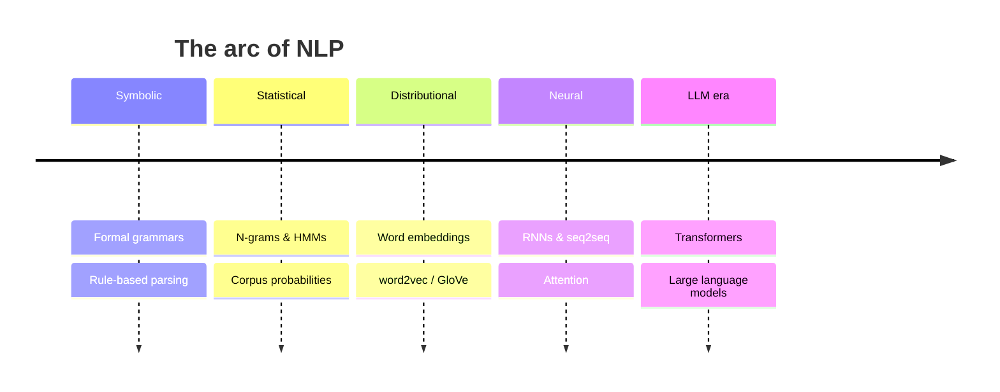

# Computational Linguistics and NLP

Computational linguistics and natural language processing (NLP) are the computational
bridge between language and machines: the study of how to represent, analyze, and
generate human language with algorithms. The field spans a spectrum from
linguistically-motivated formal models to data-driven statistical systems, and its
canonical survey is Jurafsky and Martin's
[jurafsky-martin-speech-and-language-processing](jurafsky-martin-speech-and-language-processing.md).
Its history is a case study in a discipline shifting from hand-built rules to learned
statistics.

## The symbolic era: formal grammars and parsing

The founding approach treated language processing as the application of explicit
grammars. Building on Chomsky's formal grammars
(see [chomsky-syntactic-structures](chomsky-syntactic-structures.md)), context-free
grammars and the Chomsky hierarchy provided a way to specify the syntax of a language;
**parsing** algorithms (top-down, bottom-up, chart parsers like CKY and Earley) then
assigned tree structures to sentences (see [syntax](syntax.md)). This paradigm produced
rule-based analyzers for morphology (see [morphology](morphology.md)), phonology
(see [phonetics-and-phonology](phonetics-and-phonology.md)), and semantics via logical
forms (see [semantics](semantics.md)). It was precise and interpretable but brittle:
real language is ambiguous, irregular, and full of exceptions that hand-written rules
handle poorly.

## The statistical turn

From the late 1980s the field pivoted to **probabilistic, data-driven** methods.
Instead of encoding rules, systems learned distributions from corpora: n-gram language
models estimated word probabilities, hidden Markov models tagged parts of speech,
probabilistic context-free grammars ranked parses, and machine learning
(see [../ai/machine-learning.md](../ai/machine-learning.md)) classifiers took over tasks
like word-sense disambiguation. The guiding idea was that ambiguity is best resolved by
what is *probable* given data, not by what is *permitted* by rules — a shift that made
systems robust and that leaned on the same social variation studied in
[sociolinguistics](sociolinguistics.md) as its raw material.

## Distributional semantics and embeddings

A deep linguistic idea powers the modern era: the **distributional hypothesis** — "you
shall know a word by the company it keeps." Meaning can be approximated from the contexts
a word appears in. This turned into **word embeddings** (word2vec, GloVe): dense vectors,
learned from co-occurrence, that place semantically similar words near one another and
encode analogies as geometry. Embeddings are the computational realization of
distributional meaning and the bridge from symbols to the continuous representations
neural networks consume — see
[../ai/representation-learning-and-embeddings.md](../ai/representation-learning-and-embeddings.md).

## The neural era: from RNNs to transformers and LLMs

Neural networks then subsumed most of the pipeline. Recurrent networks
(see [../ai/sequence-models-and-rnns.md](../ai/sequence-models-and-rnns.md)) processed
sequences token by token and powered the first neural machine translation and language
models, but struggled with long-range dependencies. The **transformer** and its
self-attention mechanism
(see [../ai/transformers-and-attention.md](../ai/transformers-and-attention.md)) removed
that bottleneck by letting every token attend directly to every other, enabling massive
parallelism and scale. Scaling this architecture on enormous corpora produced large
language models (see [../ai/large-language-models.md](../ai/large-language-models.md)),
which collapse the old task-specific pipeline into a single next-token predictor that
handles parsing, translation, summarization, and dialogue with one model.

## Why it matters

Computational linguistics is where every other subfield of linguistics is put to
computational test and where linguistic insight becomes deployable technology — search,
translation, assistants, code generation. It is also a two-way street: the surprising
competence of LLMs has become evidence in debates over
[language-acquisition](language-acquisition.md),
[universal-grammar](universal-grammar.md), and real-time processing in
[psycholinguistics](psycholinguistics.md), while distributional models formalize the
associative structure of the mental lexicon. The field's trajectory — rules giving way
to learned statistics giving way to scale — is one of the clearest illustrations of the
broader arc of AI.

## References

- Concept note — synthesized from the computational-linguistics literature; no single
  source. Anchored by
  [jurafsky-martin-speech-and-language-processing](jurafsky-martin-speech-and-language-processing.md);
  see also [chomsky-syntactic-structures](chomsky-syntactic-structures.md).
