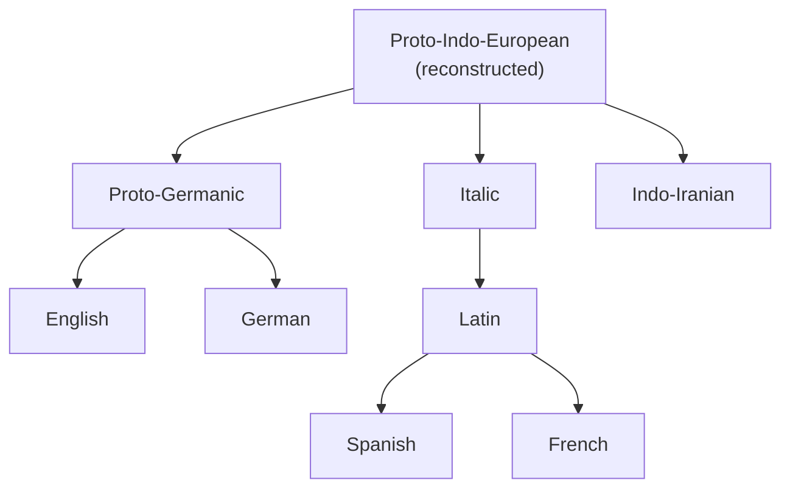

# Historical Linguistics

Historical linguistics studies how languages change over time and how present-day
languages descend from common ancestors. Its central discovery — that languages evolve
along regular, reconstructable lines — turned philology into a genuinely scientific
enterprise in the nineteenth century and remains a model of inference from indirect
evidence.

## Language changes at every level

No living language is static. Change touches:

- **Sound** — pronunciations shift over generations (see
  [phonetics-and-phonology](phonetics-and-phonology.md)).
- **Form** — inflectional systems erode or are rebuilt (see [morphology](morphology.md)).
- **Structure** — word order and construction patterns drift (see [syntax](syntax.md)).
- **Meaning** — words broaden, narrow, ameliorate, or pejorate over time (see
  [semantics](semantics.md)); *nice* once meant "foolish."

The engine of change is variation in the speech community — the synchronic differences
that [sociolinguistics](sociolinguistics.md) studies become, over time, completed
historical change.

## Sound change and the comparative method

A landmark finding is that **sound change is regular**: within a given environment a
sound shifts systematically across the whole vocabulary, not word by word. Grimm's Law,
describing the consonant shifts that separate Germanic from the rest of Indo-European
(Latin *pater* ~ English *father*), is the classic case. This regularity is what makes
reconstruction possible.

The **comparative method** exploits it. By aligning **cognates** — words in related
languages descended from the same ancestor — and identifying systematic sound
correspondences, linguists reconstruct features of an unattested **proto-language**
(e.g., Proto-Indo-European) and establish genetic relationships.

Regular correspondences distinguish true cognates from borrowings and chance
resemblances, letting the method reconstruct a family tree from living evidence.

## Grammaticalization and etymology

**Grammaticalization** is the recurrent pathway by which content words become grammatical
markers: a full verb *go* becomes a future auxiliary (*going to* → *gonna*). It shows
that grammar itself has a history and tends to evolve in directional, cross-linguistically
recurring ways. **Etymology** — tracing a word's origin and semantic history — is the
applied face of all this, reconstructing a lexical item's journey through sound and
meaning change.

## Why it matters — including for NLP

Historical linguistics grounds our understanding of why languages have the shapes they
do and constrains theories of what is a possible human language, feeding the typological
debates around [universal-grammar](universal-grammar.md). It matters for language
technology too: diachronic corpora let computational methods
(see [computational-linguistics-and-nlp](computational-linguistics-and-nlp.md)) model
**semantic change** — measuring how word meanings drift by comparing embeddings
(see [../ai/representation-learning-and-embeddings.md](../ai/representation-learning-and-embeddings.md))
trained on different time slices — and phylogenetic and reconstruction problems are
increasingly attacked with the same machine-learning machinery
(see [../ai/machine-learning.md](../ai/machine-learning.md)) used elsewhere in NLP. A
model trained on today's text is a snapshot of a moving target; understanding language
change explains why such systems date.

## References

- Concept note — synthesized from the historical-linguistics literature; no single
  source. Related canonical works:
  [fromkin-introduction-to-language](fromkin-introduction-to-language.md),
  [saussure-course-in-general-linguistics](saussure-course-in-general-linguistics.md).
