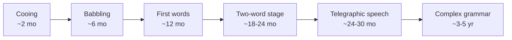

# Language Acquisition

Language acquisition is the process by which humans, and especially children, come to
command a language: its sound system, vocabulary, grammar, and use. First-language
(L1) acquisition in childhood is strikingly uniform and rapid — most children reach
fluent, rule-governed grammar by age four or five without formal instruction — which
makes it one of the central puzzles of the mind and a proving ground for competing
theories of how knowledge is gotten.

## The developmental trajectory

Acquisition unfolds in broadly consistent stages across languages and cultures:

Early on, infants are broad-band phoneme discriminators, able to hear contrasts from
any language; by roughly a year, perception has narrowed to the contrasts of the
ambient language (see [phonetics-and-phonology](phonetics-and-phonology.md)). Vocabulary
then explodes, two-word combinations appear, and functional morphology
(see [morphology](morphology.md)) and recursive syntax
(see [syntax](syntax.md)) come online. A revealing signature is **overregularization**
— a child who once said *went* starts saying *goed* — evidence that the child has
extracted a productive rule rather than merely memorized forms.

## The core debate: nativism vs. usage-based learning

**The poverty-of-the-stimulus argument.** Championed by Chomsky (see
[chomsky-syntactic-structures](chomsky-syntactic-structures.md)) and popularized by
Pinker (see [pinker-language-instinct](pinker-language-instinct.md)), the nativist
claim is that the linguistic input children receive is too sparse, noisy, and
degenerate to explain the rich, abstract grammar they end up with. Children come to know
things they were never taught and rarely if ever hear violated — for example, that
structure-dependent rules operate on hierarchical phrases rather than linear word order.
The inference is that much grammatical knowledge is innate: a
[universal-grammar](universal-grammar.md) provided by the language faculty, with
experience merely setting parameters.

**The usage-based / statistical alternative.** The opposing tradition holds that
children are powerful general learners who extract regularities from rich input using
distributional statistics, analogy, and social cues. Infants track transitional
probabilities between syllables to segment words; constructions are learned
piecemeal and generalized. On this view the stimulus is far richer than the nativist
caricature, and no dedicated grammar organ is required.

## The critical period

The **critical-period hypothesis** holds that native-like acquisition depends on
exposure within a maturational window (roughly up to puberty). Evidence includes the
plateau of adult second-language learners' grammar and accent, and cases of extreme
early deprivation. The window is better described as a gradual decline in plasticity
than a hard cutoff, and it interacts with how language is processed in the brain
(see [../neuroscience/index.md](../neuroscience/index.md)).

## Why it matters — and the LLM reframing

Acquisition is the empirical fulcrum of the innateness debate, so it bears directly on
the philosophy of mind (see [../philosophy/index.md](../philosophy/index.md)) and on how
we build machines that learn language. Large language models
(see [../ai/large-language-models.md](../ai/large-language-models.md)) have reframed the
poverty-of-the-stimulus argument in a concrete way: trained on text with no innate
grammar module, purely by predicting the next token, they acquire much of the
structure-dependent syntax the nativist argument said could not be learned from data
alone. This is not a clean refutation — LLMs consume orders of magnitude more data than
a child, learn from text rather than grounded interaction, and lack the sample
efficiency and critical-period dynamics of human learning — but it is a strong existence
proof that a lot of grammar is latent in distributional statistics, sharpening the
question of exactly what, if anything, must be innate. The comparison connects
acquisition to representation learning
(see [../ai/representation-learning-and-embeddings.md](../ai/representation-learning-and-embeddings.md))
and to how learning is studied in machines generally
(see [../ai/machine-learning.md](../ai/machine-learning.md)), and it is also studied
directly in [psycholinguistics](psycholinguistics.md) and, developmentally across
speakers, in [sociolinguistics](sociolinguistics.md).

## References

- Concept note — synthesized from the linguistics literature; no single source. Anchored
  by [chomsky-syntactic-structures](chomsky-syntactic-structures.md),
  [pinker-language-instinct](pinker-language-instinct.md), and
  [fromkin-introduction-to-language](fromkin-introduction-to-language.md).
