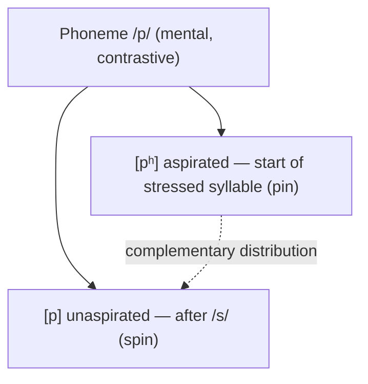

# Phonetics and Phonology

Two adjacent but distinct levels of the sound side of language. **Phonetics** studies
speech sounds as physical events — how they are produced, transmitted, and heard, with no
regard for which language uses them. **Phonology** studies the *sound system* of a
particular language — which sounds are contrastive, how they pattern, and the rules that
govern their combination. Phonetics is the raw physics and biology; phonology is the
grammar imposed on top of it.

## Phonetics: sound as a physical event

Phonetics is usually split into three branches:

- **Articulatory phonetics** — how the vocal tract produces sounds. Consonants are
  classified by *place* of articulation (bilabial, alveolar, velar, …), *manner* (stop,
  fricative, nasal, approximant, …), and *voicing* (do the vocal folds vibrate?). Vowels
  are classified by tongue *height*, tongue *backness*, and lip *rounding*. So English
  /p/ is a "voiceless bilabial stop" and /i/ (the vowel in *beet*) is a "high front
  unrounded vowel."
- **Acoustic phonetics** — the sound wave itself: fundamental frequency (pitch),
  formants (resonant frequency bands that distinguish vowels), duration, and amplitude.
  This is the level a spectrogram displays and the level a speech-recognition front end
  actually measures.
- **Auditory phonetics** — how the ear and brain perceive the signal.

The **International Phonetic Alphabet (IPA)** gives one symbol per distinct speech sound
across all languages, so any utterance can be transcribed unambiguously (e.g. *thin* =
[θɪn], *this* = [ðɪs]). Ordinary spelling cannot do this — English *ough* has many
pronunciations — which is why linguistics leans on the IPA. See
[fromkin-introduction-to-language.md](fromkin-introduction-to-language.md) for the
standard textbook treatment.

## Phonology: sound as a system

Phonology asks which distinctions *matter* in a given language. Its central unit is the
**phoneme**: the smallest sound unit that can change meaning. We find phonemes with
**minimal pairs** — two words that differ in exactly one sound and mean different things
(*pat* vs *bat* proves /p/ and /b/ are separate phonemes in English).

A phoneme is realized in speech as one or more **allophones** — physically different
sounds that speakers treat as "the same." In English the /p/ in *pin* is aspirated
([pʰ], with a puff of air) while the /p/ in *spin* is not ([p]); these are allophones of
one phoneme, in **complementary distribution** (each appears only where the other cannot).
Crucially, the same phonetic difference can be *phonemic* in another language: aspiration
distinguishes words in Hindi, Thai, and Mandarin. What is a mere accent detail in one
language is a meaning contrast in another — the core insight that sound must be studied
per-system, not just physically.

**Phonological rules** describe the regular mapping from underlying phonemes to surface
allophones — English voiceless stops aspirate at the start of a stressed syllable, vowels
lengthen before voiced consonants, and so on. Above the segment, phonology also governs
**syllable structure** (an onset, an obligatory nucleus, and a coda; languages differ in
which clusters they allow), plus **stress**, **tone**, and **intonation** — the
*suprasegmentals*.

This mirrors the phonetics/phonology split: the phoneme is the abstract system-level unit;
the allophones are its concrete phonetic realizations.

## Why it matters

Phonetics and phonology are the foundation of every level above them: the
[morphology](morphology.md) of a word is built from phonemes, and sound changes drive
[historical-linguistics](historical-linguistics.md) (regular sound laws let us reconstruct
proto-languages). The phoneme also illustrates
[saussure-course-in-general-linguistics.md](saussure-course-in-general-linguistics.md)'s
point that linguistic units are defined by *contrast within a system*, not by their
substance.

For AI, this level is where **speech technology** lives. Automatic speech recognition
(ASR) and text-to-speech (TTS) systems historically modeled phonemes and acoustic features
explicitly; the standard reference,
[jurafsky-martin-speech-and-language-processing.md](jurafsky-martin-speech-and-language-processing.md),
devotes substantial space to it. Modern end-to-end neural models
([../ai/sequence-models-and-rnns.md](../ai/sequence-models-and-rnns.md),
[../ai/transformers-and-attention.md](../ai/transformers-and-attention.md)) often learn
acoustic representations directly rather than hand-coding phonemes, but the phonetic
distinctions the phonology defines are exactly what those systems must recover to work.
Text-only [../ai/large-language-models.md](../ai/large-language-models.md) skip the sound
layer entirely — a reminder that phonology is real linguistic knowledge those models never
see. The philosophical status of the phoneme as an abstract, mind-internal category
connects to [../philosophy/index.md](../philosophy/index.md).

## References

- [fromkin-introduction-to-language.md](fromkin-introduction-to-language.md)
- [jurafsky-martin-speech-and-language-processing.md](jurafsky-martin-speech-and-language-processing.md)
- [saussure-course-in-general-linguistics.md](saussure-course-in-general-linguistics.md)
