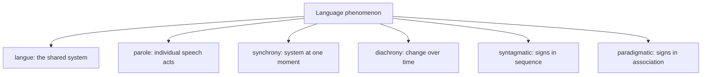

# Course in General Linguistics

*Cours de linguistique générale* (1916) is the founding text of modern **structuralism**
and, through it, of twentieth-century linguistics, semiotics, and much of continental
literary and social theory. Ferdinand de Saussure never wrote the book himself: it was
reconstructed and published posthumously by his students Charles Bally and Albert
Sechehaye from lecture notes taken during three courses he gave in Geneva. Despite that
secondhand origin, it reshaped how language is studied by insisting that language be
analyzed as a **system of relations** rather than a collection of names or a history of
individual words.

## The sign

Saussure's central unit is the **linguistic sign**, a two-sided psychological entity like
the two faces of a single sheet of paper:

- the **signifier** (*signifiant*) — the sound-pattern, the mental "sound image";
- the **signified** (*signifié*) — the concept it evokes.

The two are inseparable, and their connection is **arbitrary**: there is no natural reason
the sound *tree* attaches to the concept of a tree, only social convention and consistent
use. Language, on this view, is *not a nomenclature* — not a list of labels for
pre-existing things. A sign's value comes from its **differences** from other signs in the
system, not from any intrinsic content. This relational, difference-based theory of
meaning is a cornerstone of [semantics](semantics.md) and directly anticipates the
distributional intuition — that a word is defined by the company it keeps — underlying
modern word embeddings in [computational linguistics and NLP](computational-linguistics-and-nlp.md).

## Three founding distinctions

- **Langue vs. parole** — *langue* is the abstract, collective system of a language (the
  proper object of linguistics); *parole* is the concrete, individual act of speaking.
  This prefigures Chomsky's competence/performance split.
- **Synchrony vs. diachrony** — a language can be studied as a self-contained system *at a
  point in time* (synchronic) or in its *evolution* (diachronic). Saussure gave priority
  to synchronic analysis, a break from the historical-comparative philology that dominated
  before him. The diachronic axis is the domain of [historical linguistics](historical-linguistics.md).
- **Syntagmatic vs. paradigmatic relations** — signs relate either *in sequence* (the
  linear combination *the cat sat*) or *by association* (the substitutable set *cat / mat /
  bat*, or the paradigm *think / thought / thinking*). These two axes open the door to
  systematic analysis at every level, from phonology and [morphology](morphology.md) to
  [syntax](syntax.md).

## Why it matters

The *Course* established that meaning is structural and relational, that a language is a
self-contained system best studied on its own terms, and that the sign is the atom of that
system. It founded **semiotics** as a general science of signs and set the agenda for
structural linguistics and later movements across the humanities. Almost every later
framework — including the generative program of *Syntactic Structures*, however different
in method — inherits Saussure's basic move of treating language as an abstract mental
system to be modeled rigorously.

## References

- [Course in General Linguistics — overview](https://en.wikipedia.org/wiki/Course_in_General_Linguistics)
