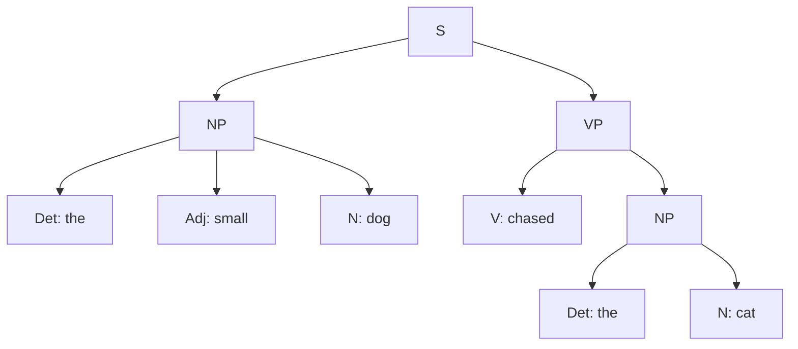

# Syntax

**Syntax** is the study of sentence structure — the rules that govern how
[words](morphology.md) combine into phrases and phrases into sentences. Its founding
observation is that a sentence is not a flat string of words but a *hierarchically
organized* object: words group into nested units. Syntax explains why *the dog chased the
cat* is grammatical while *chased dog the cat the* is not, even though both use the same
words, and why speakers can produce and understand sentences they have never heard before.

## Constituents and phrase structure

Words cluster into **constituents** — groups that behave as a single unit. In *the small
dog barked*, "the small dog" is a constituent (a *noun phrase*): you can replace it with a
pronoun (*it barked*), move it, or answer a question with it, but you cannot do the same to
an arbitrary fragment like *small dog barked*. Constituency tests (substitution, movement,
coordination) are the empirical tools for finding this structure.

A **phrase-structure grammar** captures it with rewrite rules of the form "a symbol expands
into a sequence of symbols":

```
S   → NP VP
NP  → Det (Adj) N
VP  → V NP
```

Applied to *the small dog chased the cat*, the rules generate a **tree**:



The tree makes the hierarchy explicit: the sentence (S) splits into a subject NP and a
predicate VP, and each of those splits further. Structure — not just word order — is what
grammar operates on.

## Generative grammar

Modern syntax was reframed by Noam Chomsky in
[chomsky-syntactic-structures.md](chomsky-syntactic-structures.md) (1957), which
launched **generative grammar**. The core claim: a grammar is a finite system of rules that
*generates* (specifies) exactly the infinite set of grammatical sentences of a language and
no ungrammatical ones. Grammaticality is a property of *structure*, independent of meaning
or statistics — Chomsky's famous *"Colorless green ideas sleep furiously"* is perfectly
grammatical yet meaningless, and it had near-zero probability in any corpus, which he used
to argue that syntax cannot be reduced to word co-occurrence frequencies.

**Recursion** is the engine of infinity. A rule whose output can contain its own input
(*NP → NP PP*, *S → … S …*) lets structures embed inside like structures without bound:
*the cat [that chased the dog [that ...]]*. From finitely many rules, infinitely many
sentences — the property Chomsky calls *discrete infinity* and treats as the hallmark of
human language, tying syntax directly to [universal-grammar](universal-grammar.md) and the
argument that this capacity is innate (see also
[pinker-language-instinct.md](pinker-language-instinct.md)).

Later generative theory added **X-bar theory**, the claim that *every* phrase — noun,
verb, preposition, whatever — shares one skeletal template built around a **head** (the X):
the head combines with a *complement* to form an intermediate X′ ("X-bar"), which combines
with a *specifier* to form the full phrase XP. This unifies NP, VP, PP, and the rest under a
single structural pattern, capturing a deep cross-category and cross-language regularity.

## The Chomsky hierarchy

Chomsky also classified formal grammars by generative power into a nested hierarchy —
*regular* ⊂ *context-free* ⊂ *context-sensitive* ⊂ *recursively enumerable*. Regular
grammars (finite-state) cannot handle the nested, long-distance dependencies of natural
language; context-free grammars capture most phrase structure; some natural-language
phenomena appear to need slightly more power ("mildly context-sensitive"). This hierarchy is
foundational to both linguistics and computer science (it underlies parsers and programming
language design) and is treated at length in
[jurafsky-martin-speech-and-language-processing.md](jurafsky-martin-speech-and-language-processing.md).

## Why it matters — and the NLP connection

Syntax is the bridge from words to [semantics](semantics.md): meaning is composed along the
tree (see compositionality), so getting the structure right is a precondition for getting
the meaning right. Syntactic ambiguity — *"I saw the man with the telescope"* has two trees
— shows that a single string can carry multiple structures and thus multiple meanings.

For AI, syntax is the concept the [../ai/transformers-and-attention.md](../ai/transformers-and-attention.md)
architecture engages most directly. Classical NLP parsed sentences into explicit trees with
context-free or dependency grammars. Transformers do no such thing overtly — yet the
**self-attention** mechanism lets every token attend to every other, which is precisely what
is needed to resolve the long-distance, nested dependencies that defeated finite-state
models (subject–verb agreement across intervening clauses, matching brackets, coreference).
Probing studies find that trained [../ai/large-language-models.md](../ai/large-language-models.md)
encode surprisingly tree-like syntactic information in their attention patterns and hidden
states, learned from data alone. This reopens Chomsky's old debate: he argued statistics
over words could never yield grammar, yet large statistical models acquire much of it — the
live question is whether they do so *the way humans do* (with innate structure) or merely
approximate the surface. That tension links syntax to
[../philosophy/index.md](../philosophy/index.md) and
[language-acquisition](language-acquisition.md).

## References

- [chomsky-syntactic-structures.md](chomsky-syntactic-structures.md)
- [fromkin-introduction-to-language.md](fromkin-introduction-to-language.md)
- [jurafsky-martin-speech-and-language-processing.md](jurafsky-martin-speech-and-language-processing.md)
- [pinker-language-instinct.md](pinker-language-instinct.md)
