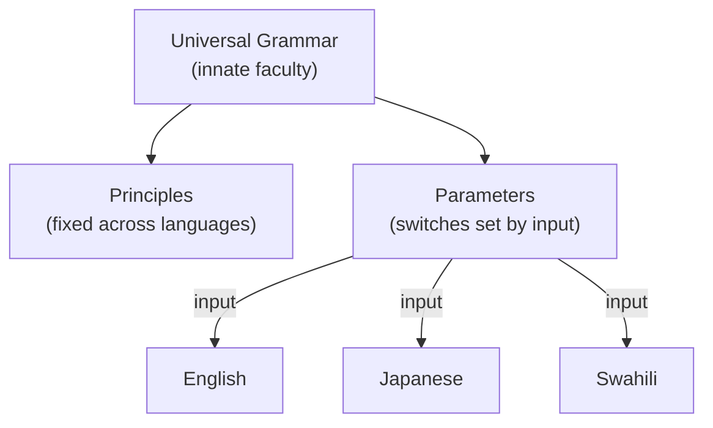

# Universal Grammar

Universal Grammar (UG) is Noam Chomsky's hypothesis that human beings are born with an
innate, species-specific endowment for language: a set of abstract principles and
structural constraints that all human languages share and that a child brings to the
task of acquisition. On this view, learning a language is not building grammar from
scratch but tuning an already-structured system to the particular language in the
environment. UG is the theoretical core of generative linguistics, launched by
[chomsky-syntactic-structures](chomsky-syntactic-structures.md) and given its most
influential popular defense in [pinker-language-instinct](pinker-language-instinct.md).

## The argument for an innate faculty

The central motivation is the **poverty-of-the-stimulus** argument (developed in
[language-acquisition](language-acquisition.md)): children converge rapidly and
uniformly on rich, abstract grammatical knowledge — including principles they are never
taught and never hear violated — on the basis of finite, noisy input. Chomsky's
inference is that the missing structure must be supplied by the mind, an innate
**language faculty**. A recurring illustration is **structure dependence**: grammatical
rules operate over hierarchical phrases (see [syntax](syntax.md)), never over mere linear
positions, even though a linear rule would be simpler to hypothesize from data. UG is
meant to explain why no human language works the "simple" linear way.

## Universals, typology, and principles & parameters

If languages share a common core, we should find **language universals** — properties
true of all (absolute universals) or statistically dominant across (implicational
universals) the world's languages. The study of this systematic cross-linguistic
patterning is **typology** (e.g., correlations between basic word order and the ordering
of other constituents). To reconcile a shared UG with the evident diversity of
languages, the **principles and parameters** model proposed that UG consists of:

- **Principles** — invariant constraints holding in every language.
- **Parameters** — a small set of binary switches (e.g., whether a language allows
  dropping the subject pronoun) that experience sets.

Acquisition, in this picture, is largely **parameter setting**: a compact way to derive
enormous diversity from a shared substrate.

## The language-faculty debate

UG has always been contested. Usage-based and functionalist linguists argue that
apparent universals reflect shared communicative pressures, cognitive biases, and
historical processes (see [historical-linguistics](historical-linguistics.md)) rather
than an innate grammar module, and that general learning suffices. Fieldwork on
typologically unusual languages has challenged proposed universals (famously, claims
about recursion). The debate reaches into the philosophy of mind and nature-versus-nurture
questions (see forward [../philosophy/index.md](../philosophy/index.md)) and into what is
known about how language is instantiated in the brain
(see [../neuroscience/index.md](../neuroscience/index.md)).

## Why it matters — the contrast with data-driven LLMs

UG frames language knowledge as **innate structure minimally shaped by data**. Large
language models (see [../ai/large-language-models.md](../ai/large-language-models.md))
embody the opposite bet: **maximal data with no innate grammar** — generic architectures
that, given enough text, acquire much of the structure-dependent competence UG said was
unlearnable. This makes LLMs a live experiment on the poverty-of-the-stimulus argument
(see [computational-linguistics-and-nlp](computational-linguistics-and-nlp.md)). The
confrontation is nuanced rather than decisive: LLMs need vastly more data than a child,
learn from disembodied text, and their inductive biases live in architecture and
optimization rather than an explicit grammar — so the question shifts from "innate or
learned?" to "what inductive biases, and how much data, make grammar learnable?" Either
way, UG remains the reference point against which data-driven language learning defines
itself.

## References

- Concept note — synthesized from the generative-linguistics literature; no single
  source. Anchored by [chomsky-syntactic-structures](chomsky-syntactic-structures.md)
  and [pinker-language-instinct](pinker-language-instinct.md); see also
  [fromkin-introduction-to-language](fromkin-introduction-to-language.md).
