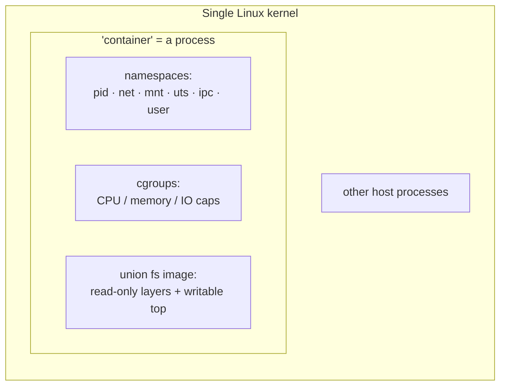
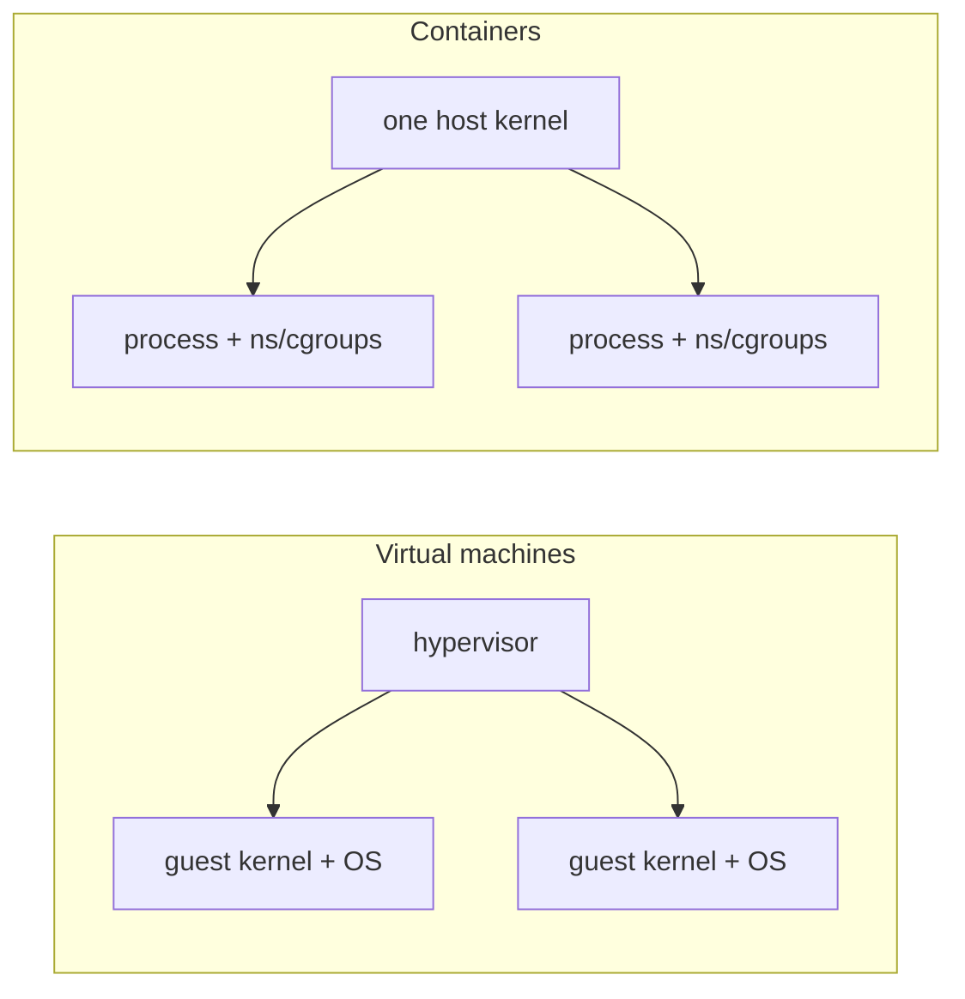

# Containers and Namespaces

The single most clarifying fact about containers is that **there is no such thing as a
container** in the Linux kernel. There is no container object, no container system call.
"Container" is a marketing word for a bundle of pre-existing kernel features used together
to make one process (and its children) *believe* it has a machine to itself. Docker, Podman,
containerd, and Kubernetes are conveniences that orchestrate those features; the isolation
itself is done by the [kernel](the-linux-kernel.md). Three ingredients do essentially all
the work:

1. **Namespaces** — isolate *what a process can see*.
2. **cgroups** — limit *what a process can use*.
3. **Union filesystems** — provide *what a process runs from* (the image).

## Namespaces: partitioning the process's view

A **namespace** wraps a global system resource so that processes inside it see their own
isolated instance. The kernel offers several kinds, and a "container" is a process placed in
a fresh set of them at once:

| Namespace | Isolates | Effect inside |
|---|---|---|
| **pid** | process IDs | its own `init` as PID 1; can't see host processes |
| **net** | the [network stack](networking-on-linux.md) | own interfaces, routes, firewall |
| **mnt** | mount points | its own filesystem tree |
| **uts** | hostname / domain | its own hostname |
| **ipc** | shared memory, semaphores | own IPC objects |
| **user** | UID/GID mappings | root *inside* maps to unprivileged *outside* |

The **user namespace** is the key to security: it lets a process be UID 0 (root) *within* the
container while being an ordinary unprivileged user on the host, so a breakout doesn't hand
over host root. This connects directly to how Linux
[permissions and users](permissions-and-users.md) work — namespacing the UID space is what
makes "rootless" containers possible.

## cgroups: capping resource consumption

Namespaces hide resources; **control groups (cgroups)** ration them. A cgroup is a kernel
mechanism to measure and *limit* a group of processes' CPU shares, memory ceiling, block-I/O
bandwidth, and process count. Without cgroups, an isolated process could still starve the host
by consuming all memory. With them, "give this container 512 MB and half a core" is enforced by
the scheduler and memory subsystem. Isolation (namespaces) plus metering (cgroups) is the
minimal recipe for multi-tenancy on one kernel.

## Union filesystems: the image

A container image is a stack of **read-only layers** combined by a **union (overlay)
filesystem** into a single apparent tree, with one **writable layer** on top for the running
container's changes. Layers are shared across containers, so a hundred containers off the same
base image share those bytes on disk and start in milliseconds. This layering is why images are
cacheable, diffable, and cheap — and why a container starts instantly where a VM must boot.

## A container is a process, not a VM

This is the load-bearing distinction. A **virtual machine** runs a *second kernel* on emulated
or virtualized hardware, mediated by a hypervisor — strong isolation, but the cost of a full OS
per guest. A **container** is just a normal Linux process on the *host's* kernel, wrapped in
namespaces and cgroups. There is no guest kernel, no boot, no hardware emulation. That is the
whole trade-off: containers are lighter and faster and denser, but they share one kernel, so a
kernel vulnerability is a shared blast radius in a way it is not across VMs.

## The tie to sandboxing agent-run code

These primitives are exactly the substrate for
[running untrusted code safely](../ai-platform/why-and-how-to-sandbox-ai-generated-code.md).
When an AI agent generates and executes code, you do not want that code touching the host
filesystem, exfiltrating over the network, or exhausting resources. Namespaces give it an
isolated filesystem and network view; cgroups cap what it can consume; a user namespace denies
it real host privilege. This is the concrete mechanism beneath
[execution sandboxing](../ai-platform/execution-sandboxing.md) — the same features that isolate
a web service isolate an agent's tool call. The shared-kernel caveat matters here too: for
genuinely adversarial code, a container alone is a weaker boundary than a VM or a
microVM/gVisor-style layer, precisely because the kernel is shared. Knowing *what a container is*
is what lets you judge whether the isolation is strong enough for the threat.

## Why it matters

Orchestration platforms like [Kubernetes](../distributed-systems/kubernetes-up-and-running.md) schedule,
network, and heal containers at scale — but they schedule *these* primitives. Every abstraction
above (pods, sidecars, service meshes) resolves down to processes with namespaces, cgroups, and
overlay mounts on some host's kernel. When something misbehaves — a container that can see too
much, a memory limit that isn't enforced, a network that leaks — the diagnosis lives at the
kernel-feature layer, not in the orchestrator's vocabulary.

## References

- [How Linux Works (Ward)](ward-how-linux-works.md)
- [The Linux Programming Interface (Kerrisk)](kerrisk-linux-programming-interface.md)
