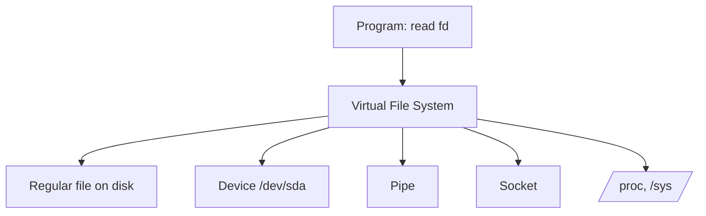

# Everything Is a File

"Everything is a file" is Unix's great unifying abstraction: an enormous variety
of resources — real files, directories, hardware devices, running processes,
kernel state, network connections, inter-process pipes — are all presented
through the **same small interface**. If you can `open`, `read`, `write`, and
`close` something, you can treat it like a file, whatever it actually is. This is
what makes Unix tools so combinable, and it is the single design decision that
most explains the flavor of the whole system.

## The uniform interface

Nearly every Unix resource is manipulated through a handful of system calls:

| Call | Meaning |
|------|---------|
| `open` | acquire a handle to a resource |
| `read` | pull bytes from it |
| `write` | push bytes to it |
| `close` | release the handle |
| `lseek`, `ioctl` | reposition / issue device-specific control |

The handle these calls return is a **file descriptor**: a small non-negative
integer that indexes into the kernel's per-process table of open resources. Three
descriptors are open by default — `0` (stdin), `1` (stdout), `2` (stderr) — which
is precisely what makes [pipes and redirection](the-shell-and-pipes.md) work: the
shell just rewires which resource a descriptor points at.

Because the *interface* is uniform, a program that reads from a descriptor
doesn't need to know whether the bytes come from a disk file, a keyboard, a
network socket, or another program. The kernel dispatches the same call to
different backing implementations behind a layer called the **Virtual File
System (VFS)** — the indirection that lets one `read` call mean many different
things (see [operating systems](../computer-science/operating-systems.md) on the
abstraction of resources).

## What counts as a file

The abstraction reaches surprisingly far:

- **Regular files and directories.** The obvious case; a directory is itself a
  file whose contents are a list of names mapped to inodes (see
  [the filesystem and FHS](the-filesystem-and-fhs.md)).
- **Devices.** Hardware appears under `/dev` as *device files*. `/dev/sda` is a
  disk; `/dev/null` discards writes; `/dev/random` yields entropy;
  `/dev/tty` is your terminal. **Character devices** stream bytes; **block
  devices** are addressable in fixed-size blocks. Talking to hardware becomes
  reading and writing a file.
- **Pipes.** A pipe is an in-kernel byte buffer with a read end and a write end,
  each a file descriptor — the mechanism underneath the shell's `|`.
- **Sockets.** Network endpoints are file descriptors too, so
  [networking](networking-on-linux.md) reuses `read`/`write` (with a few
  socket-specific calls layered on).
- **`/proc` and `/sys`.** These are *synthetic* filesystems: they don't back onto
  disk but expose kernel and process state *as files*. `/proc/<pid>/status`
  describes a running [process](processes-and-signals.md); `/proc/cpuinfo`
  reports the CPU; `/sys` exposes device and driver state, often writable to
  tune the [kernel](the-linux-kernel.md) at runtime. Introspecting and
  configuring the system becomes ordinary file I/O — no special API required.

## Why this design is powerful

The payoff is **composability**. Because every resource speaks the file
interface, the same general-purpose tools work on all of them. `cat` a device,
`grep` through `/proc`, redirect a program's output into a socket, pipe one
program into another — none of these require special-purpose code, because at the
boundary everything is just a stream of bytes behind a descriptor. This is the
concrete enabler of the [Unix philosophy](unix-philosophy.md): "write programs
that handle text streams" only pays off because the system arranges for almost
*everything* to be reachable as a stream.

It is also a lesson in the value of a **narrow, universal interface**. By
refusing to invent a bespoke API for each resource type, Unix collapsed a huge
amount of would-be complexity into one contract that every program already knows.
The cost is a leaky edge — not every resource fits the byte-stream model cleanly
(hence `ioctl`, the catch-all escape hatch, and the fact that sockets need extra
calls) — but the abstraction pays for itself many times over.

## Why it matters

This is one of the most influential ideas in systems design. It is why Unix
tooling is so interoperable, why shell scripting is so powerful, and why later
systems keep rediscovering it (Plan 9 pushed it further; container and cloud
tooling still lean on `/proc` and `/sys`). Understanding that a socket, a disk,
and a process are all "just files" is the key that unlocks how the rest of the
system fits together.

## References

Anchored in [The Art of Unix Programming](art-of-unix-programming.md) and
[The Linux Programming Interface](kerrisk-linux-programming-interface.md)
(Kerrisk) for the file-descriptor and VFS model; see
[How Linux Works](ward-how-linux-works.md) (Ward) for `/proc`, `/sys`, and device
files, and [operating systems](../computer-science/operating-systems.md) for the
underlying resource-abstraction principle.
