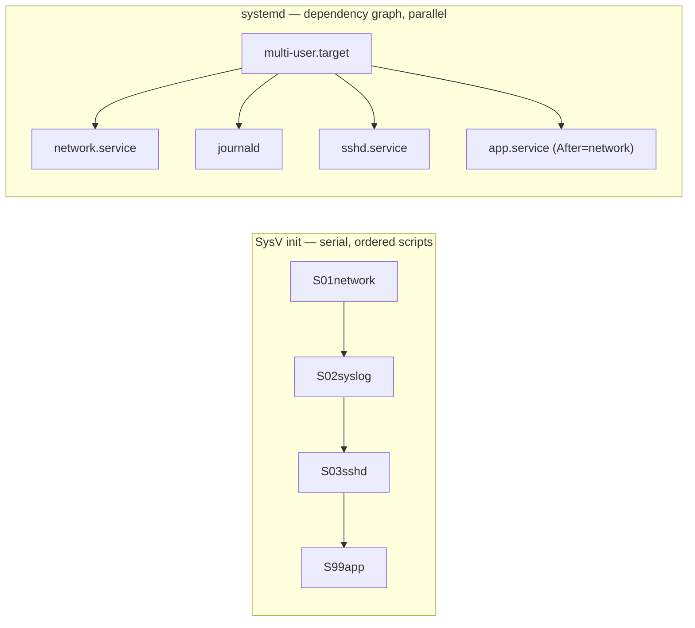
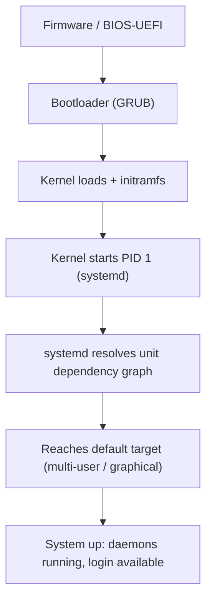

# Init and Services

When the [kernel](the-linux-kernel.md) finishes booting, it has hardware, memory, and a
scheduler — but no running applications. It starts exactly one userspace program and hands
it the reins: **PID 1**, the *init* process. Everything else on the system descends from it.
Init's job is to bring the machine from "bare kernel" to "fully running services," keep those
services alive, and take the machine back down cleanly. It is the root of the whole
[process tree](processes-and-signals.md).

## PID 1: the first and last process

PID 1 is special. The kernel starts it directly, it never exits while the system runs, and it
is the ancestor of every other process. Two duties fall to it uniquely:

- **Bring-up and teardown** — start the services that make the system useful, in the right
  order, and later stop them cleanly on shutdown.
- **Reaping orphans** — when a process's parent dies, the orphan is *re-parented to PID 1*,
  which must `wait()` on it so it doesn't linger as a zombie. This janitorial role is why a
  proper init matters even inside a minimal [container](containers-and-namespaces.md).

## init vs. systemd

Historically PID 1 was **SysV init**: a sequence of numbered shell scripts run one after
another to reach a **runlevel** (a numbered system state — single-user, multi-user,
networked, graphical). Simple and transparent, but *serial* (slow) and blind to
dependencies — it couldn't easily express "start the database before the app" or restart a
crashed service.

Modern Linux overwhelmingly uses **systemd**, which reframes bring-up around *declared
dependencies* rather than an ordered script. You describe *what* should run and *what it
needs*; systemd computes the order and starts independent things **in parallel**, which is a
large part of why modern boots are fast. systemd is more than init — it also manages logging,
device events, scheduled jobs, and more — a breadth that draws criticism for straying from
the [Unix philosophy](unix-philosophy.md) of small composable tools, but it won on capability.

## Units and targets

systemd's model is built from **units** — typed, declarative configuration objects, each a
small text file:

- **`.service`** — a daemon or one-shot task: the command to run, its dependencies
  (`After=`, `Requires=`), and its restart policy.
- **`.socket`, `.timer`, `.mount`, `.device`** — other resource types, so sockets, scheduled
  jobs, mounts, and hardware are all managed with one uniform mechanism.
- **`.target`** — a named grouping of units used as a synchronization point, the modern
  replacement for runlevels (`multi-user.target`, `graphical.target`). Reaching a target
  means all the units it pulls in are up.

The shift from imperative scripts to declarative units is the same move seen throughout
modern infrastructure — describe the desired state, let the system converge to it — which is
why systemd fits naturally into [devops-sre](../devops-sre/index.md) practice.

## Daemons, supervision, and restart

A **daemon** is a long-running background service with no controlling terminal — `sshd`,
`nginx`, `cron`. Traditionally a program *daemonized itself* (forking, detaching from its
terminal) — fiddly and error-prone. Under systemd the service simply runs in the foreground
and systemd supervises it: it *is* the parent, so it always knows whether the service is
alive. When a supervised service dies, a declared `Restart=` policy brings it back
automatically. This built-in **supervision and self-healing** is a major practical advantage
over old init scripts, where a crashed daemon simply stayed dead until someone noticed.

## Logging with journald

systemd captures each service's output into **journald**, a structured, indexed logging
system. Instead of every daemon writing its own ad-hoc text file, journald collects logs
centrally with rich metadata (which unit, which PID, priority, timestamp) so you can query
"show me everything from the database service since the last boot" as a single filter. It can
still forward to classic syslog for tools that expect plain text, but the structured store is
the default and is far easier to reason about at scale.

## The boot sequence

The chain is a **handoff of responsibility**: firmware finds a bootloader, the bootloader
loads the kernel, the kernel initializes hardware and starts PID 1, and PID 1 brings up
userspace. Each stage's only job is to set up and launch the next. Understanding where a boot
stalls is a matter of knowing which handoff failed.

## Why it matters

Init is where a *kernel* becomes a *usable system* and where operators spend much of their
time: enabling services, reading logs, diagnosing why something didn't start, defining
restart behavior. It is the bridge from the low-level [process](processes-and-signals.md) and
[kernel](the-linux-kernel.md) mechanics up to the operational world of running reliable
services — the daily substance of [nemeth-unix-linux-sysadmin](nemeth-unix-linux-sysadmin.md)
and of [devops-sre](../devops-sre/index.md) practice.

## References

- [nemeth-unix-linux-sysadmin](nemeth-unix-linux-sysadmin.md)
- [processes-and-signals](processes-and-signals.md)
- [the-linux-kernel](the-linux-kernel.md)
- [unix-philosophy](unix-philosophy.md)
- [containers-and-namespaces](containers-and-namespaces.md)
- [../devops-sre/index.md](../devops-sre/index.md)
